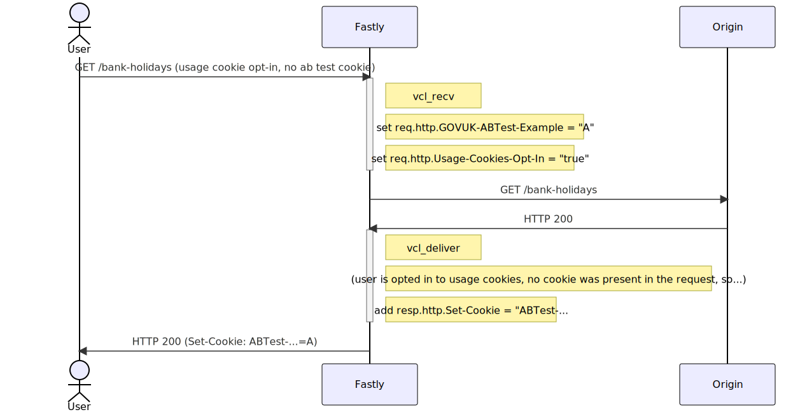
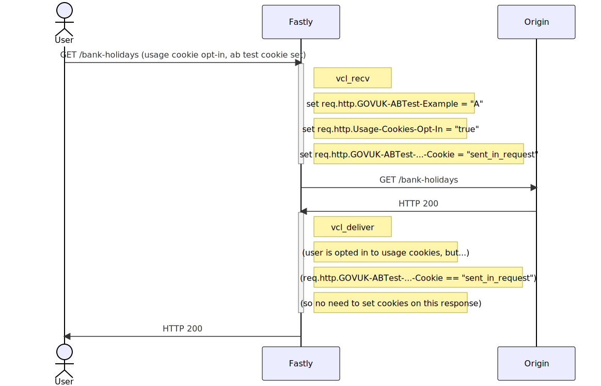

GOV.UK uses our [Content Delivery Network (Fastly)][cdn] to run A/B and multivariate tests.

For a general introduction to A/B testing from a content design perspective, see the [Confluence Wiki](https://bit.ly/AB-testing-GOVUK).

[cdn]: /manual/cdn.html

> A/B tests are only enabled for users who have opted in to analytics cookies.

If the user is opted-in to usage cookies, but hasn't got an AB test cookie yet:

If the user is opted in to usage cookies, and has already got an ABTest cookie set:

`req.http.GOVUK-ABTest-Example` is set as soon as the user is assigned a bucket, which happens for users who haven't got cookies yet (as well as for those who already have). `vcl_recv` where this happens can't set the cookie itself, because it hasn't got a response object to mutate yet.

So if we say "Only set the cookie if GOVUK-ABTest-Example is not already set" then we'll never set the cookie.

We need some way of detecting the situation where they user already had a cookie when they arrived if we want to avoid sending a Set-Cookie header in every response.

### Fastly receives the request

When a user requests a GOV.UK page, the request reaches Fastly's CDN first. If the page has A/B testing enabled, Fastly will add a `GOVUK-ABTest-Example` header to downstream requests. The header's value is set depending on whether a cookie called `ABTest-Example` is present in the original request:

- If the original request has the cookie, then the header's value is set to that cookie's value. For instance, the downstream request will have `GOVUK-ABTest-Example: B` if the `ABTest-Example` cookie of the original request has value `B`.
- If the original request doesn't have the cookie, then Fastly chooses a variant (e.g. `A`) and sets the header's value accordingly: `GOVUK-ABTest-Example: A`

In order to choose a variant, Fastly looks up the weighting of each variant in a [Fastly dictionary][dicts] configured for all A/B tests.

Fastly will then try to get a response from its cache.

- if the requested page is cached, the `vary: GOVUK-ABTest-Example` response header on previously cached responses will ensure that the right version is returned to the user.

- if not, Fastly will send the request downstream to GOV.UK (including the `ABTest-Example` header)

[dicts]: https://docs.fastly.com/guides/edge-dictionaries/

### Application layer

The application (for example, [government-frontend](/repos/government-frontend.html) or [collections](/repos/collections.html)) inspects the `GOVUK-ABTest-Example` header to determine which version of the content to return.

It also adds an extra response header: `vary: GOVUK-ABTest-Example`. This instructs Fastly and Varnish to cache both versions of the page separately.

### Fastly responds

Fastly also saves the response in the cache. The `vary: GOVUK-ABTest-Example` response header will ensure that `A` and `B` are cached separately.

If the original request did not have the `ABTest-Example` cookie, Fastly will set a `Set-Cookie` header to the response based on the value of the `GOVUK-ABTest-Example` header.

## Further reading

- ["A/B testing at the edge" - Fastly blog](https://www.fastly.com/blog/ab-testing-edge)
- ["Best Practices for Using the Vary Header" - Fastly blog](https://www.fastly.com/blog/best-practices-for-using-the-vary-header)

[fastly]: https://www.fastly.com/
[pass-folder]: https://github.com/alphagov/govuk-secrets/tree/master/pass
