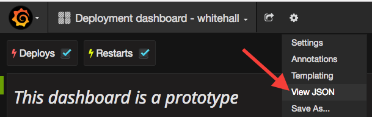
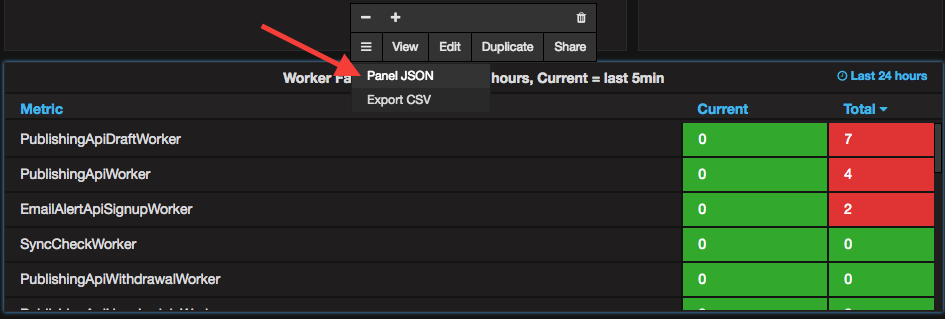

## Update and Add Panels to Existing Dashboards

[Application dashboards](deployment-dashboards.html) are configured in `govuk-puppet`. Each dashboard panel is configured by a .json.erb template in `modules/grafana/templates/dashboards/application_dashboard_panels` ([GitHub link][application_dashboard_panels]) and these are combined to generate the JSON config for each application dashboard.

It’s best to duplicate an existing dashboard in Grafana to test your changes.

Then, either add the panel to an existing row, or create a new row with your panel in.

Once you are happy with your changes, export the JSON partial of what you want to add in order to add it to `govuk-puppet`.

You can export the entire dashboard by clicking on the cog:

Or you can export a single panel by clicking on the panel title to add it to a partial:

Please delete any temporary dashboards after you’ve finished.

### If you’re changing an existing panel…

Find the partial in Puppet and replace the contents with the exported JSON. Replace any application specific text/urls/queries in the partial with template variables.

Use `git add -p` to avoid unnecessary changes being committed

### If you’re adding a new panel

Create a new partial in Puppet with the exported JSON
Replace any application specific text/urls/queries in the partial with template variables.

`govuk-puppet` uses an [array structure](https://github.com/alphagov/govuk-puppet/blob/master/modules/grafana/manifests/dashboards.pp) to dynamically control which partials are rendered.

Adding your partial name to this structure will result in it being rendered in Grafana.

### Test the dashboard

Any new partials or dashboards should be tested on Integration with multiple applications.

It is also possible to test that the Puppet generates the dashboard JSON you expect by spinning up a `graphite-1.management` VM. Run `vagrant up graphite-1.management` from inside the `govuk-puppet` repo. You will need to run `vagrant provision` whenever you make changes to your local dashboard in order for them to be picked up by the virtual machine.

Deployed dashboards live in `/etc/grafana/dashboards` on the `graphite-1.management` machine and any local virtual machines.

## Add a new application

The list of applications that have dashboards generated is stored in the [hiera data](https://github.com/alphagov/govuk-puppet/blob/master/hieradata/common.yaml) inside Puppet under `grafana::dashboards::deployment_applications`.

Each dashboard can have parameters associated with it which affect how the dashboard is generated.

Parameters:

- `has_workers`: Adds a row with worker failure and success panels. This is required for applications that have Sidekiq workers. Defaults to `false`.

- `show_controller_errors`: Adds a row which graphs 5XX responses broken down by Rails controller and action. For this graph to contain data, the application must report response statuses to Kibana as `status`, and also report the controller and action as `controller` and `action`. You may wish to set this to `false` for apps with very low request rates to avoid having an empty and potentially confusing graph. Defaults to `true`.

- `show_slow_requests`: Adds a row which graphs response times broken down by Rails controller. For this graph to contain data, the application must report response times to Kibana as `duration` and the controller as `controller`. You may wish to set this to `false` for apps with very low request rates to avoid having an empty and potentially confusing graph. Defaults to `true`.

- `docs_name`: This is the name of the application used in the developer documentation. Often the same as the repository name on GitHub. This defaults to the `app_name`.

- `error_threshold`: The threshold at which application errors are highlighted in red. Defaults to 50.

- `warning_threshold`: The threshold at which application errors are highlighted in orange. Defaults to 25.

[application_dashboard_panels]: https://github.com/alphagov/govuk-puppet/tree/master/modules/grafana/templates/dashboards/application_dashboard_panels
