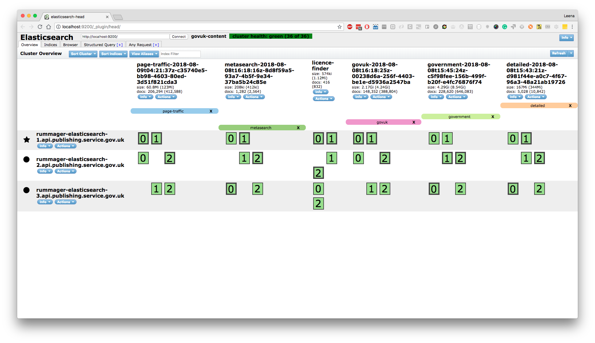
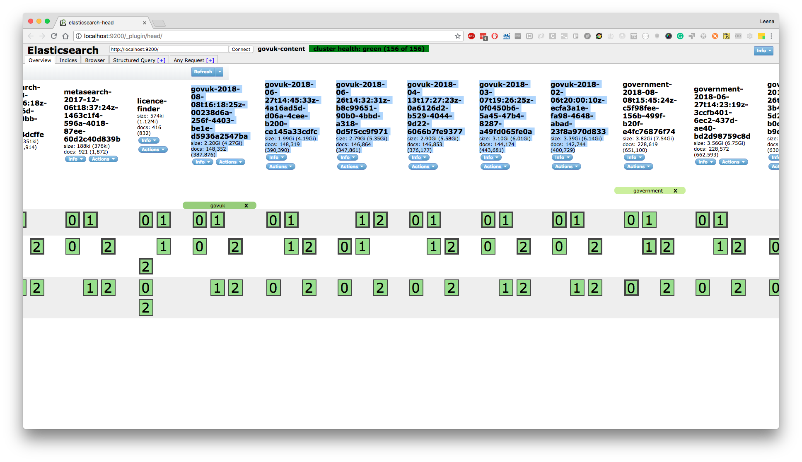
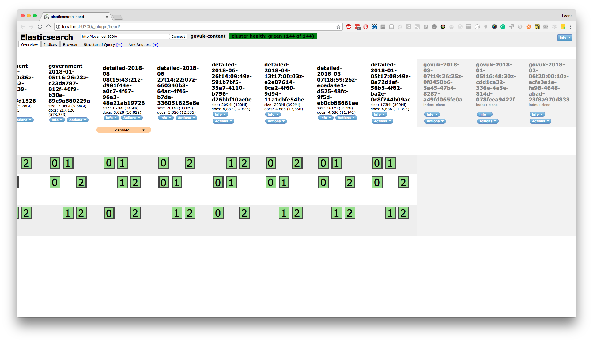

## Low available disk space on root

You can try clearing out the APT cache:

```
sudo apt-get clean
```

## Low available disc space on /mnt/uploads for asset-master-1 and asset-slave-1

Nagios is set up to monitor disc usage by /mnt/uploads on
asset-master-1.backend and asset-slave-1.backend. Usually, the culprit
behind space-chomping is /mnt/uploads/whitehall, and there are two
folders on which to focus clean-up efforts on:

-   /mnt/uploads/whitehall/attachment-cache
-   /mnt/uploads/whitehall/carrierwave-tmp

Running the following command from within the above folders (ie cd to
/mnt/uploads...) usually works best as it means that we don't end up
with the parent folders being deleted:

`find -type d -ctime +1 -exec rm -rf {} +`

In the above example, we:

-   `find -type d` - find all directories within the folder you are
    currently cd'd in to
-   `-ctime +1` - limit the results of the above `find` to files created
    over a day (24hrs) ago
-   `-exec rm -rf {} +` - execute a force removal on the folders found,
    with the above conditions

The + is a gnuism which allows the command to run more efficiently. This
[man page](http://unixhelp.ed.ac.uk/CGI/man-cgi?find) explains the +
functionality:

> This variant of the -exec option runs the specified command on the
> selected files, but the command line is built by appending each
> selected file name at the end; the total number of invoca-tions of the
> command will be much less than the number of matched files. The
> command line is built in much the same ways that xargs builds its
> command lines. Only one instance of '{}' is allowed within the
> command. The command is executed in the starting directory.

This command will take a while to complete, depending - of course - on
how large your two starting folders are. After it has completed, push
Nagios to re-check the service on each affected host.

## No disk space on the MySQL master

If the MySQL master runs out of disk space, all of the apps that rely on
MySQL may crash. You'll probably notice this in Nagios. There's a lot of
red.

Binary logs take up space that could be freed. If the slave and the
backup are at a reasonably up-to-date binlog position
(`SHOW SLAVE STATUS \G`), the older binlogs can be removed from the
master.

To recover:

1.  SSH to mysql-master-1.backend
2.  Stop MySQL using `sudo service mysql stop` (this may never return)
3.  At this point `service mysql status` may return `stop/killed`,
    indicating that Upstart has tried to kill MySQL but it is refusing
    to die
4.  `cd /var/lib/mysql && ls`
5.  Remove enough (5 to 10?) binlog files so that you can start MySQL
6.  Edit the `mysql-bin.index` file to remove references to the binlog
    files you removed manually
7.  `sudo service mysql start`
8.  `mysql -u root -p`
9.  `PURGE BINARY LOGS TO 'mysql-bin.########';`

If there's no disk space available, purging binary logs from within
MySQL doesn't work - this is why we first need to manually delete some
logs and update the index.

## Low available disk space on /var/lib/postgresql

Check which databases are occupying a lot of space and discuss with the relevant owners
about reducing size or exanding the size of the postgres drive.

Steps to investigate postgres db size:

1. SSH into `postgresql-primary-1.backend`
1. See what space is left: `df -h`
1. Open the psql console: `sudo -u postgres psql postgres`
1. List databases: `\list` or `\l`
1. Check out which databases can be improved
1. You can choose one of the dbs by doing: `\c <name-of-db>`
For example: `\c email-alert-api_production`

If this continues to be a problem see if you need to [resize the disk](/manual/adding-disks-in-vcloud.html).

## Low available disk space on /mnt/elasticsearch

Usually this is caused by old indices not being closed.

View the dashboard to see how many indices are active on the cluster:

`ssh -L9200:localhost:9200 rummager-elasticsearch-1.api.production`

Then visit <http://localhost:9200/_plugin/head/>

Go to the "Indices" tab to see all of the active indices. There should only be one index of each type.

Most of out indices are aliased. The most cases the index in use is the one that the alias points to. This is usually the most recent index. On the dashboard the alias is represented by a colour label.



If old indices haven't been deleted, you'll see duplicates.



The indices apart from the ones in use can be closed and then, if no problems arise, deleted.

To close an index, select `Actions -> Close` then wait a few minutes and monitor Icinga to make sure everything is ok. If there is a problem, the index can still be re-opened.

Then scroll to the right of the dashboard to find the closed index and do `Actions -> Delete` to delete it.



## No disk space in general

If you cant find any of the above cases causing low disk spaces, it can
be useful to run the command `sudo ncdu <mountpoint>`, where mountpoint
will be the path specified in the Nagios alert. It will calculate all
the disk space being used, and then bring you into an ncurses file
explorer-style interface. Press enter to go into a directory, and d to
delete any large files.

Press q to quit, or ? for help.

If a particular mountpoint is rather large, it may be helpful to first
scan it to see which directory inside it is using the most space, then
use ncdu on that directory. Do it with the following command:
`sudo du -hc --max-depth=1 <mountpoint>`

If you are able to determine that the machine simply requires more disk space
to run the applications (such as a growing database) you can increase capacity
by [adding a new disk in vCloud](../adding-disks-in-vcloud.html).

## Disk space used by logfiles

You may discover that disk space is mostly being used up by logfiles.
This is probably caused by logrotate failing to properly rotate a
logfile for whatever reason, so it will probably just be one or two of
the latest logfiles using a high proportion of the disk space.

If it is out of hours, free up room to resolve the incident without
performing the maintenace tasks described below. Pass to 2ndline to deal
with during working hours.

Firstly see if you can remove any old logfiles, where dir is the
directory where the large file lives: `find <dir> -mtime +45 -type f`

You can remove them by running: `find <dir> -mtime +45 -type f -delete`

45 days is specified as this is how long we're obliged to keep logfiles,
but that could be smaller if required.

Ideally see if you can copy the large file elsewhere (on a different
mount point which has free space) and then entirely truncate that log:
`truncate -s 0 <logfile>`. Manually gzip the file (gzip &lt;file&gt;)
and put it back in the log file directory.

You can force a logrotate run afterwards:
`logrotate -vf /etc/logrotate.d/<type of logs>`

**If you have nowhere to move the logs and it is causing an incident,
uptime of the server takes precedent over logfiles, so just truncate the
logs to free up space**
