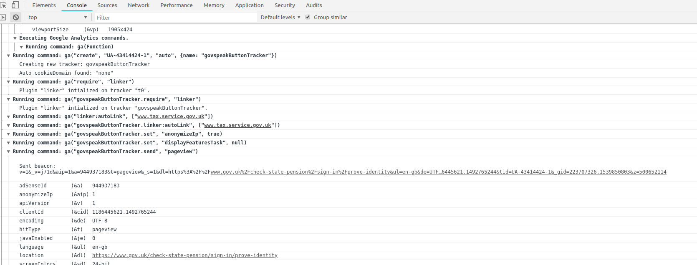

GOV.UK uses Google Analytics to track user journeys through the site. The tracking
data is available to anyone with Google Analytics Suite access for GOV.UK. You can
request access to this by following the [steps in the GDS wiki](https://sites.google.com/a/digital.cabinet-office.gov.uk/gds/communities-of-practice/data-analysis/tools-technical/access-to-google-analytics).

## GOV.UK analytics code

The GOV.UK analytics codebase is a collection of JavaScript modules spread through a few different projects:

- [static](https://github.com/alphagov/static/tree/master/app/assets/javascripts/analytics) - Core analytics code (originally from [govuk_frontend_toolkit](https://github.com/alphagov/govuk_frontend_toolkit/tree/master/javascripts/govuk/analytics) but migrated and modified) plus additional and legacy modules.
- Supplementary tracking for application specific cases is included in several applications including [government-frontend](https://github.com/alphagov/government-frontend/blob/master/app/assets/javascripts/modules/track-radio-group.js) and [frontend](https://github.com/alphagov/frontend/tree/master/app/assets/javascripts/modules).

## Tracking overview

User behaviours and journeys can be tracked in a variety of ways, the default method of tracking with Google Analytics is to record _pageviews_ - This is data relating to a page the user has just requested (eg. URL, user-agent, referrer).
Pageviews are typically recorded as the user visits the page.

Where a page offers the user multiple navigation choices it's often desirable to track _events_, a typical example of this is recording when a user chooses an option in a group of radio buttons. Event data is usually comprised of a category, a label and a value.

Both pageviews and events can be augmented with _custom dimensions_, additional fragments of data describing the behaviour of the user, eg. which variant of an multivariate test they are assigned.  The [custom dimensions are documented on Confluence](https://gov-uk.atlassian.net/wiki/spaces/GOVUK/pages/23855552/Analytics+on+GOV.UK).

## Cross domain tracking

Work has been done to implement cross domain tracking between GOV.UK and some government services. Tracking data for cross domain journeys is sent to a separate GA property from the existing GOV.UK GA property, and services can also maintain their own separate tracking.

Tracking a user journey across different services with different domains requires additional configuration so that the destination domain (eg. tax.service.gov.uk) can receive analytics data for the portion of the user journey taking place on the source domain (eg. GOV.UK).

To some extent the referrer value in pageview data will contain some evidence of where the user has arrived from, often this isn't enough information or may be misleading due to authentication redirects.

The javascript function

```javascript
GOVUK.analytics.addLinkedTrackerDomain('UA-43888888-1', 'someServiceTracker', ['some.service.gov.uk'])
```

registers a _linked_ (cross domain) tracker and sends a pageview to the tracker. The [current cross domain configuration on GOV.UK](https://github.com/alphagov/static/blob/master/app/assets/javascripts/analytics/init.js.erb#L160) contains only those domains that have turned on cross domain tracking. More information is included in [static's analytics documentation](https://github.com/alphagov/static/blob/master/doc/analytics.md#tracking-across-domains).

Some cross domain tracking existed prior to this work to link 19 services to GOV.UK. It exists on some transaction start pages such as [Change your driving test appointment](https://www.gov.uk/change-driving-test), where the start button contains data attributes, such as:

```html
<a href="https://some.service.gov.uk"
   data-module="cross-domain-tracking"
   data-tracking-code="UA-43888888-1"
   data-tracking-name="someServiceTracker">Start</a>
```

### Cross domain event tracking

Once the linked tracker is registered, it's also possible to track events using the registered tracker name:

```javascript
GOVUK.analytics.trackEvent('Radio button chosen', 'selected-service-option', { 'trackerName': 'someServiceTracker' })
```

### Cross domain tracking and GOV.UK javascript module loading

The `GOVUK.Modules` library will attempt to initialise and start a module for every `data-module` data attribute it encounters.
In the case of cross domain tracking this can be undesirable if more than one element contains the `cross-domain-tracking` data-module because the underlying `ga.js` library from Google will not accept multiple calls to register a linked tracker and will throw javascript errors.
See [this static commit](https://github.com/alphagov/static/commit/c03c11a84f86deb83ed3b7a4d16ad2e6de3f1d95) for how we mitigate against this for multiple govspeak buttons with cross domain tracking enabled.

## Developing and debugging Google Analytics tracking

Google provide an extension [Google Analytics Debugger](https://chrome.google.com/webstore/detail/google-analytics-debugger/jnkmfdileelhofjcijamephohjechhna?hl=en) which logs all GA suite interactions to the console.
This is useful for testing what is being sent to GA and when. Other GA debuggers are also available.


