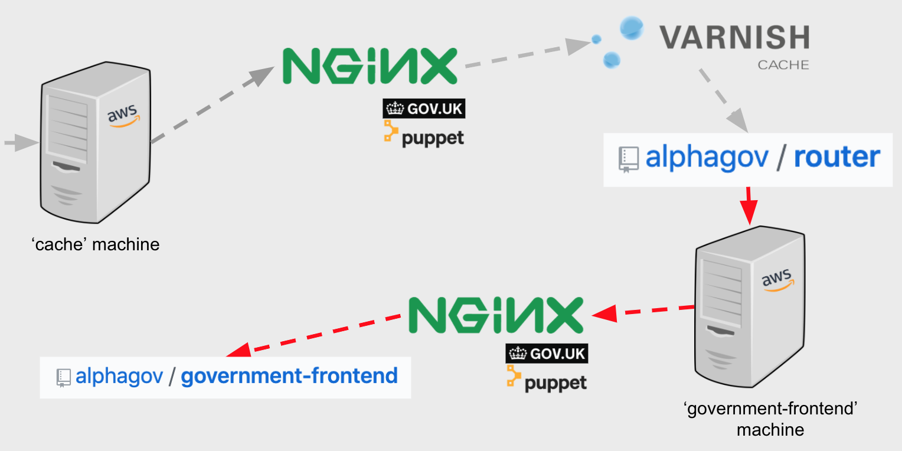
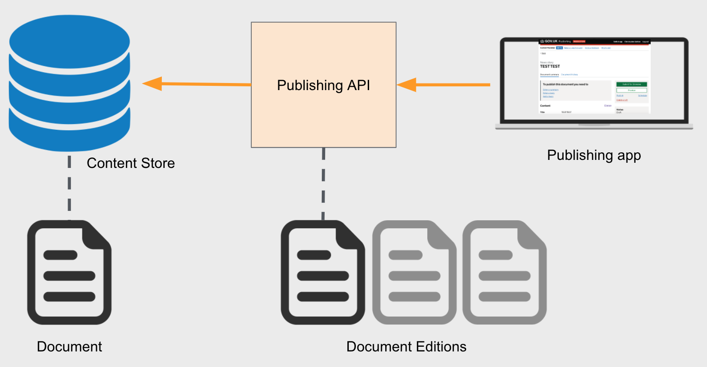

We can cover a lot of GOV.UK architecture by asking ourselves three questions:

1. What happens when a user visits a page on GOV.UK?
2. What happens when a publisher hits 'Publish'?
3. What happens when a developer deploys a change to an application?

[GOV.UK]: https://www.gov.uk

## What happens when a user visits a page on GOV.UK?

### DNS

The browser queries a local DNS server to turn the domain name into an IP address.
The local DNS server might be able to answer immediately from its cache. If not,
it will query the authoritative name servers for the domain.

`gov.uk.` is a country-code second-level domain or ccSLD (like `co.uk.`) and its
authoritative servers are hosted by [Jisc]. Unusually for a ccSLD, `gov.uk` is
also a website, and hosts the redirect from `gov.uk` to `www.gov.uk`. The records
for these two domains are within the `gov.uk` second-level zone hosted by Jisc.

GDS hosts the DNS for third-level domains under `gov.uk` (for example `service.gov.uk`)
on both [Amazon Route53] and Google Cloud Platform, for redundancy. The configuration
for these domains is in the [govuk-dns-config repo], which is deployed via the
[Deploy_DNS Jenkins job][deploy-dns], which in turn references the [govuk-dns repo].

`www.gov.uk` is a CNAME record which ultimately points to `www-gov-uk.map.fastly.net.`
The `fastly.net` domain name is hosted by special nameservers at the Fastly content
delivery network, which aim to respond with the IP address of the Fastly cache node
which is "closest" to the user. Read more about Fastly in the next section, or
[read more about gov.uk DNS][govuk-dns-docs].

[deploy-dns]: https://deploy.blue.production.govuk.digital/job/Deploy_DNS/
[govuk-dns repo]: https://github.com/alphagov/govuk-dns
[govuk-dns-config repo]: https://github.com/alphagov/govuk-dns-config
[govuk-dns-docs]: /manual/dns.html
[Jisc]: https://www.jisc.ac.uk/domain-registry
[Amazon Route53]: https://aws.amazon.com/route53/

### CDN and caching

GOV.UK uses the [Fastly] CDN to handle the majority of requests, which - as
well as reducing load on GOV.UK ('origin') by around 70% - provides 'edge nodes'
(servers) that are closer to our end users (particularly those outside the UK).

Fastly uses [Varnish] for caching, with a default cache time of 1 hour. (Read
["Our content delivery network"][our-cdn] for more information). If Fastly
doesn't have a page in its cache, it fetches the page from origin.

[Caches can be purged][purge-cache] using the [cache-clearing-service], which
tells Fastly to soft-purge (i.e. only remove the cached version once it has
received the new version from origin). This cache clearing service is
triggered automatically when pages are updated - more on that later.

[cache-clearing-service]: https://github.com/alphagov/cache-clearing-service
[Fastly]: https://www.fastly.com/
[our-cdn]: /manual/cdn.html
[purge-cache]: /manual/purge-cache.html
[Varnish]: https://varnish-cache.org/

#### Failover

If a Fastly request to origin returns a 5xx response, Fastly will request
content from the mirror, which is static HTML hosted in an S3 bucket on AWS.
The contents of the mirror are updated daily via a [govuk-crawler-worker],
which recursively crawls GOV.UK URLs from a message queue, visiting the pages
and saving the output to disk.

- Read more about [fallback to the static mirrors].
- Read more about [how errors are handled on GOV.UK].

[fallback to the static mirrors]: /manual/fall-back-to-mirror.html
[how errors are handled on GOV.UK]: /manual/errors.html
[govuk-crawler-worker]: https://github.com/alphagov/govuk_crawler_worker

#### Routing on the CDN

As well as for caching, Varnish is used for the redirection from `gov.uk` to
`www.gov.uk`, which is configured in Varnish Configuration Language (VCL) and
uploaded directly to Fastly via [govuk-cdn-config].

Other redirects that happen at the Fastly level include [bouncer]: a GOV.UK
application responsible for redirecting traffic from old pre-GOV.UK websites.
This is configured via [transition] and [transition-config]. Read
[Transition architecture] for more detail.

[bouncer]: https://github.com/alphagov/bouncer
[govuk-cdn-config]: https://github.com/alphagov/govuk-cdn-config
[Transition architecture]: /manual/transition-architecture.html
[transition]: https://github.com/alphagov/transition
[transition-config]: https://github.com/alphagov/transition-config

### Routing on GOV.UK

#### Getting to the 'router' application

Some requests make it through the CDN and cache layers to 'origin'. Origin is
a stack of computers in the cloud - in this case, AWS - and its entry point is
a load balancer.

The load balancer knows based on the hostname which machine 'class' to route
to. Different classes of machine run different sets of GOV.UK applications.
How many machines are allocated to a class - and how big those machines are -
is configured using [Terraform], in [govuk-aws]. What runs on each machine
class is configured in govuk-puppet, a file and process management system we'll
cover in more detail later.

External requests are routed to a 'cache' machine, where the request is
received by an [Nginx] web server running on the machine. Nginx proxies some
routes directly to other apps, such as [asset URLs] being
[routed to asset-manager][asset-proxy] - this is configured with govuk-puppet.
However, [Nginx proxies most requests to Varnish][nginx-varnish-proxy].
If Varnish has the route response in its cache, that is returned, otherwise it
proxies the request to [router], which is a GOV.UK maintained application
running on the cache machines.

[asset URLs]: https://github.com/alphagov/govuk-puppet/blob/881cbcdef477332948e92b88ecd04a830fd02337/hieradata/common.yaml#L1176-L1178
[asset-proxy]: https://github.com/alphagov/govuk-puppet/blob/a114dd5f80d789be368573545dc56fe388c0ac58/modules/router/templates/assets_origin.conf.erb#L53-L67
[govuk-aws]: https://github.com/alphagov/govuk-aws
[Nginx]: https://www.nginx.com/
[nginx-varnish-proxy]: https://github.com/alphagov/govuk-puppet/blob/66b2f6c6d8e572d0b4cc8d6d47338c050a1c46a2/modules/router/templates/router_include.conf.erb#L78
[router]: https://github.com/alphagov/router
[Terraform]: https://www.terraform.io/

#### Routing via 'router'

'Router' is a reverse proxy app written in Go. It is designed to be fast,
storing all known routes in memory using a [prefix trie], which it loads
from a MongoDB database of all known routes.

The MongoDB database is written to via [router-api] whenever a route is
added or changed: the Content Store (which we'll cover later) talks to
Router API [directly][register-route] to do this. Router API then
[sends POST requests to every instance of Router][router-api-updating-router],
whereupon each [Router then reloads all routes][router-reloading-routes]
from MongoDB.

Routes have different handlers. Routes marked as `gone` return a 410 Gone
response. Routes marked as `redirect` serve a 301 Moved Permanently
response. These handlers are useful for when content is deleted or
superseded. Most publishing apps provide a way of deleting or redirecting
their content, but it's worth noting the [short-url-manager] app, whose
sole purpose is to create special redirect routes to allow the creation
of short, memorable URLs that redirect to longer URLs, often as part of a
media campaign.

Routes with a `backend` handler are routed to the relevant rendering app,
based on the `backend_id` of the route, which is derived from the
`rendering_app` field in the corresponding content item in the Content
Store - we'll cover this later. For example, if the route has a
`backend_id` of `frontend`, it will forward the request to the [frontend]
application.

[frontend]: https://github.com/alphagov/frontend
[prefix trie]: https://en.wikipedia.org/wiki/Trie
[register-route]: https://github.com/alphagov/content-store/blob/08f02f990e621c9d2fd473e12a70a6805ddd8dcb/app/models/route_set.rb#L58-L82
[router-api]: https://github.com/alphagov/router-api
[router-api-updating-router]: https://github.com/alphagov/router-api/blob/master/lib/router_reloader.rb#L45-L48
[router-reloading-routes]: https://github.com/alphagov/router/blob/1e1d5c1563136ba340e1fba838d9b52e283ed815/router_api.go#L26-L42
[short-url-manager]: https://github.com/alphagov/short-url-manager

### Rendering

Once Router has forwarded the request to the right rendering app, the
rendering app itself has to do some routing. Most GOV.UK front-end apps are
built in [Rails], which means typically there is a `routes.rb` file that
maps the route to a controller. The controller takes the URL path and any
parameters and decides how to render the page.

Many pages require the application to make a request to the Content Store
to retrieve the corresponding content. Some pages are associated with
collections of content, rather than simply one content item. If it is a
static collection, such as a homepage which references several news stories,
then this remains just one content item that has been expanded via "link
expansion" (which we'll cover later) to 'include' the other content items
within it. If it is a dynamic collection, such as a search results page,
then content items are retrieved via the [search-api].

[Rails]: https://rubyonrails.org/
[search-api]: https://github.com/alphagov/search-api

#### Static assets

Whilst views can be any arbitrary HTML, GOV.UK pages are typically constructed
from components defined in [govuk_publishing_components], set in a standard
page template (header, footer, JavaScript and CSS) defined in [static].
For more details, read about the GOV.UK [Frontend architecture].

Static JS/CSS is delivered over <https://assets.publishing.service.gov.uk>.
Custom assets, such as images, are delivered over the same domain and uploaded
by content designers via [asset-manager]. Under the hood, all of these assets
live in an [AWS S3 bucket]; read ["Assets: how they work"].

[asset-manager]: https://github.com/alphagov/asset-manager
["Assets: how they work"]: /manual/assets.html
[AWS S3 bucket]: https://aws.amazon.com/free/storage/
[Frontend architecture]: /manual/frontend-architecture.html
[govuk_publishing_components]: https://components.publishing.service.gov.uk/component-guide
[static]: https://github.com/alphagov/static

### Summary

The request is resolved through DNS, more often than not hitting the CDN/cache
layers. Some requests make it through to origin, where they're routed to the
machine running the (usually Rails-based) rendering application that knows how
to handle the request.

## What happens when someone hits 'Publish'?

### Draft and live stacks

Everything you've just read about in the first section exists in two stacks:
draft and live. These are very similar to each other: each is a collection
of machines in the cloud, running GOV.UK applications. Everything that runs in
the live stack also runs in the draft stack, in order to have a way of
previewing content in a non-public-facing way. However, the draft stack also
has additional machines that run the [publishing apps].

Applications shouldn't know what stack they're in - they're simply configured
to talk to other applications in their stack.

The live stack entry point is the 'router' app. You can swap `www` for
`www-origin` to bypass Fastly and view the live stack at origin. This is
only available to office IPs / VPN, and to Fastly IP addresses (configured in
[govuk-provisioning]).

The draft stack entry point is [authenticating-proxy], which sits in front
of 'router'. You can swap `www` for `draft-origin` to view the draft stack at
origin. The draft stack is not IP-restricted, as we need to be able to share
links to be reviewed ("2i'd") or fact-checked by non-Government departments.
It is, however, only visible to users who have been verified through
Authenticating Proxy, by signing into [signon] (an authentication and
authorisation portal) or by providing a valid `auth_bypass_id` (as a URI
parameter or session cookie). Read more about previews in ["How the draft stack works"].

Signon doubles up as an authorisation platform, as it associates users with
arbitrary permissions, so a publishing app can query if the current user has
the necessary permissions to perform a given action, such as publishing
content.

[authenticating-proxy]: https://github.com/alphagov/authenticating-proxy
[govuk-provisioning]: https://github.com/alphagov/govuk-provisioning
["How the draft stack works"]: /manual/content-preview.html
[publishing apps]: /#publishing-apps
[signon]: /apps/signon.html

### Publishing API vs Content Store

At this point it's probably worth summarising what "content" is. Almost every
piece of content on GOV.UK lives in a database called "[content-store]", which
stores only the latest "edition" of that content. Internally the content is
referred to as a "document", even if it is not itself a document. Content is
retrieved via the "[Content API]", which lives in the content-store repo.

Content is published to the Content Store via the [Publishing API], which
stores all of the editions of the document, and performs validation checks
whenever it receives a new edition. Every piece of content has a `schema_name`
corresponding to a particular JSON schema defined in [govuk-content-schemas].
Most backend apps have their own databases modelling documents in their own
way; at the point of sending the document to Publishing API, they transform the
document to a JSON payload conforming to the appropriate schema.

When a new edition is sent to Publishing API, it is automatically published to
the draft Content Store, replacing whatever contents existed for that document
beforehand. An edition must be explicitly published for it to go to the live
Content Store, where it becomes visible to the outside world.

[Link expansion], mentioned in [Rendering][rendering] is the process of
joining related content items (such as the title and details of a document's
parent, used for navigational breadcrumbs) into a single JSON payload, so that
rendering apps don't need to handle the complexity of pulling all of that data
together manually. Link expansion happens in Publishing API at the point of
sending an edition downstream to the Content Store.

[Content API]: /apps/content-store.html
[content-store]: https://github.com/alphagov/content-store
[govuk-content-schemas]: https://github.com/alphagov/govuk-content-schemas
[Link expansion]: https://github.com/alphagov/publishing-api/blob/master/docs/link-expansion.md
[Publishing API]: https://github.com/alphagov/publishing-api
[rendering]: #rendering

### Downstream Sidekiq background processing triggered by publishing

The Publishing API could update the Content Store directly, but the scale of
GOV.UK means we're safer offloading that call to a background process to be
processed when resources become available. In addition, when we publish a new
edition, we often want to trigger some other actions as a result. For example,
we want to send an email to anyone subscribed to that content.

We use [Sidekiq] to manage the background processing. When each Sidekiq
process is evaluated, a message is put onto a [RabbitMQ] queue (which runs
on its own machines in Carrenza and AWS). RabbitMQ is a message broker: when
a message is broadcast to a RabbitMQ exchange, it forwards the message to its
consumers. These consumers retrieve the content item and do something in
response, such as:

- Clear the page's cache, via the cache-clearing-service
- [Send emails to users subscribed to that content][message-queues-rake]. (The
  exceptions to this are `travel-advice` & `specialist-publisher`, which
  communicate directly with email-alert-api to ensure emails go out immediately)

[Content Store registers the route][content-store-router-api] for the content
item via Router API. This happens inside the Sidekiq job directly, rather than
in a downstream process.

[content-store-router-api]: https://github.com/alphagov/content-store/blob/dd79a03d74f130650bc97d1c84aae557ccea58d3/app/models/content_item.rb#L33
[message-queues-rake]: https://github.com/alphagov/email-alert-service/blob/master/lib/tasks/message_queues.rake
[RabbitMQ]: https://www.rabbitmq.com/
[Sidekiq]: /manual/sidekiq.html

#### Sidekiq queues: high and low priority

Updating one content item often requires updating other pieces of content.
For example, if a content item's title has been changed, then content items
which refer to that content item will need to be updated to use the new
title. Sometimes a single change can trigger changes in thousands of items.

Putting both the directly changed and indirectly changed content items
on the same queue would mean it would take a long time to see the changes
in a document you've edited. Generally, it is less important to see a quick
change to the indirectly changed content than it is to see a change in the
directly changed content items. Therefore we have a concept of 'high' and
'low' priority queues.

The main content item is processed in the high priority queue. Exactly the
same things happen to the low priority content items as the high priority
content items; it just tends to take longer as there are more items to
process.

The process for finding the content items affected by a content change is
known as [dependency resolution]. Content items can be associated with
other content items in a number of ways. For example, you may provide an
[array of organisation IDs][schema-organisations-example] in your payload
when sending to Publishing API, to indicate that those organisations are
responsible for the content (this is stored on the content item in content
store as `links.organisations`).

Content can also be tagged to [taxonomies], which are used to describe where
in the site hierarchy the content sits. These are stored on the content item
as `links.taxons`. Some apps have their own interface for tagging, or you can
tag content independently using [content-tagger].

[content-tagger]: https://github.com/alphagov/content-tagger
[dependency resolution]: https://github.com/alphagov/publishing-api/blob/master/docs/dependency-resolution.md
[schema-organisations-example]: https://github.com/alphagov/govuk-content-schemas/blob/d9684140462e4a138668539c04829cd808636ed5/dist/formats/news_article/publisher_v2/schema.json#L70-L73
[taxonomies]: /manual/taxonomy.html

### Summary

The publishing app uses the Publishing API to create and synchronise a new
edition of a document, which consolidates related content items into it prior to
sending to Content Store. All affected content items are added to a publishing
queue, which triggers downstream actions such as cache clearing and email alerts.

## What happens when a developer deploys a change to an application?

### Environments

Everything you've read about the live and draft stacks, you can now multiply
threefold, as they each exist in the following environments:

- Production
- Staging
- Integration

Data is copied from Production to Staging - and from Staging to Integration - every
24 hours via [automated Jenkins jobs][copy-data-to-staging]. This way our
environments are always roughly in sync, although it's worth noting that email
addresses are anonymised and access-limited documents are obfuscated before data is
copied. The data copying is mostly [configured in govuk-puppet][govuk-env-sync],
although apps not hosted on AWS are configured in [env-sync-and-backup].

[copy-data-to-staging]: https://deploy.publishing.service.gov.uk/job/Copy_Data_to_Staging/
[env-sync-and-backup]: https://github.com/alphagov/env-sync-and-backup/
[govuk-env-sync]: /manual/govuk-env-sync.html

### Deploying

We have detailed docs on [how to deploy an application][how-to-deploy]. But
what happens under the hood?

When a PR is opened against a GOV.UK repository, the corresponding Jenkins job
on [CI Jenkins] runs the tests (although we're gradually
[moving to GitHub Actions][github-actions-rfc]). The Jenkins jobs are created
in the first place by being [added to govuk-puppet][create-jenkins-job], and
configured to use the [govuk-jenkinslib] library to build and run the tests.

The tests report back to the PR as a [GitHub check], though other checks may
also be required before the PR can be merged ([govuk-saas-config] defines things
such as whether branches must be up to date with 'master' before merging).

On merge, the same Jenkins job that ran the tests runs the tests again, then
[creates and pushes a git tag][push-tag] to GitHub, then
[sends a message][send-deploy-message] to the [deploy Jenkins] environment
to build the [govuk-app-deployment] job. This clones the repository, checks out
the tag and deploys the code to the corresponding nodes on Integration using
[Capistrano][Capistrano] (a Ruby-based server automation and deployment tool).
Capistrano does deployments only by default, but can also do deployments 'with
migration' or 'with hard restart', etc, depending on the nature of the change.

A developer must manually trigger a deployment to Staging and Production through
the [release] app. This uses the same Jenkins/Capistrano pipeline as for
Integration, but on the Staging and Production Jenkins environments respectively.

Some apps require extra care when deploying; see ['Static' deployment rules][static-deploy].

[Capistrano]: https://capistranorb.com/
[CI Jenkins]: https://ci.integration.publishing.service.gov.uk/
[create-jenkins-job]: https://github.com/alphagov/govuk-puppet/blob/6a0b05aa1f9a90c01cefd5fc5b9c8e5f0aa030f2/hieradata/common.yaml#L422
[deploy Jenkins]: https://deploy.integration.publishing.service.gov.uk/
[GitHub check]: https://developer.github.com/v3/checks/
[github-actions-rfc]: https://github.com/alphagov/govuk-rfcs/blob/master/rfc-123-github-actions-ci.md
[govuk-app-deployment]: https://github.com/alphagov/govuk-app-deployment
[govuk-jenkinslib]: https://github.com/alphagov/govuk-jenkinslib
[govuk-saas-config]: https://github.com/alphagov/govuk-saas-config
[how-to-deploy]: /manual/development-pipeline.html
[push-tag]: https://github.com/alphagov/govuk-jenkinslib/blob/dab23c591306d9f497f1c89651f7b7c0c6cc6967/vars/govuk.groovy#L122-L124
[release]: https://github.com/alphagov/release
[send-deploy-message]: https://github.com/alphagov/govuk-jenkinslib/blob/dab23c591306d9f497f1c89651f7b7c0c6cc6967/vars/govuk.groovy#L132-L135
[static-deploy]: /manual/deploy-static.html

### Puppet on GOV.UK

As discussed in the routing section, we have different 'classes' of machines
running in the cloud; to recap, the "cache" machines run the Router
application. These classes are configured in [govuk-puppet], which uses
[Puppet] under the hood: tooling which configures resources such as files
and processes.

Puppet runs in a master/agent setup. There is a single "puppetmaster" running
on its own class of machine, whereas the agents run on all the other machines
(irrespective of class). The Puppet master is in charge of keeping all of the
Puppet agents in sync with itself.

[Icinga] alerts us to problems with our machines and apps. There is a wide
variety of different alerts, all of which are configured in Puppet. Each
puppet agent is responsible for [configuring Icinga alerts] using the
[Icinga Puppet module]. Alerts might be triggered by an application's
[health check endpoint] being unavailable, or by a machine having
[low available disk space], or a number of other reasons.

For monitoring, 'filebeat' is used to send logs to [Logit], and 'statsd'
exports most monitoring metrics, which can be viewed in [Grafana]. This is
configured in [govuk_app_config], which is included in most GOV.UK apps.
Read more about [tooling for monitoring][tools].

If an app release contains a major change such as a renamed environment
variable, then it will require an application restart, which would bring the
application offline on that machine. The load balancer would begin serving
traffic from different nodes of the same class: for this reason it is
important that all machines are updated at different times. Therefore, each
instance [runs puppet every half hour][puppet-cronjob], with the Puppet
agents configured to run after the puppetmaster at randomised times.

When [deploying Puppet], the latest versions of govuk-puppet and
govuk-secrets are copied to the puppetmaster. On each Puppet run, the Puppet
agent checks for differences between what is sees and what the puppetmaster
says should be there to see if they have diverged ("configuration drift")
and whether they should reset themselves against the master. Only after all
the Puppet agents have updated can you be confident that your Puppet change
hasn't broken anything, which is why you must wait 30 minutes between Puppet
deploys.

[configuring Icinga alerts]: https://github.com/alphagov/govuk-puppet/blob/0b20c7efe7e0c3855d4821e55a914ab577d3b84e/modules/govuk_containers/manifests/app.pp
[deploying Puppet]: /manual/deploy-puppet.html
[health check endpoint]: https://github.com/alphagov/content-publisher/blob/5b968f1bbfd4fa7e577ea535bb2dc23fcf0c99b8/spec/requests/healthcheck_spec.rb
[govuk_app_config]: https://github.com/alphagov/govuk_app_config
[govuk-puppet]: https://github.com/alphagov/govuk-puppet
[Grafana]: /manual/grafana.html
[Icinga]: /manual/icinga.html
[Icinga Puppet module]: https://github.com/alphagov/govuk-puppet/blob/master/modules/icinga/manifests/check.pp
[Logit]: /manual/logit.html
[low available disk space]: https://github.com/alphagov/govuk-puppet/blob/f12b696a24a7bd7ab0bfbdd0a35a1acc921ff168/modules/icinga/manifests/client/checks.pp#L37-L43
[Puppet]: https://puppet.com/open-source/#osp
[puppet-cronjob]: https://github.com/alphagov/govuk-puppet/blob/9dda11ec245e882ed879cdb7abb7ffe70df015ce/modules/puppet/manifests/cronjob.pp
[tools]: /manual/tools.html

### Summary

When code gets merged into the `master` branch, it is automatically deployed
to Integration and a release tag is created in GitHub. Another Jenkins job uses
Capistrano to deploy the release to the relevant machines in the cloud. The
same process for Staging and Production is manually triggered by a developer.
Puppet is used to keep each node's environment consistent, and to monitor the
health of each application.
