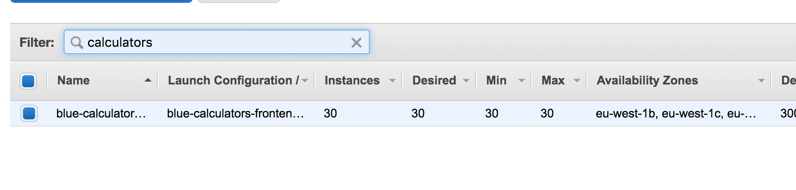
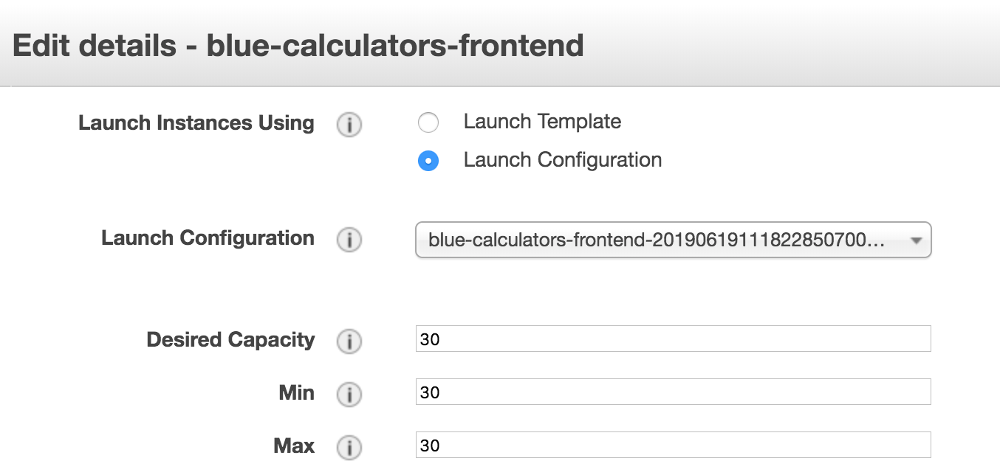

In AWS, [we use auto scaling groups][asg] to ensure we have the right number of
machines available to handle incoming traffic.

Unfortunately there are a number of limitations with the system currently which
means we can't use it to automatically scale up the number of machines.
However, we can manually scale up the number of machines in advance if we
anticipate an increase in traffic. This was used effectively after we deployed
the ["Get ready for Brexit" tool][brexit-tool] to ensure we would cope with
the load.

[asg]: https://docs.aws.amazon.com/autoscaling/ec2/userguide/AutoScalingGroup.html
[brexit-tool]: https://www.gov.uk/get-ready-brexit-check

## Manually scaling up/down

1. Scaling up/down machines in AWS will trigger [Icinga alerts](icinga) so let
   developers in `#govuk-2ndline` know you are about to do this.

1. [Access the AWS Console](/manual/access-aws-console.html) and [go to the EC2 service][ec2-home].

1. Select "Auto Scaling Groups" from the bottom of the menu on the left hand
   side and find the right machine class in the list (you can filter on the
   name).

   

### Changing the size of the ASG

> **Note:** If you anticipate this change being permanent, you [should make
> sure to raise a PR against govuk-aws-data][pr] once it's all working to
> ensure the number doesn't get put back to the old value if Terraform gets
> deployed.

1. In the "Details" tab at the bottom, you will see "Desired Capacity", "Min"
   and "Max" which shows the existing configuration. Scroll right and then
   click on the "Edit" button.

1. In the box that appears, change the numbers as required. To ensure you get
   the right number of machines you want, it's best to change all three numbers
   to the same value.

   

1. Click "Save".

1. If you have:

   1. increased the number of instances (a.k.a scale out):

        This should trigger the creation of new machines and
        automatically run the appropriate [`Deploy_Node_Apps`][deploy-node-apps]
        jobs.

        To check the machines are recognised, you can [use
        `govuk_node_list -c <class>` on the jumpbox][jumpbox] and check the IP
        addresses printed match those in the [EC2 machine listing][ec2-machines]
        (you can filter the listing by machine class and sort by the date created).

        If any of the machines aren't recognised by `govuk_node_list` you can
        [destroy the machine][reprovision] and wait for a new one to spawn.

   2. decreased the number of instances (a.k.a scale in):

        The number of instances to be terminated will be equally distributed
        among the 3 availability zones.

        Before any instance is terminated, any active connection through the
        load balancer(s) associated with the instance will be drained so that
        the instance can be terminated without negative impact on user traffic.
        For e.g. there should be no HTTP 5xx errors when an instance is terminated
        via autoscaling scale in.

        You may want to speed up the removal of terminated instances in Icinga
        by following the documentation
        [here](https://docs.publishing.service.gov.uk/manual/remove-machines.html)

### Removing a specific instance

You may want to remove a specific instance from the ASG if it is
having problems.

1. In the "Instances" tab at the bottom, you will see a list of
   instances.  Select the instance you want to remove, and click
   "Detach" in the "Actions" drop-down.

2. In the box that appears, check "Add a new instance to the Auto
   Scaling group to balance the load" and confirm that you want to
   detach the instance.

> **Note:** The removed instance will stick around, so make sure to
> terminate it when you no longer need it.

[icinga]: /manual/icinga.html
[ec2-home]: https://eu-west-1.console.aws.amazon.com/ec2/home?region=eu-west-1
[ec2-machines]: https://eu-west-1.console.aws.amazon.com/ec2/v2/home?region=eu-west-1#Instances:sort=tag:Name
[jumpbox]: /manual/howto-ssh-to-machines.html
[deploy-node-apps]: https://deploy.blue.production.govuk.digital/job/Deploy_Node_Apps/
[reprovision]: /manual/reprovision.html#aws
[pr]: https://github.com/alphagov/govuk-aws-data/pull/562
