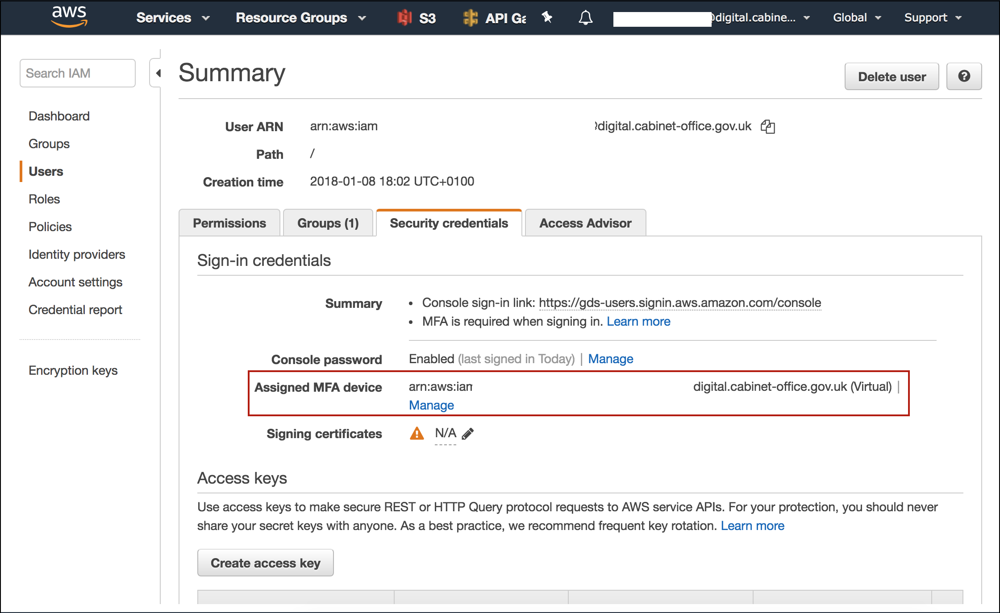
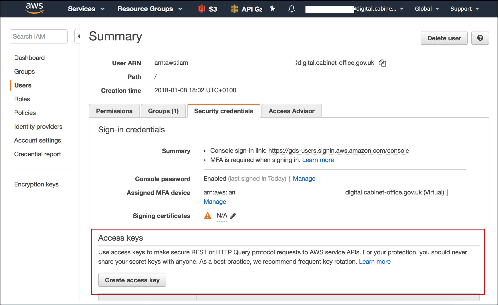

💡 Before you can access something in AWS, you [need to set up your AWS
account][set-up-account].

---

## 1. Create `~/.aws/config`

1. You can find the `role_arn` in the ["Role ARN" table][secret-docs]
1. You can find your `mfa_serial` under "Assigned MFA device" in your user
   profile [in the AWS Console][aws-console], under the [IAM
   service][iam-service]:

  

Create `~/.aws/config`:

```ini
[profile govuk-<environment>]
source_profile = gds
role_arn = <Role ARN>
mfa_serial = <MFA ARN>

[profile gds]
region = eu-west-1
```

## 2. Create `~/.aws/credentials`

First, create a pair of [access keys][access-keys].



Create `~/.aws/credentials`:

```ini
[gds]
aws_access_key_id = <access key id>
aws_secret_access_key = <secret access key>
```

## 3. Test it! 🚀

To test your configuration run:

```
aws --profile govuk-integration s3 ls
```

You should be prompted for an MFA token. If successful, you should receive some
output.

[set-up-account]: /manual/set-up-aws-account.html
[aws-console]: /manual/aws-console-access.html
[iam-service]: https://console.aws.amazon.com/iam/home?#/users
[secret-docs]: https://github.com/alphagov/govuk-aws-data/blob/master/docs/govuk-aws-accounts.md
[access-keys]: https://docs.aws.amazon.com/general/latest/gr/aws-sec-cred-types.html#access-keys-and-secret-access-keys
