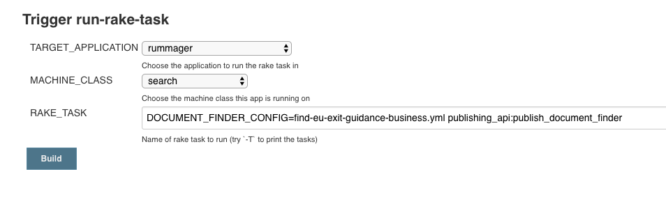

*If you are trying to update the content returned by the business readiness finder, see: [Updating content for the business readiness finder](/manual/business-readiness-update-content.html)*

The full journey for the  [business readiness finder][business-readiness-finder] is made up of the following content items:

1. The start page: [`/business-uk-leaving-eu`](https://www.gov.uk/business-uk-leaving-eu)
2. The Q&A: [`/prepare-business-uk-leaving-eu`](https://www.gov.uk/prepare-business-uk-leaving-eu)
3. The finder: [`/find-eu-exit-guidance-business`](https://www.gov.uk/find-eu-exit-guidance-business)

The content for the start page can be updated in Mainstream Publisher as you would any other start page.

The content item for the Q&A doesn't actually contain any details. The titles of the questions are defined in a YAML file in [finder frontend][finder-frontend]. However the body of the question, for example the options if the question is a checkbox, are read from the content item of the finder itself (content item 3 in the list). Finder frontend searches the content item for a facet "key" that matches the question, e.g. `sector_business_area` to find the question content.

The content item for the finder is updated from a [YAML file][govuk-app-deployment-secrets]. Any changes to this YAML file affect both the facets in the finder and the options in the Q&A.

## Updating question titles

1. Update the content of the YAML file in [finder frontend][finder-frontend]
2. Merge and deploy the changes

## Updating the business readiness finder

The content item for the business readiness finder is published by rummager. However the actual config is read in from [govuk-app-deployment-secrets][govuk-app-deployment-secrets].

1. Update [govuk-app-deployment-secrets][govuk-app-deployment-secrets]
2. Merge the changes to [govuk-app-deployment-secrets][govuk-app-deployment-secrets]
3. Re-deploy Rummager so it can pick up the changes in [govuk-app-deployment-secrets][govuk-app-deployment-secrets]

  N.B. If you have made changes to the facets, you may also need to re-deploy email-alert-api and finder-frontend

4. Run the `publishing_api:publish_document_finder` [rake task][staging-rake-task] in rummager to publish the changes:

    

5. If you are making changes to the schema, you may also need to [reindex elasticsearch](/manual/reindex-elasticsearch.html).

[business-readiness-finder]: https://www.gov.uk/find-eu-exit-guidance-business
[finder-fronted]: https://github.com/alphagov/finder-frontend/blob/3d7f25ddca4bedd9d9fb750fb1d651964cf2a34b/lib/prepare_business_uk_leaving_eu.yaml
[govuk-app-deployment-secrets]: https://github.com/alphagov/govuk-app-deployment-secrets/blob/9a39969d504543e040ffc1afc70924e23d249033/shared_config/find-eu-exit-guidance-business.yml
[staging-rake-task]:https://deploy.staging.publishing.service.gov.uk/job/run-rake-task/parambuild/?TARGET_APPLICATION=rummager&MACHINE_CLASS=search&RAKE_TASK=DOCUMENT_FINDER_CONFIG=find-eu-exit-guidance-business.yml%20publishing_api:publish_document_finder
