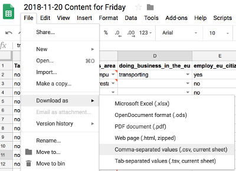
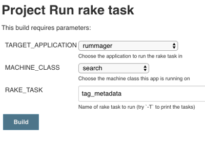

The [business readiness finder][business-readiness-finder] relies on metadata tags in rummager to filter content.

## Updating content

Content is curated and added to a [spreadsheet][] by the content team. Developer help is needed to upload the content. We do this by converting the spreadsheet into a CSV, including it in [govuk-app-deplopment-secrets][govuk-app-deployment-secrets] and then releasing rummager.

The process of converting the spreadsheet into a CSV involves removing a header row and converting windows encoded line breaks if present.  There is a [script](https://github.com/alphagov/govuk-app-deployment-secrets/blob/master/bin/prep_csv) to do this.

1. Make sure the “List of documents with facets” tab is selected and download the spreadsheet as csv:

    

2. `cd govuk-app-deployment-secrets`
3. `bin/prep_csv ~/Downloads/your-downloaded-file.csv`
4. Create a pull request and get it reviewed & merged.
5. Re-deploy rummager/search-api and email-alert-api via Jenkins.
6. Run the `tag_metadata` rake task in rummager/search-api to index the contents of the new CSV, it should take 2 to 3 minutes:
    * [integration][tag_metadata_integration]
    * [staging-aws (search-api)][tag_metadata_staging_aws]
    * [production (rummager)][tag_metadata_production_r] *and* [production (search-api)][tag_metadata_production_sa]

    

7. Check the results on e.g. [https://www-origin.integration.publishing.service.gov.uk/find-eu-exit-guidance-business](https://www-origin.integration.publishing.service.gov.uk/find-eu-exit-guidance-business)

> These requests often come in through Zendesk and for pages that have only been created that same day, so you may only be able to check this in production.


## Removing content from the business readiness finder

If your commit includes some items being removed from the content spreadsheet then you should take a note of the `base_paths` for these items and once you have run the `tag_metadata` rake task in the above instructions, you should also run [destroy_metadata_for_base_paths][destroy-metadata] ([e.g. on staging][metadata-rake-task]), passing in the `base_paths` that need removing.

There are also other useful [rake tasks][rake_tasks]. Remember to redeploy apps and re-run the `tag_metadata` task as above.

## Pinning content to sections in the business readiness finder

Requests from Zendesk can specify that content is pinned within the finder. Pinning an item means that it appears at the top of whatever business finder facet(s) it is tagged to. The process for adding a pinned item:

1. Using the base path of the content item to be pinned, get the content id. You can do this via the publishing-api:
```Edition.includes(:document).where(base_path: paths).pluck(:content_id).uniq```
2. Add the content id to the list of [ordered related items for the business finder](https://github.com/alphagov/govuk-app-deployment-secrets/blob/master/shared_config/find-eu-exit-guidance-business.yml#L222-L244), within govuk-app-deployment-secrets.  Despite the name, the order of the `ordered_related_items` does not matter.
3. Create a pull request and get it reviewed & merged.
4. Re-deploy rummager.
5. Update the finder content by running the [`tag_metadata` rake task][staging-rake-task] in rummager to index the contents of the new CSV, it should take 2 to 3 minutes.
6. [Republish the finder][republish_finder] so that the finder content item is updated.
7. Check the results on e.g. [https://www-origin.integration.publishing.service.gov.uk/find-eu-exit-guidance-business](https://www-origin.integration.publishing.service.gov.uk/find-eu-exit-guidance-business)

The same process applies for removing a pinned item: get the content item and remove it from the list within the ordered-related items.

[govuk-app-deployment-secrets]: https://github.com/alphagov/govuk-app-deployment-secrets
[destroy-metadata]: https://github.com/alphagov/rummager/blob/605b08bc96999b58d3a5eb57967ffc7a8de1e41c/lib/tasks/metadata_tagger.rake#L9
[metadata-rake-task]: https://deploy.staging.publishing.service.gov.uk/job/run-rake-task/parambuild/?TARGET_APPLICATION=rummager&MACHINE_CLASS=search&RAKE_TASK=destroy_metadata_for_base_paths
[business-readiness-finder]: https://www.gov.uk/find-eu-exit-guidance-business
[spreadsheet]: https://docs.google.com/spreadsheets/d/1bFSDYFT5fBpDQTvAeqw4j7QhYXTnFmDuGCLGDwx-wYk/edit#gid=372225498
[tag_metadata_integration]: https://deploy.integration.publishing.service.gov.uk/job/run-rake-task/parambuild/?TARGET_APPLICATION=rummager&MACHINE_CLASS=search&RAKE_TASK=tag_metadata
[tag_metadata_staging_aws]: https://deploy.blue.staging.govuk.digital/job/run-rake-task/parambuild/?TARGET_APPLICATION=search-api&MACHINE_CLASS=search&RAKE_TASK=tag_metadata
[tag_metadata_production_r]: https://deploy.publishing.service.gov.uk/job/run-rake-task/parambuild/?TARGET_APPLICATION=rummager&MACHINE_CLASS=search&RAKE_TASK=tag_metadata
[tag_metadata_production_sa]: https://deploy.blue.production.govuk.digital/job/run-rake-task/parambuild/?TARGET_APPLICATION=search-api&MACHINE_CLASS=search&RAKE_TASK=tag_metadata
[rake_tasks]: https://github.com/alphagov/rummager/blob/master/lib/tasks/metadata_tagger.rake#L18
[republish_finder]: https://docs.publishing.service.gov.uk/manual/business-readiness-publish-changes.html#updating-the-business-readiness-finder
