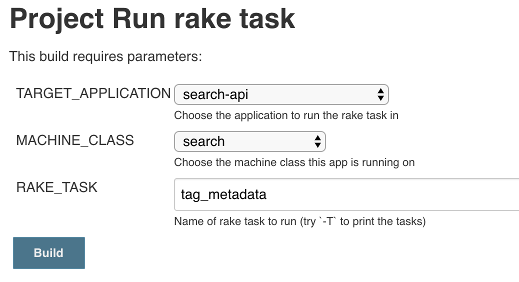

The [business readiness finder][business-readiness-finder] relies on metadata tags in rummager to filter content.

## Updating content

Content is curated and added to a [spreadsheet][] by the content team. Developer help is needed to upload the content. We do this by converting the spreadsheet into a CSV, including it [govuk-app-deplopment-secrets][govuk-app-deployment-secrets] and then releasing rummager.

The process of converting the spreadsheet into a CSV involves removing a header row and converting windows encoded line breaks if present.

1. Clone https://github.com/alphagov/govuk-app-deployment-secrets and create a new branch (the rest of the instructions assume you’ve cloned this to ~/govuk/govuk-app-deployment-secrets)
2. Download the spreadsheet as csv (choose the “List of documents with facets” tab)

    

3. Copy the downloaded spreadsheet into  ~/govuk/govuk-app-deployment-secrets/shared_config Note: it’s not a good idea to overwrite business_readiness.csv just yet, because if you need to use the `tr` command below, it will output an empty file if passed the same filename for input and output.

4. Remove the header row!!!!!

5. Remove windows encoded line breaks if present. You can do this as follows:

    5.1. From a command prompt (assumes your file is called “downloaded_file.csv”):

    ```bash
    file downloaded_file.csv
    ```

    5.2 If the output includes “with CRLF line terminators”

    ```bash
    tr -d '\r' < downloaded_file.csv > business_readiness.csv
    ```

    5.3 If the output did not include "with CRLF line terminators"

    ```bash
    mv downloaded_file.csv business_readiness.csv
    ```

6. Continue normal git development workflow and raise a PR

7. Once your PR is reviewed and merged, you’ll need to re-release rummager and email-alert-api to make the new content live.

8. Rummager loads the csv at startup so visit the finder once you’ve released to make sure it is still serving correctly: https://www-origin.integration.publishing.service.gov.uk/find-eu-exit-guidance-business

    >REMEMBER - on integration, merging a PR into master for email-alert-api or rummager will automatically release the apps to the integration environment.

9. Although the metadata is loaded into memory in rummager, the new content won’t actually be pushed to the Elasticsearch index yet. To do this, you need to run a rake task ([e.g. on staging][staging-rake-task]). You need the `tag_metadata` task against `rummager` on a `search` box (it should take around 2 to 3 minutes):

    

## Removing content from the business readiness finder

If the diff includes some items being removed from the content spreadsheet then you should take a note of the `base_paths` for these items and once you have run the `tag_metadata` rake task in the above instructions, you should also run [destroy_metadata_for_base_paths][destroy-metadata] ([e.g. on staging][metadata-rake-task])passing in the `base_paths` that need removing.

[govuk-app-deployment-secrets]: https://github.com/alphagov/govuk-app-deployment-secrets
[destroy-metadata]: https://github.com/alphagov/rummager/blob/605b08bc96999b58d3a5eb57967ffc7a8de1e41c/lib/tasks/metadata_tagger.rake#L9
[metadata-rake-task]: https://deploy.staging.publishing.service.gov.uk/job/run-rake-task/parambuild/?TARGET_APPLICATION=rummager&MACHINE_CLASS=search&RAKE_TASK=destroy_metadata_for_base_paths
[business-readiness-finder]: https://www.gov.uk/find-eu-exit-guidance-business
[spreadsheet]: https://docs.google.com/spreadsheets/d/1bFSDYFT5fBpDQTvAeqw4j7QhYXTnFmDuGCLGDwx-wYk/edit#gid=372225498
[staging-rake-task]: https://deploy.staging.publishing.service.gov.uk/job/run-rake-task/parambuild/?TARGET_APPLICATION=rummager&MACHINE_CLASS=search&RAKE_TASK=tag_metadata
