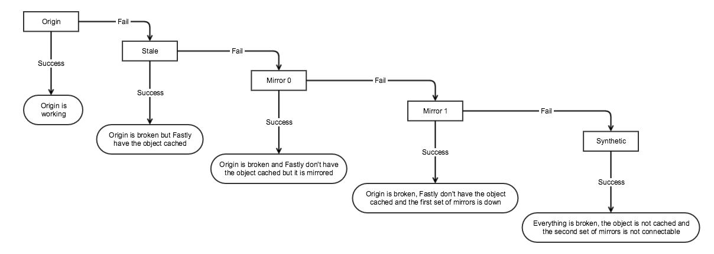

GOV.UK uses Fastly as a CDN. Citizen users aren't accessing GOV.UK servers
directly, they connect via the CDN. This is better because:

- The CDN "edge nodes" (webservers) are closer to end users. Fastly has
  servers all around the world but our "origin" servers are only in the UK.
- It reduces load on our origin. Fastly uses Varnish to cache responses.

The CDN is responsible for retrying requests against the
[static mirror](/manual/fall-back-to-mirror.html).



## CDN configuration

Most of the CDN config is versioned and scripted:

- [CDN configuration](https://github.com/alphagov/govuk-cdn-config/)
- [CDN config secrets](https://github.com/alphagov/govuk-cdn-config-secrets)

These are deployed to [integration][integration_cdn], [staging][staging_cdn]
and [production][production_cdn].

Some configuration isn't scripted, such as logging. The www, bouncer and assets
services sends logs to S3 and stream them to `monitoring-1`. These logging
endpoints are configured directly in the Fastly UI. There is
[documentation](/manual/query-cdn-logs.html) on how to query the CDN logs.

[integration_cdn]: https://deploy.integration.publishing.service.gov.uk/job/Deploy_CDN/
[staging_cdn]: https://deploy.staging.publishing.service.gov.uk/job/Deploy_CDN/
[production_cdn]: https://deploy.publishing.service.gov.uk/job/Deploy_CDN/

## Fastly Caching

The main www.gov.uk cache is
[Varnish](https://varnish-cache.org/docs/2.1/index.html), which Fastly run for
us.

Varnish lets us configure our caching logic with VCL (Varnish config language).

It also lets us do fancy things, like [only allowing connections to staging from permitted IPs](https://github.com/alphagov/govuk-cdn-config/blob/master/vcl_templates/www.vcl.erb#L193), [forcing SSL](https://github.com/alphagov/govuk-cdn-config/blob/master/vcl_templates/www.vcl.erb#L214) and [blocking IP addresses](https://github.com/alphagov/govuk-cdn-config/blob/master/vcl_templates/www.vcl.erb#L200), among other things.

We set a default TTL of 3600s on cached objects. This means that pages such as
the GOV.UK homepage will be cached for 1 hour. 5XX responses get cached for
1s; mirror responses get cached for 15 minutes.

We also set a grace period of 24 hours. So if the homepage server is down,
we'll continue to serve a stale homepage for 24 hours.

We will cache any non-GET/HEAD request that returns a 404 or 405 status for the
default TTL. This means (for example) that a POST request that returns a 405
(Method Not Allowed) will be cached.

These are the GET request status codes that Varnish caches automatically:
200, 203, 300, 301, 302, 404 or 410. See the [Varnish docs](https://varnish-cache.org/docs/2.1/reference/vcl.html#variables)
for more detail. We have added to these: see the [repo](https://github.com/alphagov/govuk-cdn-config)
VCL for special handling of certain status codes, and for the most up-to-date
version of what we're running in Fastly.
Refer to the Varnish 2.1 documentation when looking at the VCL code.

**Testing VCL**

VCL can be tricky to get right. When making changes to the VCL, add smoke tests
[to smokey](https://github.com/alphagov/smokey/blob/master/features/caching.feature)
and check that they don't fail in staging.

You can also use Fastly's [Fiddle tool](https://fiddle.fastlydemo.net/) to
manually test, and you can also test your changes with cURL by including a
debug header:

```sh
$ curl -svo /dev/null -H "Fastly-Debug:1" https://www.gov.uk
```

This will give you various debugging headers that may be useful:

```
< Fastly-Debug-Path: <nodes you hit>
< Fastly-Debug-TTL: <nodes with TTL>
< Fastly-Debug-Digest: <hash>
< X-Served-By: <node that responded>
< X-Cache: HIT, HIT
< X-Cache-Hits: 1
< X-Timer: <time it took>
< Vary: Accept-Encoding, Accept-Encoding
```

See the Varnish/Fastly docs for what these mean. Check out the Fastly
[debugging guide](https://docs.fastly.com/guides/debugging/checking-cache#using-curl)
for more details on testing.

## Fastly's IP ranges

Fastly publish their cache node
[IP address ranges as JSON from their API][fastly_ips]. We use these IP
addresses in 2 places:

- Origin has [firewall rules][] in place so that only our office and Fastly
  can connect.
- Our [Fastly Varnish config][vcl_config] restricts HTTP purges to specific
  IP addresses (otherwise anyone would be able to purge the cache).

We have [a Jenkins job "Check CDN IP Ranges"][check-cdn-ip-ranges] which will
start to fail if our Fastly IPs don't match the IPs returned from the Fastly
API. If you see this alert, you can
[let Reliability Engineering know][raise-with-re] and they will update our
list of Fastly IPs to match the ones listed by Fastly.

Updating the firewall rules in Carrenza with new Fastly IPs used to be done by
committing the change to the govuk-provisioning repo and to then deploy the
firewall through a jenkins job. This process is broken at the moment since the
code base has diverged from the state of the firewall, while this is remedied
we have to add the new rules manually, this is how to do it:

1. You will need to install [vcd-cli][vcd-cli] to use the following scripts.
2. Connect to the [Carrenza VPN][carrenza-vpn]
3. Login to Vcloud director, you can find the organisation name and the credentials
attached to it in the password store.

```bash
vcd login vcloud.carrenza.com {organisation} 2nd-line-support@digital.cabinet-office.gov.uk -V 32.0
```

4. Find the correct values for $stag_prefix and $prod_prefix in Carrenza and run this script, setting env to either staging or production and put the list
of new Fastly IP ranges into fastly_ips as an array

```bash
env=$1
fastly_ips=()

case $env in
        "staging")
                dests=(${stag_prefix}.146 ${stag_prefix}.158 ${stag_prefix}.155 ${stag_prefix}.155 ${stag_prefix}.155 ${stag_prefix}.157 ${stag_prefix}.149)
                gateway='0e7t-DR-GOVUK-Staging-gateway-LDN'
                ;;
        "production") 
                dests=(${prod_prefix}.82 ${prod_prefix}.94 ${prod_prefix}.91 ${prod_prefix}.91 ${prod_prefix}.91 ${prod_prefix}.93 ${prod_prefix}.85)
                gateway='0e7t-GOV_PRODUCTION-gateway01'
                ;;
        *)
                echo "Environment should either be staging or production"
                exit 1
                ;;
esac

ports=(443 443 6514 6515 6516 80 443)
names=(origin API monitoring-1_GOV.UK monitoring-1_Assets monitoring-1_Bouncer apt_mirror Backend_AWS)

nb_rules=$(( ${#fastly_ips[@]} * 7 ))
for i in $(seq $nb_rules $END)
do
        vcd gateway services firewall create --disabled --name "NewRule_$i" --action accept --type user $gateway
done

newrules_ids=(`vcd gateway services firewall list $gateway | grep 'NewRule_' | awk '{print $1'}`)

seq=0
for ip in ${fastly_ips[@]}
do
        for i in `seq 0 6`
        do
                name="'Fastly $ip to ${names[$i]}'"
                vcd gateway services firewall update --enabled --name $name --source $ip:ip --destination ${dests[$i]}:ip --service tcp any ${ports[$i]} $gateway ${newrules_ids[$seq]}
                seq=$((seq+1))
        done    
done
```

[fastly_ips]: https://api.fastly.com/public-ip-list
[firewall rules]: https://github.com/alphagov/govuk-provisioning/blob/master/vcloud-edge_gateway/vars/production_carrenza_vars.yaml
[vcl_config]: https://github.com/alphagov/govuk-cdn-config/
[check-cdn-ip-ranges]: https://deploy.publishing.service.gov.uk/job/Check_CDN_IP_Ranges/
[raise-with-re]: raising-issues-with-reliability-engineering.html
[vcd-cli]: https://github.com/vmware/vcd-cli
[carrenza-vpn]: https://docs.publishing.service.gov.uk/manual/connect-to-vcloud-director.html#connecting-with-cisco-anyconnect

## Banning IP addresses at the CDN edge

We occasionally decide to ban an IP address at our CDN edge if they exhibit the
following behaviour:

- not respecting [our robots.txt directives][robots]
- repeatedly receiving 429 (rate limit) error responses from origin and not
  slowing down
- making suspicious requests like attempting SQL injection queries

[robots]: https://www.gov.uk/robots.txt

Banning IPs shouldn't be taken lightly as IP address can be shared my multiple
user devices and the user behind an IP address can change over time, so there's
always a chance that we may block a legitimate user when we ban IP addresses.

You can change the list of banned IP addresses by modifying the
[YAML config file][ip_ban_config] and [deploying the configuration][ip_ban_deploy].

[ip_ban_config]: https://github.com/alphagov/govuk-cdn-config-secrets/blob/master/fastly/dictionaries/config/ip_address_blacklist.yaml
[ip_ban_deploy]: https://deploy.publishing.service.gov.uk/job/Update_CDN_Dictionaries/build

## Bouncer's Fastly service

A Fastly CDN service can normally handle up to 1000 domains (this limit was
undocumented).

We have asked them to increase this limit for Bouncer's service a few times as
the number of domains it handled grew, and the limit is
[currently 3500](https://fastly.zendesk.com/requests/7356). We have
[about 2000 domains](https://transition.publishing.service.gov.uk/hosts)
so shouldn't need to increase it again for a while.

If we reach the limit then the [Jenkins job to update Bouncer's CDN
config](https://deploy.publishing.service.gov.uk/job/Bouncer_CDN/) should fail
and new domains won't be added to the service.

Configuring a new site in Transition generally adds at least 4 domains to the
service, including the `aka` domain for each real domain. For example:

-   `www.foo.gov.uk`
-   `aka.foo.gov.uk`
-   `foo.gov.uk`
-   `aka-foo.gov.uk`

### New solution for Bouncer and Fastly

Fastly's new solution to get around the domain limit is a "service pinned map".

They have created a map which we access using
`bouncer-cdn.production.govuk.service.gov.uk`.
Domains that need to be transitioned can `CNAME` to this domain. It also has
4 IP addresses assigned, which at the time of writing are the same as the `A`
records at that hostname:

- `151.101.2.30`
- `151.101.66.30`
- `151.101.130.30`
- `151.101.194.30`

Domains do not need to be added to the "Production Bouncer" Fastly service
like they used to be.
