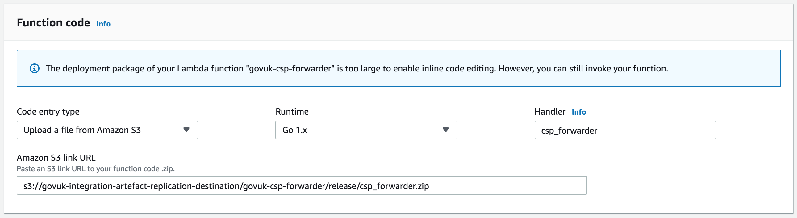
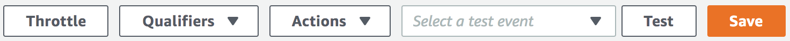
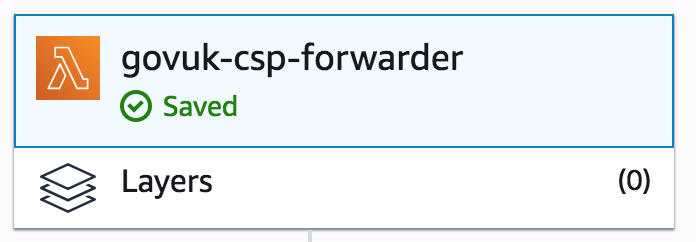

Content Security Policy (CSP) is a browser standard to prevent cross-site scripting (XSS), clickjacking and other code
injection attacks resulting from execution of malicious content in the context of another website. A policy, determining
which stylesheets, scripts and other assets are allowed to run, is sent with every request and is parsed and enacted by
the browser.

CSP can be run in two modes - *report only*, where violations of the policy are reported to a given endpoint but
allowed to execute, and *enforcement*, where violations are blocked.

## How the policy is set

The specific policy that is sent with a request to the browser as an HTTP header is defined in the
[`govuk_app_config` gem](https://github.com/alphagov/govuk_app_config/blob/master/lib/govuk_app_config/govuk_content_security_policy.rb)
which is included in all frontend apps. This central definition means the entire site has a single policy,
and changes can be rolled out more easily.

Each frontend app has an [initialiser](https://github.com/alphagov/government-frontend/blob/master/config/initializers/csp.rb)
which invokes the CSP setting code in the gem.

## How violations are reported

In all production-like environments (production, staging, integration), CSP is running in report only mode while more
information is gathered about which parts of the site currently rely on behaviour that would be blocked by an enforced
CSP.

In other environments such as development and test, CSP is running in enforcement mode to allow errors to be captured
at an early stage.

In report only mode, all violations are reported to an endpoint defined in the policy. This endpoint URL points to an
AWS Lambda function running [`govuk-csp-forwarder`](https://github.com/alphagov/govuk-csp-forwarder). This is a Go
app that receives CSP violation reports from browsers, performs some filtering, and forwards all other reports to
[Sentry](https://sentry.io/govuk/) where they are further filtered on the way in, and then logged.

The aim of the filtering steps is to remove a large amount of false positive reports that are generated when browser
extensions modify GOV.UK pages to inject custom scripts or other assets which violate the policy.

## How the CSP forwarder is built and deployed

Whenever a branch is merged into `master`, CI Jenkins runs the `Jenkinsfile` to build an artefact by compiling the
Go source code and compressing it into a zip file. This zip file is then uploaded to the
`govuk-integration-artefact-replication-destination` S3 bucket, which is in the `govuk-infrastructure-integration` AWS
account. The Lambda function itself runs in the `govuk-tools` AWS account.

This zip file can be uploaded to Lambda using the AWS console:

1. Log in to the AWS console
2. Select "Lambda" from the Services menu
3. Select the "EU (London)" region
4. Select the `govuk-csp-forwarder` function from the list
5. Scroll down to the "Function code" section
6. Select "Upload a file from Amazon S3" from the drop down menu
7. Paste the S3 URL in the text box - `s3://govuk-integration-artefact-replication-destination/govuk-csp-forwarder/release/csp_forwarder.zip`
   
8. Click the orange "Save" button on the top right-hand side
   
9. You should see a green "saved" text and tick on the Lambda function
   
