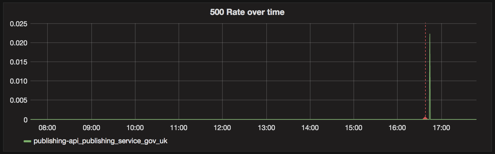
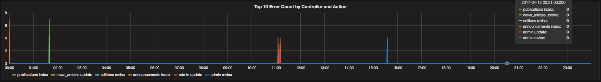
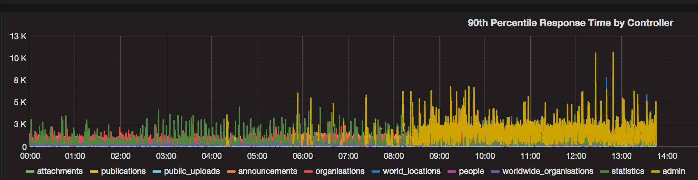

# Monitor your app during deployment

## Deployment Dashboards

There are a number of applications with a dashboard showing useful information for the deployment process.

They can be found in [Grafana](tools.html#grafana), and they are all named "Deployment dashboard - application name", such as [Deployment dashboard - whitehall](https://grafana.publishing.service.gov.uk/dashboard/file/deployment_whitehall.json).

The existing deployment dashboards are written by puppet every 30 minutes and loaded when Grafana starts. Don’t change them directly.

You can also see further tips on [how we use Graphite](graphite-and-deployment-dashboards.html) to present the data below.

## Panels

### Deployment and restart lines

These show/hide vertical lines on the other panels that show when events happened.

Implementation note:

Deployment lines use graphite [events](http://graphite.readthedocs.io/en/latest/events.html) data as deployment data in graphite's normal time-series format is not available in all environments.

### Processes - Last hour

This shows the number of processes running on each server. During a deployment, you should expect the number of processes to double and then return to normal (the number depends on the server).

You should only test your code when this has settled back to normal.

Implementation note:

We have converted nulls to 0 so that we can see when a server dies. Data is available for all ruby/rack services, but not python ones. YMMV with other languages.

### 500 Rate over time

Shows average error rate per one second bucket over the dashboard selected time range. This currently defaults to 24 hours but the you can change it.

Implementation note:

The Y-Axis on this graph depends on how the data is collected and sampled by graphite, and is not meaningful to users. It’s only showing you relative spikes in errors.

### Errors and 5XX counts

These show you the total number of errors and 5XXs over the last 5 minutes and the last 24 hours respectively.

Implementation note:

Warning (orange) and error (red) levels are confirgurable on per application basis using `warning_threshold` and `error_threshold`.

The reason for the long titles is we can’t alter the table column headings in Grafana.

### Links

Any additional links to monitoring services that we have not been able to add to the dashboard. Errbit currently links to the page showing all the applications for a given environment. Unfortunately we are not able to link to the application specific Errbit.

Icinga for general errors for a given environment. This should be checked prior to any deployments and also after once all processes count have returned to normal.

### Worker Failures

Shows the total number of errors across all the workers related to an application for 5 minute period and the total time range of the dashboard.

Note: If an application has no workers then this row is not displayed for that application’s dashboard.

### Worker Success

Shows the total number of successes across all the workers related to an application for 5 minute period and the total time range of the dashboard.

Note: If an application has no workers then this row is not displayed for that application’s dashboard.

### 5xx by Controller and Action

Graph showing the number of errors for a given controller and action over the dashboard time range.

### 90th Percentile Response by Controller

Graph showing the response time by controller over the dashboard time range.

## Deploy the Dashboards

Please refer to [add a deployment dashboard](add-deployment-dashboard.html) for details on adding/updating dashboards.
