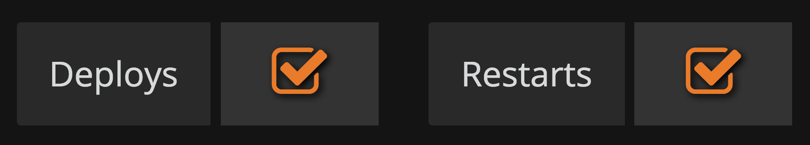
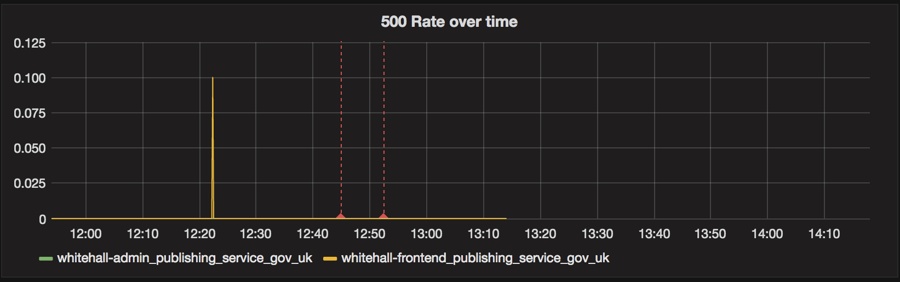
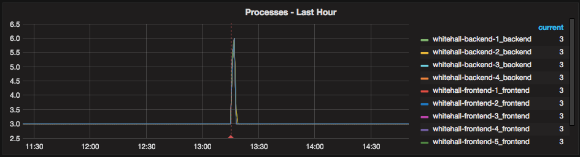
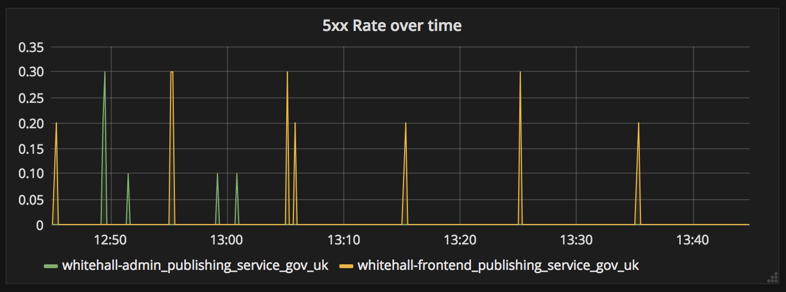
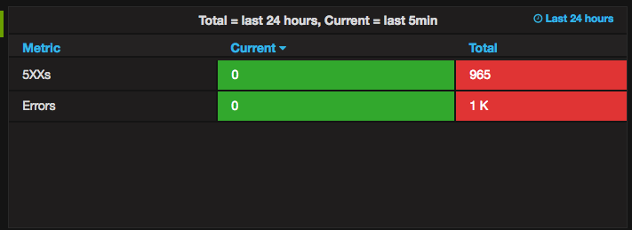
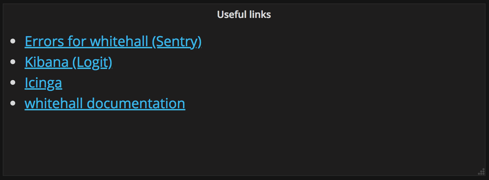
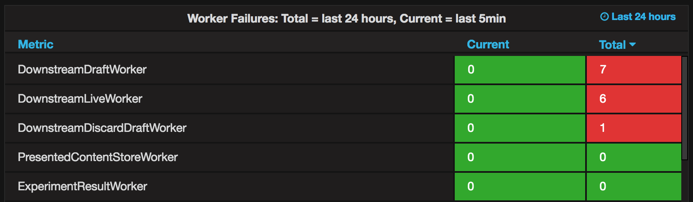
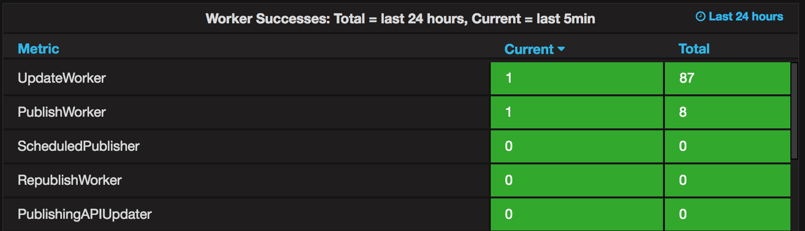
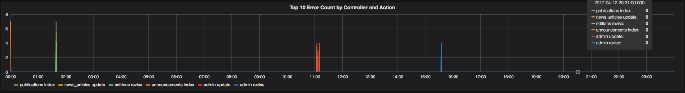
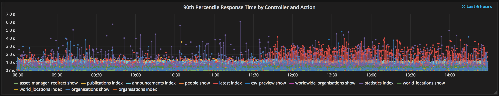

## Deployment Dashboards

There are a number of applications with a dashboard showing useful information for the deployment process.

They can be found in [Grafana](tools.html#grafana), and they are all named "Application dashboard - application name", such as [Application dashboard - Whitehall][whitehall-dashboard].

The existing deployment dashboards are written by Puppet every 30 minutes and loaded when Grafana starts. Don’t change them directly.

You can also see further tips on [how we use Graphite][graphite-dashboards] to present the data below.

## Panels

### Deployment and restart lines

These toggle vertical lines on the panels that show when events happened.

#### Implementation note

Deployment lines use Graphite [events][events] data as deployment data in Graphite's normal time-series format is not available in all environments.

### Processes

This shows the number of processes running on each server. During a deployment, you should expect the number of processes to double and then return to normal (the number depends on the server).

You should only test your code when this has settled back to normal.

####  Implementation note

We have converted `null`s to `0`s so that we can see when a server dies. Data is available for all ruby/rack services, but not python ones. It can be different with other languages.

### 5xx Rate over time

This shows average error rate per one second bucket over the dashboard selected time range. This currently defaults to 24 hours but you can change it.

#### Implementation note

The Y-axis on this graph depends on how the data is collected and sampled by Graphite, and is not meaningful to users. It only shows relative error spikes.

### Errors and 5XX counts

These show the total number of errors and `5XX`s over the last 5 minutes and over the last 24 hours, respectively.

#### Implementation note

Warning (orange) and error (red) levels are configurable on per application basis using `warning_threshold` and `error_threshold`.

The reason for the long titles is we can’t alter the table column headings in Grafana.

### Useful links

Icinga shows general errors for a given environment. It should be checked prior to any deployments and also after all processes count have returned to normal.

### Worker Failures

This shows the total number of errors across all the workers related to an application for 5 minute period and for the total time range of the dashboard.

> **Note:** If an application has no workers then this row is not displayed for that application’s dashboard.

### Worker Successes

This shows the total number of successes across all the workers related to an application for 5 minute period and for the total time range of the dashboard.

> **Note:** If an application has no workers then this row is not displayed for that application’s dashboard.

### Top 10 Error Count by Controller and Action

This shows the number of errors for a given controller and action over the dashboard time range.

### 90th Percentile Response by Controller and Action

This shows the 90th percentile response time by controller and action over the dashboard time range.

## Deploy the Dashboards

Please refer to [add a deployment dashboard][add-dashboard] for details on adding or updating dashboards.

[whitehall-dashboard]: https://grafana.publishing.service.gov.uk/dashboard/file/whitehall.json
[graphite-dashboards]: graphite-and-deployment-dashboards.html
[events]: http://graphite.readthedocs.io/en/latest/events.html
[add-dashboard]: add-deployment-dashboard.html
