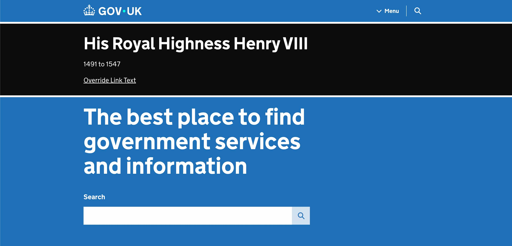
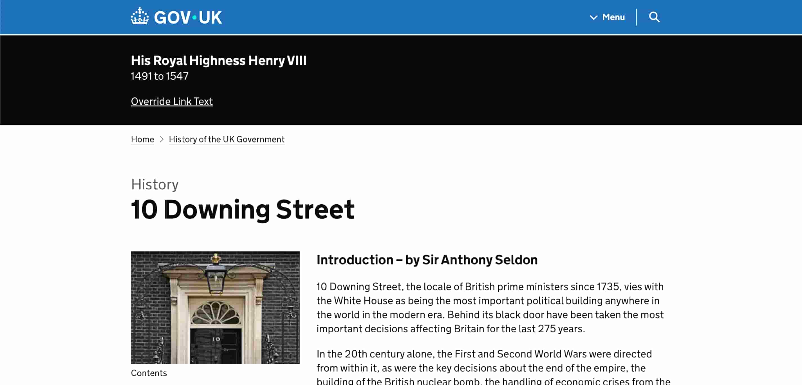
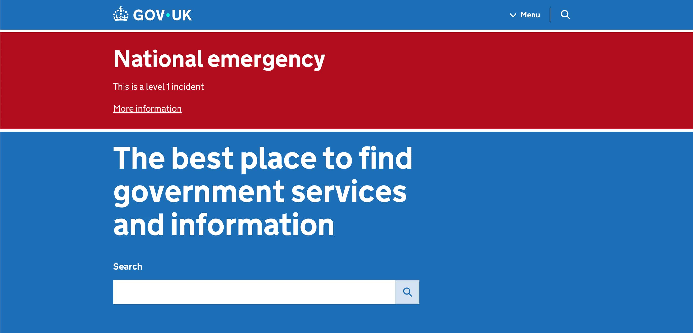
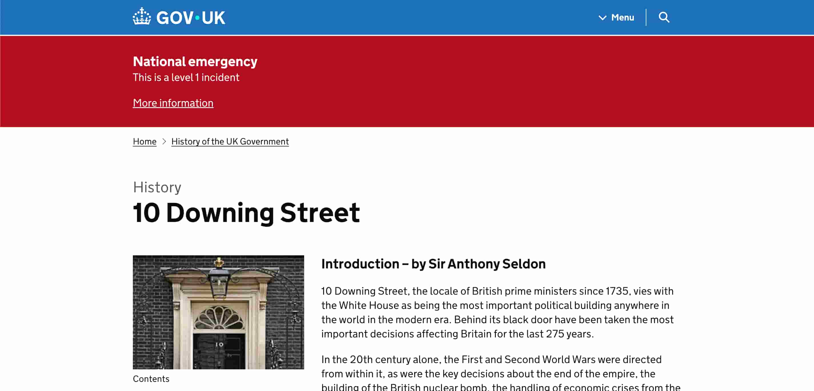
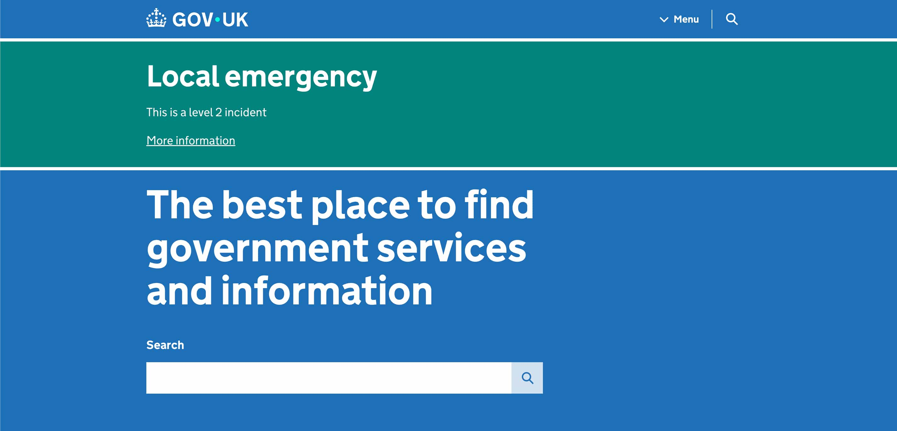
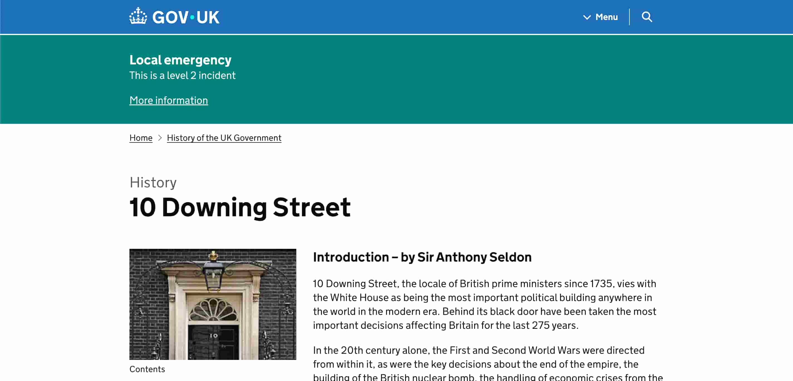

In emergencies, GOV.UK can display important information in a banner at the top
of each page of the website.

> There is also [a non-emergency sitewide banner](/manual/global-banner.html),
> used to convey important information on GOV.UK which is not deemed
> emergency-level information.

## When to deploy an emergency banner

GOV.UK publishes an emergency banner when there is:

- a notable death
- a national emergency
- a local emergency

The [GOV.UK Programme Team on-call](https://governmentdigitalservice.pagerduty.com/schedules/PCK3XB2) (also known as the Senior Management Team escalations contact) make the decision as to whether to deploy an emergency banner.

Whilst this used to be a developer task, it is now expected to be actioned by a GDS content designer (from Content Operations if in office hours, or the on-call content person if out of hours).
The content designer must have GDS Admin permission in Whitehall Publisher in order to deploy the emergency banner.

## Deploy an emergency banner

### 1. Obtain the content for the banner

The GOV.UK Programme Team on-call will provide:

- the [type of emergency banner](#types-of-emergency-banners):
  notable death, national emergency or local emergency.
- text for the heading

They may optionally also provide:

- text for the 'short description' (a sentence displayed under the heading)
- a URL for users to find more information (a relative URL if it's on www.gov.uk)
- alternative link text for the "More information" link

### 2. Deploy the banner

Navigate to one of the following locations in Whitehall Publisher and enter the details as provided:

- [Integration](https://whitehall-admin.integration.publishing.service.gov.uk/government/admin/emergency_banner)
- [Staging](https://whitehall-admin.staging.publishing.service.gov.uk/government/admin/emergency_banner)
- [Production](https://whitehall-admin.publishing.service.gov.uk/government/admin/emergency_banner)

### 3. Check that the banner works

Most GOV.UK pages have a cache `max-age` of 5 minutes. After deploying the
emergency banner you should expect to see the banner on all GOV.UK pages within
10 minutes.

Once the banner deployment completes:

1. Wait 1 minute to allow frontend application caches to expire.
1. Visit a page and add a cache-bust query string (a question mark followed by
   some random string of your choice) to the URL.
1. Don't forget to change the URL to reflect the environment (staging,
   production) that you are checking.
1. Wait 10 minutes, then check that the emergency banner is visible without the
   cache-bust string.

You must check that:

- the banner displays as expected
- the header, short description and link text are correct
- the link (if applicable) works
- the banner is the right colour: black for notable death, red for national
  emergency, green for local emergency

If the banner doesn't show, see [Troubleshoot the emergency banner](#troubleshoot-the-emergency-banner).

#### Some example pages to check

- [https://www.gov.uk/](https://www.gov.uk/) ([staging](https://www-origin.staging.publishing.service.gov.uk/))
- [https://www.gov.uk/financial-help-disabled](https://www.gov.uk/financial-help-disabled) ([staging](https://www-origin.staging.publishing.service.gov.uk/financial-help-disabled))
- [https://www.gov.uk/government/organisations/hm-revenue-customs](https://www.gov.uk/government/organisations/hm-revenue-customs) ([staging](https://www-origin.staging.publishing.service.gov.uk/government/organisations/hm-revenue-customs))
- [https://www.gov.uk/search](https://www.gov.uk/search) ([staging](https://www-origin.staging.publishing.service.gov.uk/search))

## Remove an emergency banner

Navigate to one of the following locations in Whitehall Publisher and press the "Remove banner" button:

- [Integration](https://whitehall-admin.integration.publishing.service.gov.uk/government/admin/emergency_banner)
- [Staging](https://whitehall-admin.staging.publishing.service.gov.uk/government/admin/emergency_banner)
- [Production](https://whitehall-admin.publishing.service.gov.uk/government/admin/emergency_banner)

> You must have GDS Admin permission for Whitehall Publisher in order to remove the emergency banner.

---

## Troubleshoot the emergency banner

### Background

- The information for the emergency banner is stored in a Redis key as a Ruby
  hash (key-value map).
- A [controller in
  Whitehall](https://github.com/alphagov/whitehall/blob/main/app/controllers/admin/emergency_banner_controller.rb)
  sets or removes the Redis key.
- The [govuk_web_banner](https://github.com/alphagov/govuk_web_banners) gem, included in frontend
  apps, is responsible for reading the data from Redis and rendering the banner into all pages. It
  caches the result from Redis for up to 60 seconds.

### The banner is not showing / not clearing

Usually this is because some cached content has not yet expired. This could be
in the frontend rendering apps or in your browser.

1. Double-check that you are looking at the right environment.
1. Use a fresh private/Incognito window so that your testing is not affected by
   browser state such as cookies or cache.
1. Check whether the banner appears on www-origin
   ([staging](https://www-origin.staging.publishing.service.gov.uk),
   [production](https://www-origin.production.publishing.service.gov.uk)). If
   the banner works on origin but not on www.gov.uk, wait 5 minutes then try
   again.
   - It is possible to [flush pages from the CDN
     cache](/manual/purge-cache). This
     should not be necessary unless there is a bug or misconfiguration in
     GOV.UK.
1. [Inspect the Redis key](#inspect-the-redis-key) to check whether the banner
   data was stored successfully.
1. Try forcing a redeploy of the app responsible for rendering the page you're looking at.
1. Try clearing the frontend memcache. Log into the AWS web console for the
   appropriate environment, find [frontend-memcached-govuk under Elasticache,
   Memcached
   clusters](https://eu-west-1.console.aws.amazon.com/elasticache/home?region=eu-west-1#/memcached/frontend-memcached-govuk)
   and press the Reboot button. The UI will ask you to confirm the request.

[Slimmer cache]: https://github.com/search?q=repo%3Aalphagov%2Fslimmer%20CACHE_TTL&type=code

### Inspect the Redis key

You can query Redis to check whether the banner data has been stored.

1. Open a Rails console for Frontend.

    ```bash
    kubectl -n apps exec -it deploy/frontend -- rails c
    ```

1. Retrieve the value of the Redis key.

    ```rb
    Redis.new.hgetall("emergency_banner")
    ```

    If an emergency banner is active, the value should look similar to:

    ```rb
    => {"campaign_class"=>"notable-death", "heading"=>"The heading", "short_description"=>"The short description", "link"=>"https://www.gov.uk", "link_text"=>"More information about the emergency"}
    ```

    If there is no banner, the value should be empty:

    ```rb
    => {}
    ```

---

## Types of emergency banners

### Death of a notable person

A large **black** banner is displayed on all GOV.UK pages, including the homepage.

The wording to use in the template will be the official title of the
deceased and the years of their life, for example 'His Royal Highness Henry VIII
1491 to 1547'. The text should link to their official biography.

#### GOV.UK Homepage



#### Other pages



### National emergency (level 1 or category 2)

A large **red** banner is displayed on all GOV.UK pages, including the homepage.

#### GOV.UK Homepage



#### Other pages



### Localised large-scale emergency (level 2 or category 1)

A large **green** banner is displayed on all GOV.UK pages, including the homepage.

These incidents will not be processed outside of business hours.

#### GOV.UK Homepage



#### Other pages


