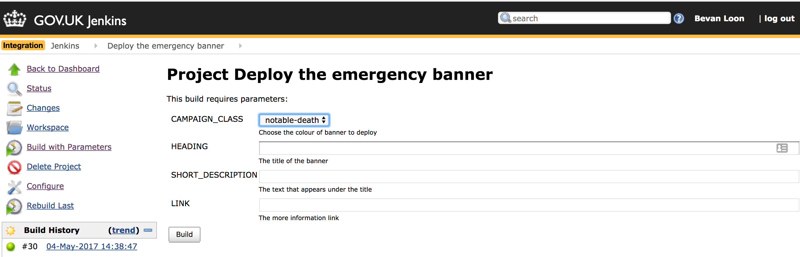
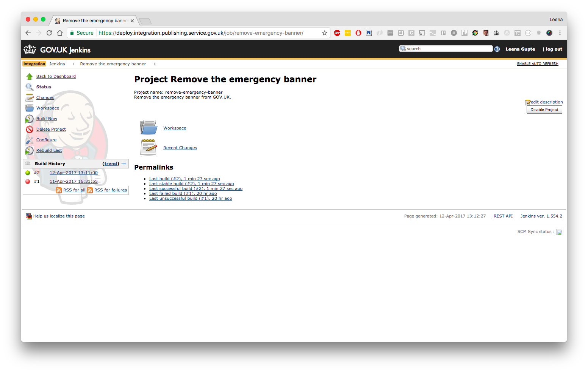
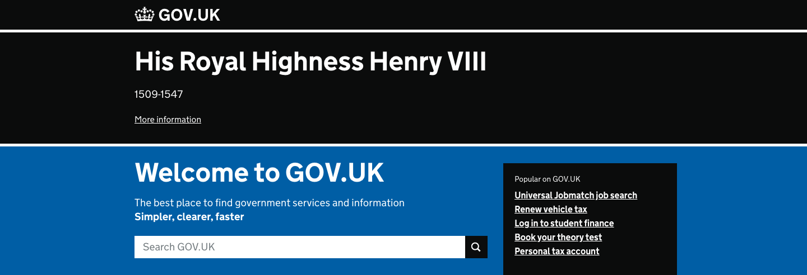
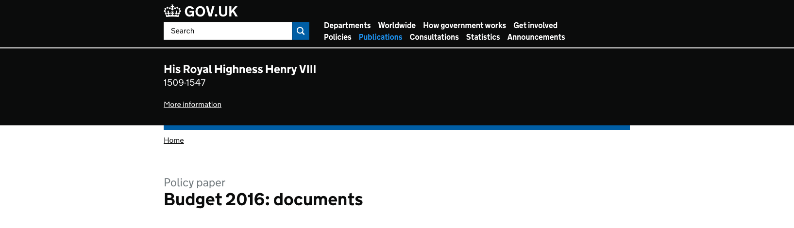
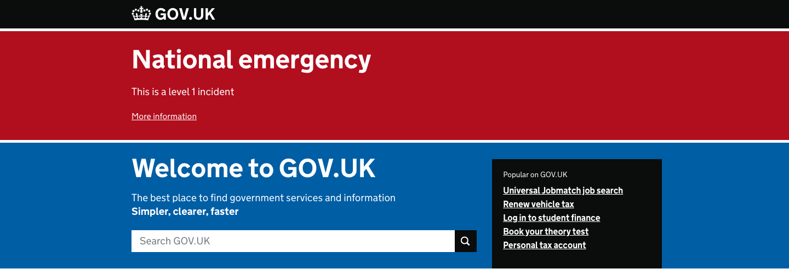
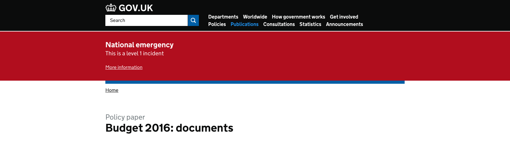
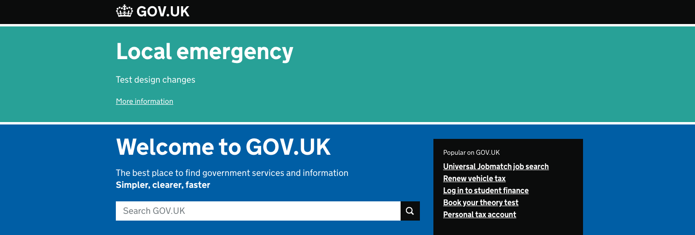
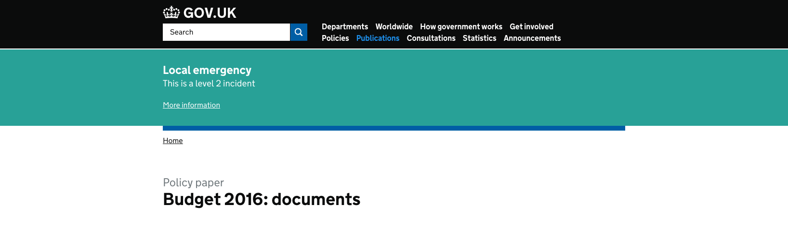

There are three types of events that would lead GOV.UK to add an emergency
banner to the top of each page on the web site; a notable death, a national
emergency or a local emergency.

The GOV.UK on-call escalations contact will tell you when you need to publish
an emergency banner. They will ensure that the event is legitimate and provide
you with the text for the emergency banner. They will also tell you what type
of event it is; you do not need to determine the type of event yourself.

If you need to publish the emergency banner out of hours, you will be
instructed to do so either by the GOV.UK on-call escalations contact or the
Head of GOV.UK.

Contact numbers for those people are in the [legacy Ops manual](https://docs.google.com/document/d/17XUuPaZ5FufyXH00S9qukl6Kf3JbJtAqwHR3eOBVBpI/edit).

## Adding emergency publishing banners

### 1. Get the content you will need

The GOV.UK on-call escalations contact will supply you with:

- The emergency banner type or campaign class (one of `notable-death`,
  `national-emergency` or `local-emergency`)
- Text for the heading.
- (Optional) Text for the 'short description', which is a sentence displayed under the heading. This is optional.
- (Optional) A URL for users to find more information (it might not be provided at first).
- (Optional) Link text that will be displayed for the more information URL (this will default to "More information" if you do not supply it).

### 2. Deploy the banner using Jenkins

The data for the emergency banner is stored in Redis. Jenkins is used to set the variables.

1. Go to the Jenkins task:
   - [Deploy the emergency banner on Integration](https://deploy.integration.publishing.service.gov.uk/job/deploy-emergency-banner/)
   - [Deploy the emergency banner on Staging](https://deploy.blue.staging.govuk.digital/job/deploy-emergency-banner/)
   - [⚠️ Deploy the emergency banner on Production ⚠️](https://deploy.blue.production.govuk.digital/job/deploy-emergency-banner/)

1. Click `Build with Parameters`.

1. Fill in the appropriate variables using the form presented by Jenkins.

1. Click `Build`.



> **Note**
>
> The Jenkins job will also clear all caches. The main page updates immediately, however whitehall and travel advice can take a couple of minutes before the banner appears.

### 3. Test with cache bust strings

Test the changes by visiting pages and adding a cache-bust string. Remember to change the URL based on the environment you are testing in (integration, staging, production).

For each page:

- Check the banner displays as expected
- Double-check the information for the header, short description and link are as they should be
- Test the link, if it is present
- Make sure the banner colour is appropriate - black for a notable death, red for a national emergency, green for a local emergency

Some example pages to check:

- [https://www.gov.uk/?ae00e491](https://www.gov.uk/?ae00e491) ([Integration](https://www-origin.integration.publishing.service.gov.uk/?ae00e491), [Staging](https://www-origin.staging.publishing.service.gov.uk/?ae00e491))
- [https://www.gov.uk/financial-help-disabled?7f7992eb](https://www.gov.uk/financial-help-disabled?7f7992eb) ([Integration](https://www-origin.integration.publishing.service.gov.uk/financial-help-disabled?7f7992eb), [Staging](https://www-origin.staging.publishing.service.gov.uk/financial-help-disabled?7f7992eb))
- [https://www.gov.uk/government/organisations/hm-revenue-customs?49854527](https://www.gov.uk/government/organisations/hm-revenue-customs?49854527) ([Integration](https://www-origin.integration.publishing.service.gov.uk/government/organisations/hm-revenue-customs?49854527), [Staging](https://www-origin.staging.publishing.service.gov.uk/government/organisations/hm-revenue-customs?49854527))
- [https://www.gov.uk/search?q=69b197b8](https://www.gov.uk/search?q=69b197b8) ([Integration](https://www-origin.integration.publishing.service.gov.uk/search?q=69b197b8), [Staging](https://www-origin.staging.publishing.service.gov.uk/search?q=69b197b8))

If the banner doesn't show, [look at the troubleshooting section](#the-banner-is-not-showing--not-clearing).

If you are in production environment, once the origin cache is purged the CDN cache will be purged automatically. This will clear cache for the top 10 most visited pages.

Once all caches have had time to clear, check that the emergency banner is visible when accessing the same pages as before but without a cache-bust string.

- [https://www.gov.uk/](https://www.gov.uk/) ([Integration](https://www-origin.integration.publishing.service.gov.uk/), [Staging](https://www-origin.staging.publishing.service.gov.uk/))
- [https://www.gov.uk/financial-help-disabled](https://www.gov.uk/financial-help-disabled) ([Integration](https://www-origin.integration.publishing.service.gov.uk/financial-help-disabled), [Staging](https://www-origin.staging.publishing.service.gov.uk/financial-help-disabled))
- [https://www.gov.uk/government/organisations/hm-revenue-customs](https://www.gov.uk/government/organisations/hm-revenue-customs) ([Integration](https://www-origin.integration.publishing.service.gov.uk/government/organisations/hm-revenue-customs), [Staging](https://www-origin.staging.publishing.service.gov.uk/government/organisations/hm-revenue-customs))
- [https://www.gov.uk/search](https://www.gov.uk/search) ([Integration](https://www-origin.integration.publishing.service.gov.uk/search), [Staging](https://www-origin.staging.publishing.service.gov.uk/search))

---

## Removing emergency publishing banners

### Remove the banner using Jenkins

1. Navigate to the appropriate deploy Jenkins environment (integration, staging or production):
   - [Remove the emergency banner from Integration](https://deploy.integration.publishing.service.gov.uk/job/remove-emergency-banner/)
   - [Remove the emergency banner from Staging](https://deploy.blue.staging.govuk.digital/job/remove-emergency-banner/)
   - [⚠️ Remove the emergency banner from Production ⚠️](https://deploy.blue.production.govuk.digital/job/remove-emergency-banner/)

1. Click `Build now` in the left hand menu.



Caches will clear automatically.

---

## Troubleshooting

### Background

The information for the emergency banner is stored in Redis. [Static](https://github.com/alphagov/static) is responsible for displaying the data and we use Jenkins to run [rake tasks in static](https://github.com/alphagov/static/blob/master/lib/tasks/emergency_banner.rake) to set or delete the appropriate hash in Redis.

### The banner is not showing / not clearing

Usually this is because the caching has not cleared properly. This can be at
various points in our stack as well as locally in your browser. Things to try:

- Make sure you are actually looking at a page on the environment you released
  the banner. All the links in this document go to the production version of
  GOV.UK. Remember to use the equivalent page for the environment (often staging)
  on which you are testing/releasing the banner.
- Test the page with `curl` to circumvent any browser-based caching.
  Chrome seems to aggressively cache on occasion. You can also test in an
  private browser instance.
- It is possible that the caching layers for the GOV.UK stack have evolved and
  we need to tweak the scripts to clear new caches that have been set up.

### Manually testing the Redis key

You can manually check whether the data has been stored in Redis by the Jenkins job on one of the frontend machines.

1. Load a Rails console for the static application on the frontend machine in the relevant environment.

   ```bash
   $ gds govuk connect -e staging app-console frontend/static
   ```

1. Check the Redis key exists:

   ```rb
   irb(main):001:0> Redis.new.hgetall("emergency_banner")
   #> {}
   ```

In the above example, the key has not been set. A successfully set key would return a result similar to the following:

```rb
irb(main):001:0> Redis.new.hgetall("emergency_banner")
=> {"campaign_class"=>"notable-death", "heading"=>"The heading", "short_description"=>"The short description", "link"=>"https://www.gov.uk", "link_text"=>"More information about the emergency"}
```

### Manually running the rake task to deploy the emergency banner

If you need to manually run the rake tasks to set the Redis keys, you can do so (remember to follow the instructions above to clear application template caches, restart Whitehall and purge origin caches afterwards):

1. SSH into a `frontend` machine appropriate to the environment you are
   deploying the banner on. For example:

   ```bash
   $ gds govuk connect -e staging ssh frontend
   ```

1. Change into the directory for `static`:

   ```bash
   $ cd /var/apps/static
   ```

1. Run the rake task to create the emergency banner hash in Redis, substituting
   the quoted data for the parameters:

   ```bash
   $ sudo -u deploy govuk_setenv static bundle exec rake emergency_banner:deploy[campaign_class,heading,short_description,link,link_text]
   ```

The `campaign_class` is directly injected into the HTML as a `class` and must be one of

- notable-death
- national-emergency
- local-emergency

For example, if you are deploying an emergency banner for which you have the
following information:

- Type: Death
- Heading: Alas poor Yorick
- Short description: I knew him Horatio
- URL: <https://www.gov.uk>
- Link text: Click for more information

You would enter the following command:

```bash
$ sudo -u deploy govuk_setenv static bundle exec rake emergency_banner:deploy["notable-death","Alas poor Yorick","I knew him Horatio","https://www.gov.uk","Click for more information"]
```

Note there are no spaces after the commas between parameters to the rake task.

Quit your SSH session:

```bash
$ exit
```

### Manually running the rake task to remove an emergency banner

1. SSH into a frontend machine:

   ```bash
   $ gds govuk connect -e staging ssh frontend
   ```

1. Change into the directory for `static`:

   ```bash
   $ cd /var/apps/static
   ```

1. Run the rake task to remove the emergency banner hash from Redis:

   ```bash
   $ sudo -u deploy govuk_setenv static bundle exec rake emergency_banner:remove
   ```

1. Quit your SSH session

   ```bash
   $ exit
   ```

---

## Types of emergency banners

### Death of a notable person

A large **black** banner is displayed on all GOV.UK pages, including the homepage.

The wording to use in the template will be the official title of the
deceased and the years of their life, for example 'His Royal Highness Henry VIII
1491 to 1547'. The text should link to their official biography.

#### GOV.UK Homepage



#### Other pages



### National emergency (level 1 or category 2)

A large **red** banner is displayed on all GOV.UK pages, including the homepage.

#### GOV.UK Homepage



#### Other pages



### Localised large-scale emergency (level 2 or category 1)

A large **green** banner is displayed on all GOV.UK pages, including the homepage.

These incidents will not be processed outside of business hours.

#### GOV.UK Homepage



#### Other pages


