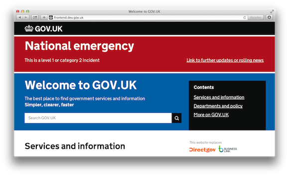
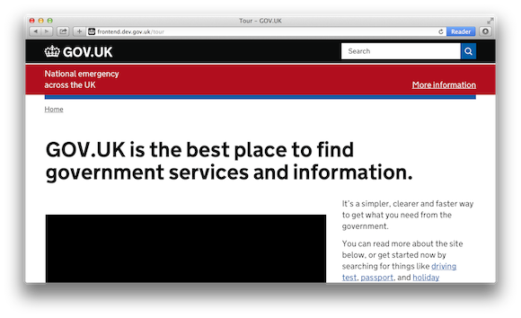
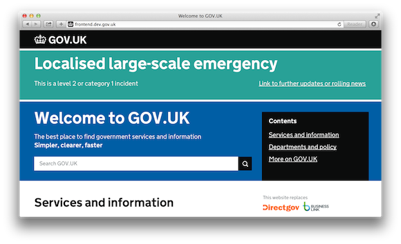
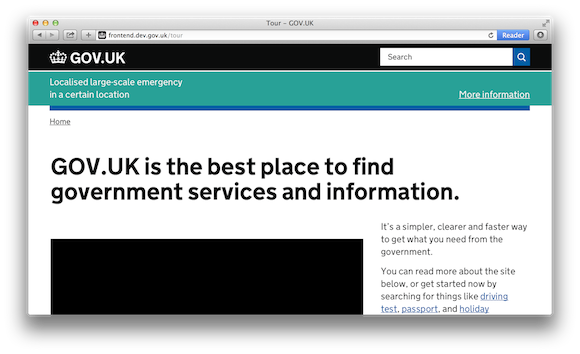
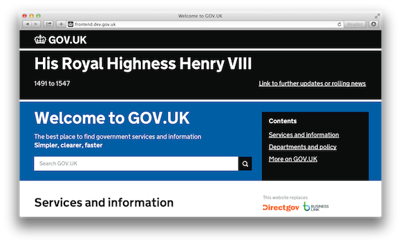

# Deploy emergency publishing banners

There are three types of events that would lead GOV.UK to add an emergency banner to
the top of each page on the web site. Each type of event is detailed below.

The GOV.UK on-call escalations contact will tell you when you need to publish an
emergency banner. They will ensure that the event is legitimate and provide you
with the text for the emergency banner.

The GOV.UK on-call escalations contact will tell you what type of event it is; you do
not need to determine the type of event yourself.

If you need to publish the emergency banner out of hours, you will be
instructed to do so either by the GOV.UK on-call escalations contact or the Head of
GOV.UK.

[Contact numbers for those people](https://github.gds/pages/gds/opsmanual/2nd-line/contact-numbers-in-case-of-incident.html) are in the opsmanual on GitHub enterprise.

## Adding emergency publishing banners

Before publishing an emergency banner, you will need the following. The text
required will be supplied by the GOV.UK on-call escalations contact:

### Prerequisites

- Text for the heading
- Text for 'extra info', which is a sentence displayed under the heading
- A URL for users to find more information (it might not be provided at first)
- The colour for the background of the banner. Each type of emergency has a colour - see below.

### Steps to publish the banner

If you've not used them before, you'll need to clone [fabric-scripts](https://github.com/alphagov/fabric-scripts) and follow the setup instructions in the fabric-scripts README.

1) Make sure your copy of fabric-scripts is up to date and on master.

2) Pick your environment, which can be `integration`, `staging`, or `production`:

```
export environment=integration
```

3) Run the following command. When prompted, enter the details provided to you by the GOV.UK on-call escalations contact:

```
fab $environment campaigns.deploy_emergency_banner
```

4) The fabric task will restart the appropriate applications. Once the fabric task has completed, wait for the apps to finish reloading - 2 minutes should suffice).

5) After waiting you need to reload whitehall

Whitehall runs its own internal caching system, so you need to run the following command:

```
fab $environment class:whitehall_frontend app.reload:whitehall
```

6) Test the changes by visiting pages and adding a cache-bust string

You can automate this by using the [emergency publishing scraper](https://github.com/alphagov/emergency-publishing-scraper)

- [https://www.gov.uk/?ae00e491](https://www.gov.uk/?ae00e491)
- [https://www.gov.uk/financial-help-disabled?7f7992eb](https://www.gov.uk/financial-help-disabled?7f7992eb)
- [https://www.gov.uk/government/organisations/hm-revenue-customs?49854527](https://www.gov.uk/government/organisations/hm-revenue-customs?49854527)
- [https://www.gov.uk/search?q=69b197b8](https://www.gov.uk/search?q=69b197b8)

7) Next purge our entire origin cache:

```
fab $environment cache.ban_all
```

8) If you are in production environment, once the origin cache is purged, purge the CDN cache. At the time of writing, this can only be done one item at a time, and doesn't work in staging or integration.

You can do so by giving a list of comma separated url paths,
the following is a list of the 10 most used pages:

```
fab $environment cdn.fastly_purge:/,/search,/state-pension-age,/jobsearch,/vehicle-tax,/government/organisations/hm-revenue-customs,/government/organisations/companies-house,/get-information-about-a-company,/check-uk-visa,/check-vehicle-tax
```

See [these instructions more details](https://github.gds/pages/gds/opsmanual/2nd-line/cache-flush.html) on purging the cache.

9) Check that the emergency banner is visible when accessing the same pages as above
   but without a cache-bust string.

10) Remember to unset your environment variable:

```
unset environment
```

11) [Freeze all deployments](https://github.gds/pages/gds/opsmanual/2nd-line/blocking-apps-from-release.html), especially for `static` and `frontend`. Any deployments of these applications to production will overwrite the banners. Consider raising Pull Requests against both applications with the code that the emergency publishing procedure generated in order to persist the banners. This is especially important for the Death of a Notable Person procedure, as it's expected that the banner will be shown for 10 days.

### Potential issues you may see

There is an race condition when uncaching static templates, which may cause them to be
recached with the old version. As static uses a file system cache (storing them in the
`public/` dir), they will not time out / be regenerated unless the files are removed.

To manually clear the template cache you can use the [fabric task as a guide](https://github.com/alphagov/fabric-scripts/blob/master/campaigns.py#L53-L69)

Once this is done, static will regenerate the templates from the new code. It will then be
up to 5 minutes for application Slimmer caches to expire, and pickup the new version from static.

### Removing emergency publishing banners

**Follow the instructions for publishing a banner**, but instead of the `campaigns.deploy_emergency_banner` fabric task, run:

```
fab $environment campaigns.remove_emergency_banner
```

## Types of banners

### National emergency (level 1 or category 2)

A large **red** `campaign` banner is to be displayed on the GOV.UK homepage.

A small red `notification` banner is to be displayed on all other GOV.UK
pages.




### Localised large-scale emergency (level 2 or category 1)

A large **green** `campaign` banner is to be displayed on the GOV.UK homepage.

A small green `notification` banner is to be displayed on all other GOV.UK
pages.

These incidents will not be processed outside of business hours.




### Death of a notable person

A large **black** `campaign` banner is to be displayed on the GOV.UK
homepage.

A small black `notification` banner is to be displayed on all other GOV.UK
pages.

The wording to use in the template will be the official title of the
deceased and the years of their life e.g. 'His Royal Highness Henry VIII
1491 to 1547'. The text should link to their official biography.


