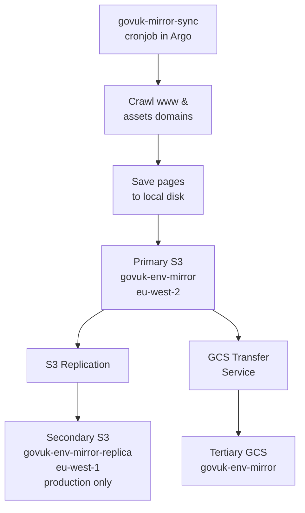
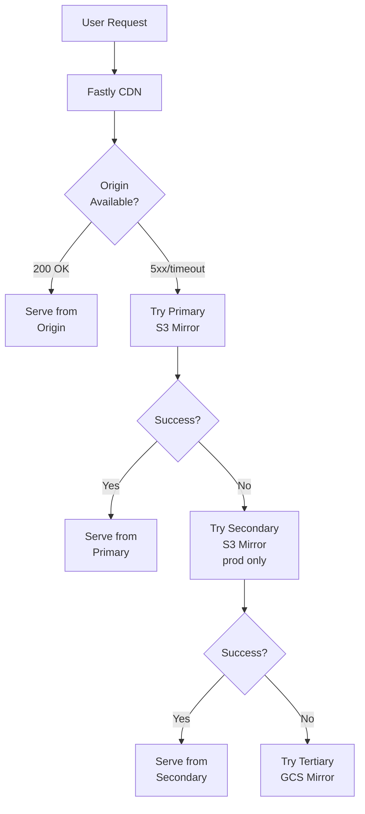

A GOV.UK mirror is a static copy of pages and assets hosted on www.gov.uk or assets.publishing.service.gov.uk (or equivalent domains in integration and staging). A mirror includes:

- HTML pages
- related assets for those pages (e.g. JavaScript, CSS, images, fonts)
- other linked assets (or "attachments") such as CSVs, PDFs etc

## Architecture

### How content flows through the mirror system

The GOV.UK mirror system operates in two main flows:

#### 1. Content Population Flow (Nightly)

The [govuk-mirror-sync cronjob][govuk-mirror-sync configuration] crawls content, saves it locally, and distributes it across multiple storage locations for redundancy.



#### 2. Content Serving Flow (On Origin Failure)

When Fastly cannot reach our origin servers, it attempts to serve content from mirrors in priority order.



## Available mirrors

We maintain three mirrors, ranked by priority:

1. Primary: AWS S3 bucket named `govuk-<environment>-mirror` in eu-west-2
1. Secondary: AWS S3 bucket named `govuk-<environment>-mirror-replica` in eu-west-1 (production only)
1. Tertiary: Google Cloud Storage (GCS) bucket named `govuk-<environment>-mirror`

We use multiple mirrors across various AWS regions and GCP to ensure redundancy and increase availability.

### GCP (GCS) Mirror

#### Accessing the GCP Project

Each environment's Google Cloud resources live inside the relevant Project for the environment, e.g. "GOVUK Integration", "GOVUK Staging", etc.

If you want to access the GCP resources for the Integration environment, you can access these through the Google Cloud Console by navigating to:

`Open Project Picker (⌘+O)` -> `GOVUK Integration`

Then you can access the Bucket and Storage Transfer Jobs.

#### GCS Bucket

For example, in Integration, you can access these through the Google Cloud Console by navigating to:

`Cloud Storage` -> `Buckets` -> `govuk-integration-mirror`

Once there you should find the relevant directory structure for `assets` and `www.gov.uk`.

#### Storage Transfer Job

To find the job that manages the transfer from the AWS S3 Bucket to the GCS Bucket, navigate to:

`Storage transfer` -> `Transfer jobs`

From there, you should see all the configured transfer jobs (currently just one at the time of writing) and can view the configuration and history of them, such as:

- Bytes copied
- Bandwidth
- Errors
- Number of objects
- Daily run histoy

You may find the Terraform that configures the Storage Transfer [here](https://github.com/alphagov/govuk-aws/blob/81ee9f6e91fd8692fbf751ecf980c671c13aa3c0/terraform/projects/infra-google-mirror-bucket/main.tf#L124).

## When is the GOV.UK mirror used?

If [Fastly, our primary CDN](/manual/cdn.html), cannot fetch a page from our backend servers (because of a timeout or a 5xx error), then Fastly will attempt to serve a page from a mirror in order of priority.

### Fastly failover behavior

When the origin is unavailable:

1. Fastly first attempts to serve the page from the **primary S3 mirror** (eu-west-2)
2. If that fails, it tries the **secondary S3 replica** (eu-west-1, production only)
3. As a final fallback, it attempts the **tertiary GCS mirror**

This layered approach ensures maximum availability even if individual mirror buckets have issues.

## How are the mirrors populated?

Every night the [govuk-mirror-sync cronjob][govuk-mirror-sync configuration] crawls the www and assets domains, saves pages and assets to disk and then uploads the files to the primary S3 bucket. The [govuk-mirror] repository contains the code responsible for crawling and saving pages to disk.

S3 Replication automatically copies any changes from the primary S3 bucket to the secondary S3 bucket. This is configured in [govuk-aws].

GCP Storage Transfer Service copies any changes from the primary S3 bucket to the tertiary GCS bucket.

## What is not covered by mirrors?

Certain page types aren't included in the mirrors:

- Smart answer pages (as the govuk-mirror crawler doesn't support following form links)
- [CSV preview pages](https://github.com/alphagov/govuk-helm-charts/pull/1337)

## Monitoring & Health Checks

### Success signals

A healthy mirror sync can be verified through:

**Job completion time:**

- Normal runs typically complete in about **8-9 hours**
- Check the [govuk-mirror-sync job in Argo][govuk-mirror-sync job] for completion status and duration

**Content freshness:**

- Pages published on a given day should appear in the mirror within **24 hours** (by the next nightly sync)
- Spot-check recently published content by fetching directly from mirrors using the `Backend-Override` header

**Storage verification:**

- Check that all three mirror buckets (primary S3, secondary S3, tertiary GCS) contain recently updated objects
- Verify object counts and total storage sizes are roughly consistent across mirrors

### Content-level checks

To verify mirror content is up to date:

1. Identify a page published in the last 24 hours from the publishing pipeline
2. Fetch it from the primary mirror: `curl -H 'Backend-Override: mirrorS3' https://www.gov.uk/path/to/page`
3. Confirm the page content matches what's expected

## Failure Indicators

### Signs that mirrors may need investigation

**Job-level failures:**

- govuk-mirror-sync job fails to complete in Argo
- Job runs significantly longer than usual (more than 9 hours)
- Error messages in job logs indicating crawl failures or upload issues

**Storage-level issues:**

- One or more mirror buckets are empty or contain significantly fewer objects than expected
- Last modified timestamps on bucket objects are more than 24-48 hours old
- S3 replication or GCS transfer metrics show failures

**Serving-level problems:**

- Users report stale content when origin is supposedly healthy
- Direct mirror fetches return 404s for content that should exist

### Investigation steps

If you suspect mirror issues:

1. **Check the mirror sync job**: Review [Argo logs][govuk-mirror-sync job] for errors during crawl, save, or upload phases
2. **Verify bucket contents**: Check AWS S3 Console and GCP Console to confirm buckets are populated and recently updated
3. **Test direct access**: Use `curl` with `Backend-Override` header to fetch from each mirror and verify responses
4. **Review Fastly logs**: Check if Fastly is falling back to mirrors unexpectedly
5. **Check replication status**: Verify S3 replication metrics and GCS transfer job status

## Troubleshooting

### How to poke it

You can test mirrors directly during incidents or investigation:

**Fetch a page from each mirror:**

```bash
# Primary S3 mirror (eu-west-2)
curl -H 'Backend-Override: mirrorS3' https://www.gov.uk/

# Secondary S3 replica (eu-west-1, production only)
curl -H 'Backend-Override: mirrorS3Replica' https://www.gov.uk/

# Tertiary GCS mirror
curl -H 'Backend-Override: mirrorGCS' https://www.gov.uk/
```

**Check for specific content:**

```bash
# Fetch a recently published page
curl -H 'Backend-Override: mirrorS3' https://www.gov.uk/government/publications/example

# Fetch an asset
curl -H 'Backend-Override: mirrorS3' https://assets.publishing.service.gov.uk/path/to/asset.pdf
```

The [allowed values](https://github.com/alphagov/govuk-fastly/blob/68427d372df05fd23c6851cfbea610845c6c3997/modules/www/www.vcl.tftpl#L258-L289) for `Backend-Override` are `mirrorS3`, `mirrorS3Replica` and `mirrorGCS`.

### Common checks

**Review job logs:**

Check the [logs of the govuk-mirror-sync job in Argo][govuk-mirror-sync job] for any errors during crawling, saving pages or uploading to S3.

**Verify bucket contents:**

1. **AWS S3**: Check the AWS Console for buckets `govuk-<environment>-mirror` and `govuk-<environment>-mirror-replica`
2. **GCP**: Check the GCP Console for bucket `govuk-<environment>-mirror`
3. Look for recent object modification times and verify object counts

**Check replication:**

- S3 replication metrics in AWS Console
- GCS Storage Transfer Service job status in GCP Console

## Known Gaps & Potential Future Work

Areas where the mirror and related components could be improved:

**Monitoring gaps:**

- We don't currently have automated alerts for mirror sync failures or unusual runtimes
- Content freshness is checked manually rather than automatically
- No automated verification that all three mirrors contain consistent content

**Operational improvements:**

- Better visibility into which mirror Fastly is actually serving from during failover scenarios
- Clearer runbook for what to do if all mirrors are stale or unavailable
- Differential or incremental changes to the sync script to reduce the time and costs required

[govuk-aws]: https://github.com/alphagov/govuk-infrastructure/blob/e6c2c58b9f1c9e530d4aa270d24e36ec3a8792c3/terraform/deployments/govuk-publishing-infrastructure/govuk_mirror_sync.tf#L235
[govuk-mirror]: https://github.com/alphagov/govuk-mirror
[govuk-mirror-sync configuration]: https://github.com/alphagov/govuk-helm-charts/tree/main/charts/mirror
[govuk-mirror-sync job]: https://argo.eks.production.govuk.digital/applications/cluster-services/mirror?view=tree
