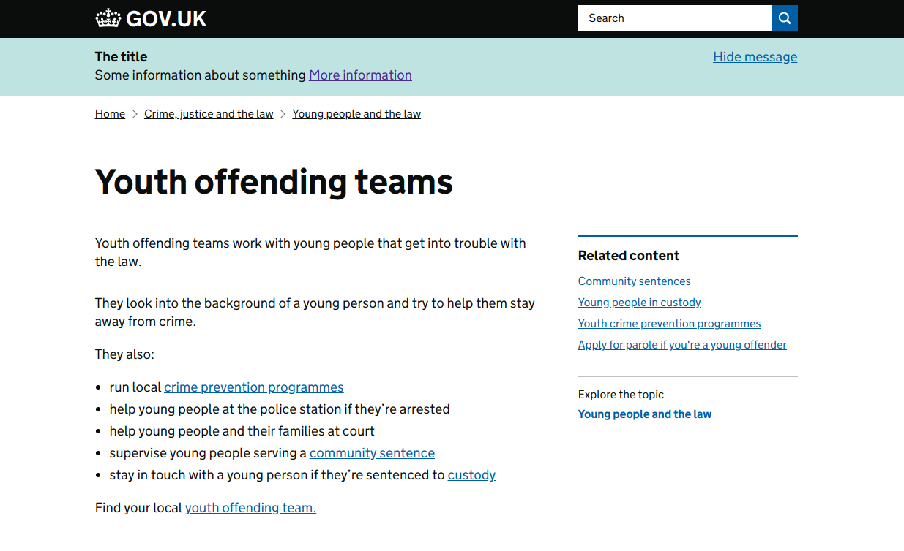

When active, the global banner is served on nearly all GOV.UK pages.
It should be used sparingly to convey information not suitable for the emergency banner.

It will be necessary for someone with access to the [static Github repository](https://github.com/alphagov/static) to make changes to activate the banner.

## Updating the global banner

Updating the content to appear in the global banner is done by editing the file
`app/views/notifications/_global_bar.html.erb` in [https://github.com/alphagov/static](https://github.com/alphagov/static).

The variables `title`, `information`, `link_href` and `link_text` should be amended
with the appropriate content.

## Activating the global banner

Once the content is updated, the banner can be made active by setting the 
`show_global_bar` variable in the same file to `true`.

Static will then need to be deployed to make the banner appear in the various frontend apps.
