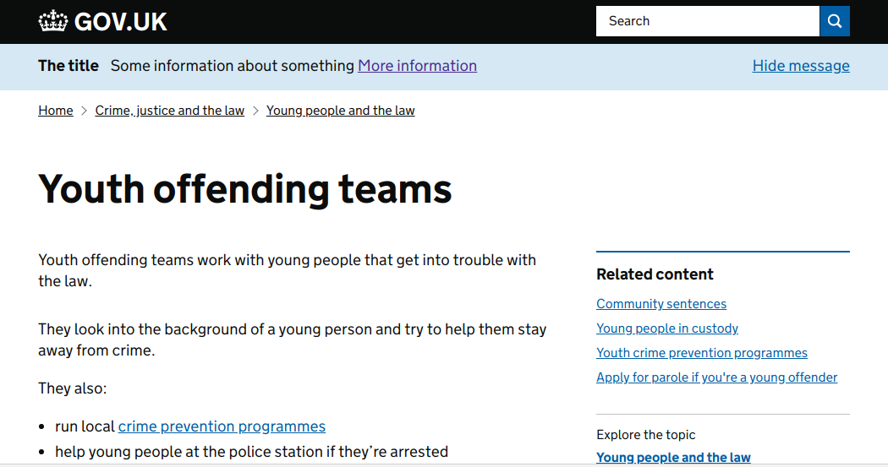

A site-wide banner can be activated to convey important information on GOV.UK
which is not deemed emergency level information. Unlike the
[emergency banner](/manual/emergency-publishing.html), by default the
global banner disappears after someone has seen it three times (controlled
by a cookie).

The content of the site-wide banner is contained in
[`app/views/notifications/_global_bar.html.erb` in Static][global-bar-view].

## Activating the global banner

In `app/views/notifications/_global_bar.html.erb`,

1. Update the variables `title`, `title_href`, `link_text` and `link_href` with the relevant info where applicable, otherwise set to `false`.
1. Update the `show_global_bar` variable to `true`
1. Optional: set the `always_visible` boolean to `true` if banner should not disappear after being seen enough times.
1. Deploy static

The usual [Static deployment rules](/manual/deploy-static.html) apply.

## Add the target page to blocklist

The target page linked to from the banner will automatically hide the banner.
Add any other pages that don't need to show the banner to the `urlBlockList` in `app/assets/javascripts/global-bar-init.js`.

### Versioning the global banner

The number of times a user has viewed the banner is stored in a `global_bar_seen` cookie.
Once the view count reaches 3, a user will not see the cookie again, even if the banner is
re-deployed. The only way a user will see the banner again is if:

1. the `global_bar_seen` cookie expires, or
1. the global banner is versioned

To version the global banner, increase the `BANNER_VERSION` in [`global-bar-init.js`](https://github.com/alphagov/static/blob/master/app/assets/javascripts/global-bar-init.js) by one.

## Removing the global banner

In [`app/views/notifications/_global_bar.html.erb`][global-bar-view]:

1. Update the `show_global_bar` variable to `false`
1. Deploy static

[global-bar-view]: https://github.com/alphagov/static/blob/master/app/views/notifications/_global_bar.html.erb
