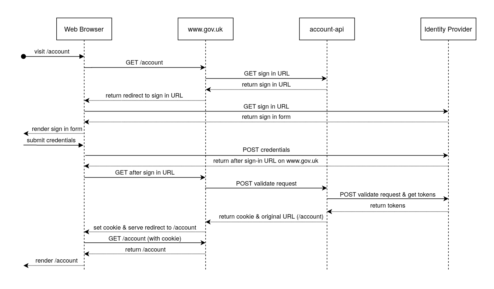

GOV.UK uses the account service built and supported by the Digital Identity programme to give users a personalised experience.

You can sign into a GOV.UK account by visiting [www.gov.uk/account](https://www.gov.uk/account).

How does "signing in" to GOV.UK work?
-------------------------------------

Signing in to GOV.UK is done over the OpenID Connect protocol, with an Identity Provider built by the Digital Identity programme.

1. The user visits a page which requires authentication, and they are *not* signed in (if they are, we just serve the page and are done)
2. The relevant frontend app fetches a sign in URL from [account-api][], and tells account-api:
   - Which URL we should send the user to after they successfully sign in
   - Whether we need to authenticate them with MFA
3. The user then signs in by interacting with the Identity Provider built by the Digital Identity Sign In team:
   - They may create a new account, reset their password, or do something else at this point --- it's a black box to us
   - After signing in, Digital Identity redirect the user back to www.gov.uk/sign-in/callback with some query parameters
4. The [frontend SessionsController][] validates the parameters, sets the user's cookie, and redirects them to the URL the relevant frontend app requested when fetching the sign in URL:
   - [account-api][] makes a request to the Identity Provider to validate the parameters: they're only valid for a few minutes, and only valid once, to prevent record & replay attacks
   - The Identity Provider will return basic information about the account, and a unique "subject identifier", which we use to identify users on our side
   - The cookie the [frontend SessionsController][] sets stores this subject identifier (and a few other things)

If the user is already signed in on the Identity Provider domain (which may happen because our and their cookies are independent), they won't have to sign in, they'll be redirected straight to the after sign-in URL.

The session cookie we set is managed in the [govuk-cdn-config][]:

- The `GOVUK-Account-Session` response header makes Fastly set the cookie value
- The `GOVUK-Account-End-Session` response header makes Fastly delete the cookie

When running in development mode, we set a cookie on `.dev.gov.uk`

How can applications use the account?
-------------------------------------

[govuk-cdn-config][] sets three custom request headers which apps can make use of (or in development mode they can use the cookie we set on `.dev.gov.uk`):

- The `GOVUK-Account-Session` request header holds the full cookie value
- The `GOVUK-Account-Session-Flash` request header holds any flash message portion
- The `GOVUK-Account-Session-Exists` request header is set to a constant value

These headers are not set if there is no session cookie.  We have three different headers so that apps can fine-tune their caching behaviour.

For example, an app which wants to show one thing if a user is logged in and another thing if a user is logged out, where the logged-in thing does not depend on who the user is, may just be able to use the `GOVUK-Account-Session-Exists` request header, and set a `Vary: GOVUK-Account-Session-Exists` response header, so that only two copies of the page are cached.

Usually, frontend apps should interact with the account through the [govuk_personalisation][] gem.  It manages the request and response headers properly, and helps avoid the risk of caching a personalised response.

Notifications and the account
-----------------------------

Email notifications are being migrated into the account.

This involves changes to [email-alert-api][]:

- To record which GOV.UK account a Subscriber belongs to
- To change the email address of a Subscriber automatically when the email address of the corresponding GOV.UK account is changed
- To end a Subscriber's subscriptions automatically when the corresponding GOV.UK account is deleted

And to [email-alert-frontend][]:

- To allow signing in to manage subscriptions where a Subscriber belongs to a GOV.UK account
- To allow creating subscriptions without sending an email with a confirmation link, where the user is logged into a GOV.UK account which has a corresponding Subscriber

We often use the terminology of "linking" a Subscriber to a GOV.UK account to refer to making an existing Subscriber belong to an account.

Only notifications users who set up an account and then interact with their notifications through it will be "linked".  At some point we are likely to force remaining users to set up an account but, for now at least, we have two separate ways of authenticating notifications users: magic links and the account.

[account-api]: https://github.com/alphagov/account-api
[frontend SessionsController]: https://github.com/alphagov/frontend/blob/main/app/controllers/sessions_controller.rb
[govuk-cdn-config]: https://github.com/alphagov/govuk-cdn-config/
[govuk_personalisation]: https://github.com/alphagov/govuk_personalisation
[email-alert-api]: https://github.com/alphagov/email-alert-api
[email-alert-frontend]: https://github.com/alphagov/email-alert-frontend/
