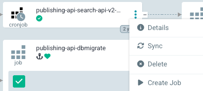

To resync content items in Vertex search, publishing-api needs to push the documents to search-api-v2.
There are various rake tasks to achieve this.

### Resyncing all content

A rake task `requeue_all_the_ever_published_things` exists to requeue all items for search.
This task "requeues" documents rather than "republishs" them to avoid triggering updates in other parts of the system, i.e. email alerts.

As this rake task doesn't have any arguments it was possible to config a cron job that can be run from Argo CD.

This job will need to be run when the [datastore schema] is updated.

To find the job in Argo:

1. Login to [Argo]
2. Navigate to the publishing-api app
3. Find the [`publishing-api-search-api-v2-bulk-import`] cron job
4. Click on the kebab menu next to the job name and click "Create Job"



### Resyncing one content item

To resync a single content item one of the `represent_downstream` tasks can be used. As the task takes an argument it needs to be run using a [kubectl command].

```
k exec deploy/publishing-api -- \
  rake 'represent_downstream:content_id[57a1253c-68d3-4a93-bb47-b67b9b4f6b9a]'
```

[datastore schema]: https://github.com/alphagov/govuk-infrastructure/blob/b1e7f2fb064c875d1905c3847cf0f725dd442433/terraform/deployments/search-api-v2/datastore_schema.tf
[`requeue_all_the_ever_published_things`]: https://github.com/alphagov/publishing-api/blob/676ba553affcd359eb5edffea29b902f13ed91a3/lib/tasks/queue.rake#L61
[Argo]: https://argo.eks.production.govuk.digital/
[`publishing-api-search-api-v2-bulk-import`]: https://github.com/alphagov/govuk-helm-charts/blob/3c861a2038b6eeb78e3c1cca8c6c47596446cb45/charts/app-config/values-production.yaml#L2363
[`represent_downstream`]: https://github.com/alphagov/publishing-api/blob/4106458e7cd07f5db56120f71799b75a0087a26d/lib/tasks/represent_downstream.rake
[kubectl command]: https://docs.publishing.service.gov.uk/kubernetes/cheatsheet.html#run-a-rake-task
