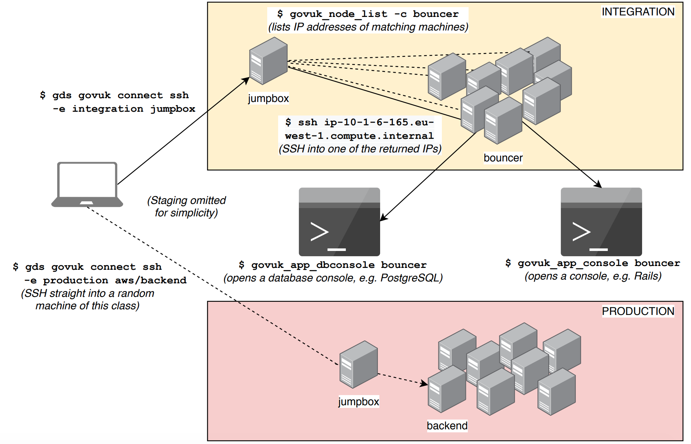

This document explains how to SSH into machines in AWS, and what commands exist
to navigate machines and applications quickly.



In AWS, there are no static hostnames, so we can't have `backend-1.backend.integration`
to SSH to like in Carrenza. EC2 instances have dynamically assigned IPs, which means
hostnames like `ip-10-1-5-53.eu-west-1.compute.internal`. Each Puppeted instance has a
"node class" (backend, frontend, ...) and the list of instances belonging to these
classes is accessible via `govuk_node_list` when logged onto the environment.

To help connecting to the environments, there is a wrapper tool called
[`govukcli`](https://github.com/alphagov/govuk-aws/blob/master/tools/govukcli). The tool
uses the idea of "contexts", where a "context" is a specific environment. By setting a
context, any subsequent `govukcli` commands will be tied to the environment you chose.

## Setup

Follow the [set up govukcli](/manual/get-ssh-access.html#3-set-up-govukcli) instructions.

## Usage

### Local dev machine

To view all possible contexts, run:

```sh
local$ govukcli list-contexts
```

To set a persistent context:

```sh
local$ govukcli set-context integration
```

Now when you SSH into an instance, it will be to one running on the specified environment:

```sh
# SSH into a 'calculators_frontend' node in current context (Integration)
local$ govukcli ssh calculators_frontend
```

Alternatively, you can set a context for the current command only by passing a CLI parameter:

```sh
# SSH into a 'calculators_frontend' node in Staging, ignoring local context
local$ govukcli ssh --context staging calculators_frontend
```

Note that the SSH examples above will SSH you into a random machine of the right node class.
You can find out which class you need by finding the corresponding [app page](https://docs.publishing.service.gov.uk/apps.html).

`govukcli` finds a matching machine via the 'jumpbox', which you can also SSH into directly:

```sh
local$ govukcli ssh jumpbox
```

### Jumpbox

The jumpbox is a special node that knows about all of the other nodes in its environment.

List the IP addresses of every node in the environment:

```sh
jumpbox$ govuk_node_list
```

This long list of IPs is not very useful on its own, but you can filter it by node class:

```sh
jumpbox$ govuk_node_list -c backend
```

And if you can't remember the names of the node classes, there's a built-in helper:

```sh
jumpbox$ govuk_node_list --classes
```

Once you have found the IP of the machine you want to SSH into, you can manually SSH
directly from the jumpbox machine:

```sh
jumpbox$ ssh ip-10-1-5-22.eu-west-1.compute.internal
```

You can also do this from your local machine by appending the environment to the address:

```sh
local$ ssh ip-10-1-5-22.eu-west-1.compute.internal.integration
```

Note that in Carrenza, there are no dynamic IPs, so you can SSH into a specific node by name.
There are no Carrenza machines on Integration anymore, so these examples assume you've set
context to `staging`:

```sh
# SSH into the `backend-1.backend.staging` node
local$ govukcli ssh backend-1
```

...or as with AWS, you can SSH into a random machine of the right node class:

```sh
# This may SSH into `backend-1.backend.staging` or into a different node
local$ govukcli ssh backend
```

### Application node

Now you're on the node running the application you want to explore. There are two main
ways of interacting with the running application.

You can start up an application console (typically Rails):

```sh
node$ govuk_app_console
```

...or you can start up a database console (typically PostgreSQL):

```sh
node$ govuk_app_dbconsole
```

These common commands, along with `govuk_node_list`, live in
[govuk-puppet](https://github.com/alphagov/govuk-puppet).

## Troubleshooting

Sometimes you might try to ssh into a server and nothing happens. Double-check that you
have added the key into the keychain like so: `ssh-add -K ~/.ssh/id_rsa`.

Make sure you have been granted access. For example, if you have yet to be granted access
to production, your attempt to SSH into a production node will fail silently.

If in doubt, run `GOVUKCLI_OUTPUT=debug govukcli ssh backend` to help you to debug.
