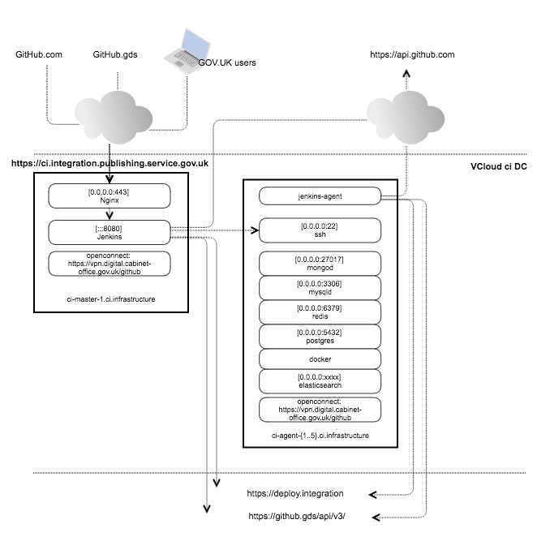

## Introduction

Our CI environment provides the infrastructure and services to cover the
first stages of our build and continuous deployment pipeline:

- Build application, Puppet and infrastructure projects from our GitHub organisation
- Run unit, functional, performance tests
- Update the status of the build in GitHub
- Trigger deployment jobs on our Deployment infrastructure

## Systems diagram

Components:

- The CI environment runs in the Integration environment in the "CI" vDC
- Jenkins master:
  - Nginx, listening on port 443, serves <https://ci.integration.publishing.service.gov.uk>
    and proxies requests to Jenkins. It is also running on port 80 to serve a monitoring page.
  - Jenkins master, listening on port 8080
- Jenkins agents:
  - The master instance connects with the agent box via SSH to manage the process
  - The agent machines run a set of services for application tests. Not all the boxes run
    the same services, this is managed with Puppet. Check the `govuk_ci::master::ci_agents` label keys in
    [Hiera](https://github.com/alphagov/govuk-puppet/blob/master/hieradata/common.yaml) for more information.
- Supporting services:
  - An [Icinga instance](https://ci-alert.integration.publishing.service.gov.uk) to monitor the
    status of CI and the supporting infrastructure.
  - A [Deploy Jenkins instance](https://deploy.integration.publishing.service.gov.uk) to deploy Puppet
    in to the environment and run any other adhoc tasks.
  - [Graphite](https://ci-graphite.integration.publishing.service.gov.uk) and [Grafana](https://ci-grafana.integration.publishing.service.gov.uk)
    for metrics in the environment.
  - Puppetmaster which deploys the latest version of <https://github.com/alphagov/govuk-puppet>.
  - Apt instance for Gemstash

## Access

SSH to a random CI machine with `gds govuk connect ssh -e ci ci-agent`.
If you know the agent you want, append `:number` to the end of
`ci_agent` to go straight to that machine.

## Configuration

### Configuration Management

The configuration for CI resides in [govuk-puppet](https://github.com/alphagov/govuk-puppet/tree/master/modules/govuk_ci).

### Manual configuration

#### Set up Jenkins credentials

The credentials plugin allows us to store credentials in Jenkins that can be retrieved later by other plugins
via API. At the moment these credentials are configured manually because Jenkins encrypts the secrets in a
credentials.xml file, so we can't replicate the encryption with Puppet. The [Jenkins Puppet module](https://forge.puppet.com/rtyler/jenkins)
can manage credentials via Jenkins CLI, but currently not all types of credentials are supported.

To configure our credentials manually, from the Jenkins Credentials section add the following entries:

- GitHub token for govuk-ci
  - ID: github-token-govuk-ci
  - Type: Secret text
  - Description: GitHub token for govuk-ci
  - Scope: Global
  - Secret: *\<personal access token for govuk-ci user on GitHub\>*
- GitHub token for govuk-ci with username
  - ID: github-token-govuk-ci-username
  - Type: Username with password
  - Description: GitHub token for govuk-ci with username
  - Scope: Global
  - Username: govuk-ci
  - Password: *\<personal access token for govuk-ci user on GitHub\>*
- govuk-ci SSH key
  - ID: govuk-ci-ssh-key
  - Type: SSH Username with private key
  - Description: govuk-ci SSH key
  - Scope: Global
  - Username: govuk-ci
  - Private Key: From the Jenkins master ~/.ssh
  - Passphrase: *\<private key passphrase\>*
- Pact broker creds for ci.dev.publishing.service.gov.uk
  - ID: pact-broker-ci-dev
  - Type: Username with password
  - Description: Pact broker creds for ci.dev.publishing.service.gov.uk
  - Scope: Global
  - Username: pact_ci
  - Password: *\<pact_ci user password on ci.dev.publishing.service.gov.uk\>*
- Jenkins user that connects to SSH slaves
  - ID: jenkins-ssh-slave
  - Type: SSH Username with private key
  - Description: Jenkins user that connects to SSH slaves
  - Scope: Global
  - Username: jenkins
  - Private Key: From the Jenkins master ~/.ssh
  - Passphrase: *\<private key passphrase\>*

The credential IDs are referenced in our Puppet code, we shouldn't update this field without checking first.

#### Set up GitHub repositories

We use this with the GitHub and GitHub Branch Source plugins to define the source code repositories of
our jobs.

- Manage Jenkins -\> Configure Global Security
  - GitHub -\> Add GitHub Server
  - API URL: 'https://api.github.com'
  - Credentials: select 'GitHub token for govuk-ci'
  - Untick 'Manage hooks'
  - Click 'Test connection' to confirm the settings

With this configuration, in our jobs we can use 'GitHub' API endpoints to
access the source code repository. The API endpoint name is referenced in
Puppet to configure jobs automatically so we shouldn't update it.

## On the blog

- [Updating the GOV.UK Continuous Integration environment](https://gdstechnology.blog.gov.uk/2017/02/10/updating-the-gov-uk-continuous-integration-environment/)
