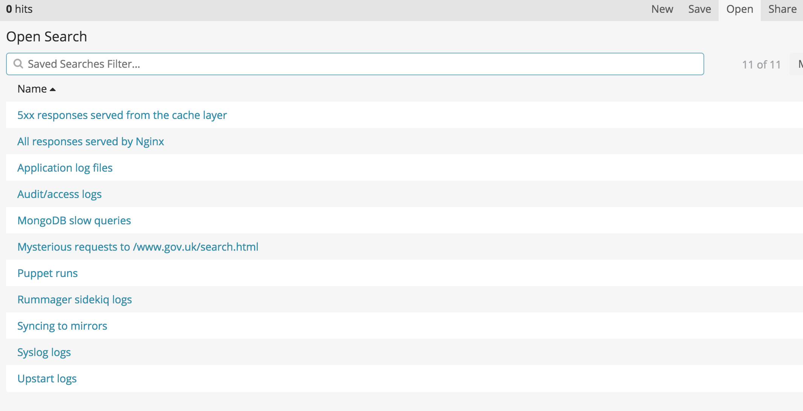

All logs for GOV.UK on all environments are collected in Kibana, which you can
access through [Logit](logit.html).

Kibana can be [searched using the Lucene search syntax or full JSON-based
Elasticsearch queries][kibana-search].

## Examples

You can save and load queries using the buttons in the top right. You may want to use one of the existing queries as a starting point instead of writing a query from scratch.



### 5xx errors returned from cache layer

```rb
host:cache* AND (@fields.status:[500 TO 504] OR status:[500 TO 504])
```

### Puppet runs

```rb
# both agent and master
syslog_program:puppet*

# agent only
syslog_program:"puppet-agent"

# master only
syslog_program:"puppet-master"
```

### Syslog logs

```rb
application:"syslog"
```

### Syslog logs filtered by program

```rb
application:"syslog" AND syslog_program:"rsync"
```

### Nginx logs

```rb
tags:"nginx"
```

Nginx logs for frontend:

```rb
tags:"nginx" AND application:frontend*
```

> **Note**
>
> The `@timestamp` field records the request END time. To calculate request start time subtract `request_time`.

### Application upstart logs

```rb
tags:"upstart"

tags:"upstart" AND tags:"stdout"

tags:"upstart" AND tags:"stderr"

tags:"upstart" AND application:"licensify"
```

### Application production.log files

```rb
tags:"application"

tags:"application" AND application:"smartanswers"
```

### MongoDB slow queries

```rb
application:"mongodb" AND message:"command"
```

### Audit/access logs

```rb
application:"syslog" AND syslog_program:"audispd"
```

### Mirrorer logs

```rb
syslog_program:"govuk_sync_mirror"
```

### Publishing API timeouts

```rb
message:"TimedOutException" AND (application:"specialist-publisher" OR application:"whitehall" OR application:"content-tagger")
```

## Syslog program names

If you're looking for specific program outputs, use `syslog_program:FOO`:

- `audispd`: This is used to see all audit logs from various servers. You can refer to README for searching particular types of audit logs. The program name with combination of source_host and message can be helped for looking at various specific audit log lines on a server.
- `clamd`
- `cron`
- `govuk_sync_mirror`: Records information from govuk_sync_mirror script
- `puppet-agent`: Records output for govuk_puppet script on various servers
- `puppet-master`
- `smokey`

## Gotchas

- Score: does a aggregation of field on last 2000 results
- Terms is not an aggregation of field, it is an aggregation of terms in the field across 1 recent indices
- For more elaborate searching, [read about the Lucene and Elasticsearch syntax][kibana-search]
- `@timestamp` of nginx log entries records [request end time is sometimes confusing][end]

[kibana-search]: https://www.elastic.co/guide/en/kibana/current/search.html
[end]: http://serverfault.com/questions/438880/what-does-nginxs-time-local-logging-variable-mean-specifically/438891#438891
