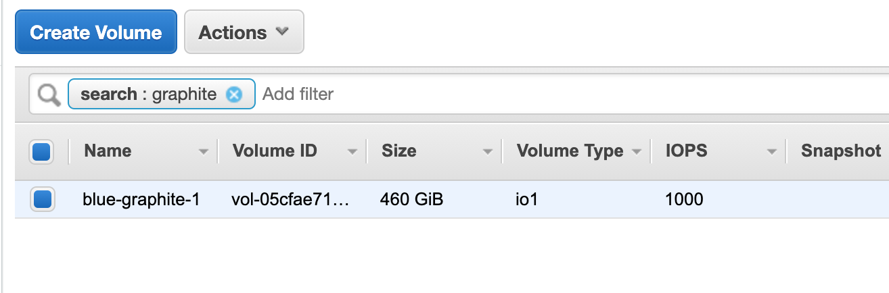
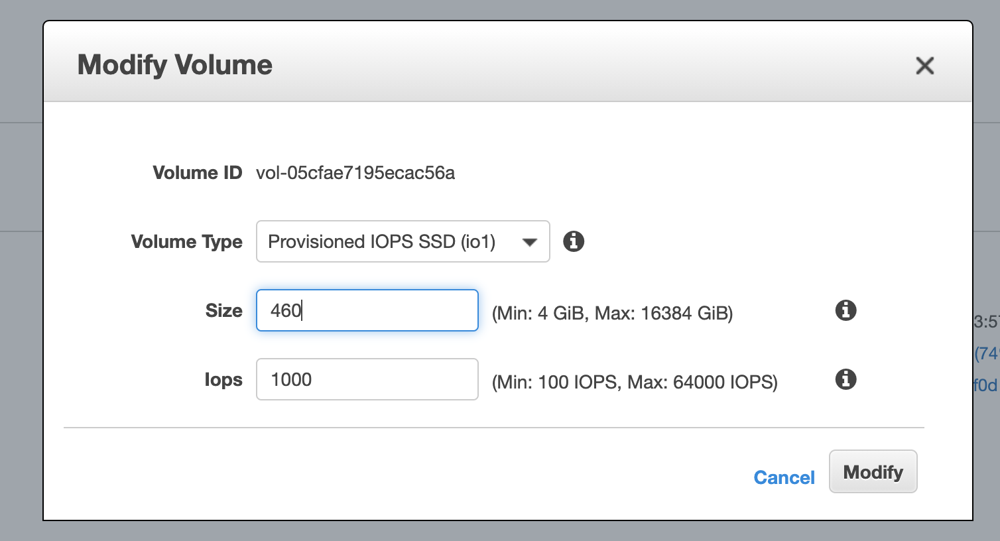
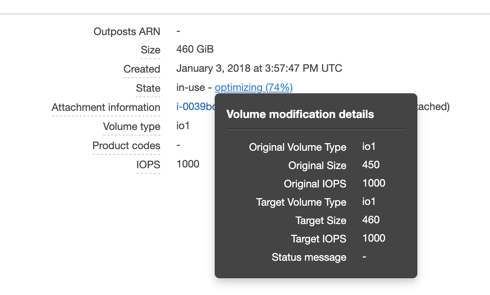

In AWS, [we use Elastic Block Store (EBS)][ebs] to attach additional
block storage to EC2 instances.

EBS is not the same thing as [Elastic File System (EFS)][efs], which
is more like a shared NFS volume and does not need to be manually
resized.

[ebs]: https://docs.aws.amazon.com/AWSEC2/latest/UserGuide/AmazonEBS.html
[efs]: https://docs.aws.amazon.com/efs/latest/ug/whatisefs.html

## Manually scaling up

> **Note:** EBS volumes can only be grown, not shrunk, so you [should
> make sure to raise a PR against govuk-aws-data][pr] once it's all
> working to ensure that Terraform doesn't attempt (and fail) to
> shrink the volume when deployed.

1. [Access the AWS Console](/manual/access-aws-console.html) and [go to the EC2 service][ec2-home].

1. Select "Volumes", from the "Elastic Block Store" menu on the left
   hand side and find the right volume in the list (you can filter on
   the name).

   

1. Select "Modify Volume" from the "Actions" list and enter the new
   size.

   

1. Click "Modify".

1. Wait for the volume to resize.  The state in the "Description" tab
   at the bottom will say "optimizing" and display a percentage.  This
   will take a while.

   

1. SSH into the EC2 instance and check that the volume has resized:

   ```
   $ lsblk
   NAME                   MAJ:MIN RM   SIZE RO TYPE MOUNTPOINT
   nvme0n1                259:0    0    20G  0 disk
   └─nvme0n1p1            259:1    0    20G  0 part /
   nvme1n1                259:2    0   460G  0 disk
   └─graphite-data (dm-0) 252:0    0   450G  0 lvm  /opt/graphite
   ...
   ```

   You might need to reboot before the new space shows up.

## If you are growing a regular partition

See [these docs](https://n2ws.com/blog/how-to-guides/how-to-increase-the-size-of-an-aws-ebs-cloud-volume-attached-to-a-linux-machine) and add some instructions here.

## If you are growing an LVM volume

1. Grow the LVM physical volume to fill the empty space:

   ```
   $ sudo pvresize /dev/nvme1n1
     Physical volume "/dev/nvme1n1" changed
     1 physical volume(s) resized / 0 physical volume(s) not resized
   ```

   Where `/dev/nvme1n1` is the device name from `lsblk`.

1. Grow the LVM logical volume to fill the empty space:

   ```
   $ sudo lvresize -l +100%FREE /dev/graphite/data
     Extending logical volume data to 460.00 GiB
     Logical volume data successfully resized
   ```

   Where `/dev/graphite/data` is the path to your logical volume.

1. Grow the filesystem to fill the empty space:

   ```
   $ sudo resize2fs /dev/graphite/data
   resize2fs 1.42.9 (4-Feb-2014)
   Filesystem at /dev/graphite/data is mounted on /opt/graphite; on-line resizing required
   old_desc_blocks = 29, new_desc_blocks = 29
   The filesystem on /dev/graphite/data is now 120585216 blocks long.
   ```

   Where `/dev/graphite/data` is the path to your logical volume.

[ec2-home]: https://eu-west-1.console.aws.amazon.com/ec2/home?region=eu-west-1
[pr]: https://github.com/alphagov/govuk-aws-data/pull/811
