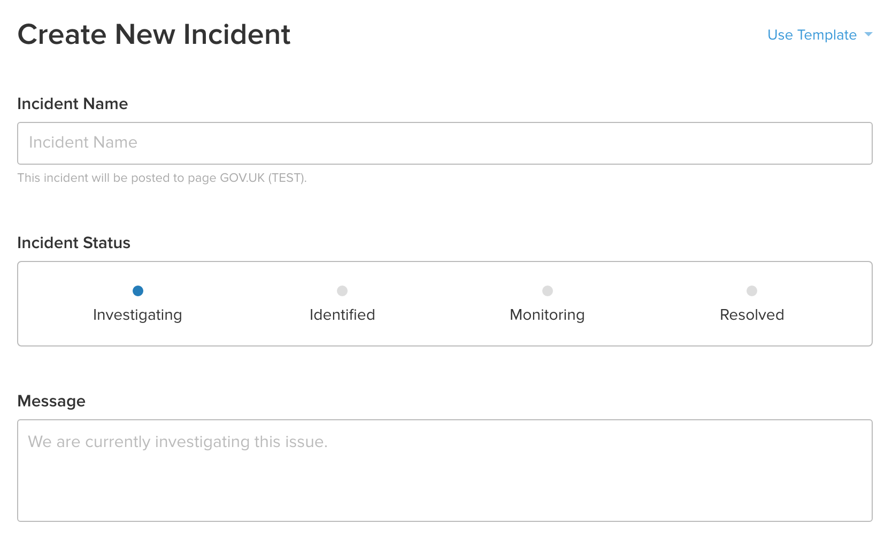

When something goes wrong on GOV.UK we follow our [incident management procedure][inc].
As part of that we update our status page [status.publishing.service.gov.uk][status].

The page is managed using a third party service called [Statuspage][sp].

Use [manage.statuspage.io][man] to post messages. 2nd line delivery manager can grant you access.

Remember: government publishers are the main audience of the page.
They'll want to know what isn't working, and how long it will take to fix. Write in non-technical language.
Use the pre-written templates, they've been proofread and can be customised to most situations.

This is what the [Statuspage admin interface][man] looks like:

## Incident Name

This is to say which application is affected and what the fault is. You *can* update
the name, but make sure it's consistent enough to track throughout the stages of the incident.

Example names:

> Delay in publishing content

<!-- -->
> Attachments aren't uploading

<!-- -->
> Search isn't working on GOV.UK

## Incident Status and Message

When you list an incident, you'll need to select an 'incident status'.

### "Investigating" status

Provide reassurance to publishers that we know about a problem and are working to diagnose it.

Example messages:

> We’re looking into an issue with Whitehall Publisher which is causing attachment uploads to fail. We’ll update this page as soon as we know what's causing it.

<!-- -->
> We're looking into a delay that's occurring when trying to publish new content. Your content may appear on the site later than usual.

<!-- -->
> We're looking into a problem that means email alerts aren't being sent out as quickly as they should. We'll update this page as soon as we know what's causing it.

### "Identified" status

This is where we state that we've found the problem.
Explain what the problem is in as simple terms as possible, and an estimated time to fix.

Example messages:

> We’ve found the problem causing the delay in publishing content – it's caused by the server running too many tasks. We’re working on fixing it and expect it to take approximately 3 hours to fix.

<!-- -->
> We've found out what's causing the delay to email alerts. There was an error which made the email queue artificially long. We expect it to take one hour to fix.

### "Monitoring" status

We've fixed the issue - but are keeping an eye on it to make sure it's properly resolved.
State whether there will be a delay to the fix being visible, e.g. "This should start functioning normally again in 20 minutes".

Example messages:

> We've fixed the problem that was delaying publishing. We're going to keep an eye on it for the next hour to make sure it's resolved.

<!-- -->
> We've fixed the problem that was delaying email alerts. We're going to keep an eye on it for the next 2 hours to make sure it’s resolved.

### "Resolved" status

We've fixed the issue and everything is back to normal. The incident is closed.

Example messages:

> The delay in publishing content has been solved. Content will appear on the site as normal.

<!-- -->
> The problem with the email queue has been fixed. Email alerts should now be working normally.

<!-- -->
> The problem with the server running too many tasks has been fixed. Attachment uploads should now be back to normal.

<!-- -->
> The issues we were having with search on GOV.UK have been fixed. Everything should now be working as normal.

<!-- -->
> The invading alien army has retreated. Everything is fine again.

[inc]: /manual/incident-management-guidance.html
[status]: https://status.publishing.service.gov.uk
[sp]: https://statuspage.io
[man]: https://manage.statuspage.io
