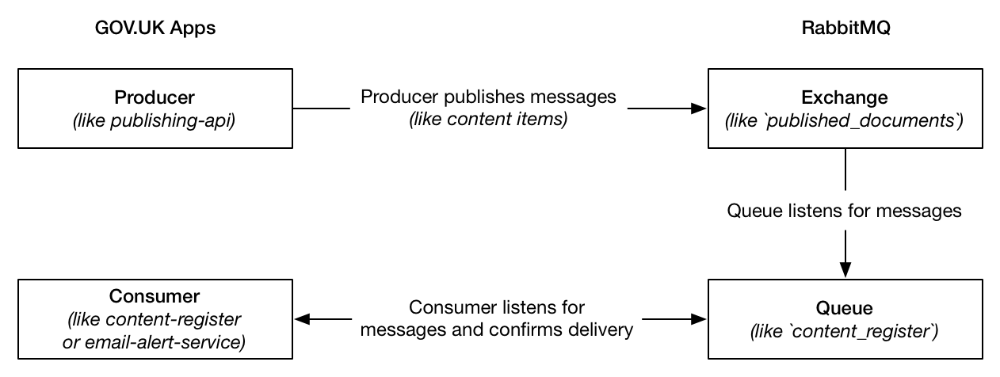

[RabbitMQ][RabbitMQ] is a message broker based on the [Advanced Message Queuing
Protocol][AMQP] (AMQP).

[Learn more about RabbitMQ][rabbitmq_tutorial].

## Connecting to the RabbitMQ web control panel

Run `gds govuk connect rabbitmq -e integration aws/rabbitmq` and point your
browser at <http://127.0.0.1:15672>.

## RabbitMQ metrics

A [generic RabbitMQ dashboard][rabbitmq-dashboard] shows metrics for queues and exchanges.

## How we run RabbitMQ

### Overview



**Producer**: an application that publishes messages RabbitMQ. On GOV.UK this could
be [publishing-api](https://github.com/alphagov/publishing-api).

**Exchanges** are AMQP entities where messages are sent. They take a message
and route it into zero or more queues. The routing algorithm used depends on
the exchange type and rules called _bindings_.  When a content change is made
in a publishing application (e.g. Travel Advice Publisher), Publishing API
[publishes a message][publishing_api_publishes_message] to our main exchange,
`publishing_documents`.

**Queues** are very similar to queues in other message and task-queueing
systems: they store messages that are consumed by applications. An example of a
queue is `email_alert_service` which is used by
[email-alert-service][email-alert-service] to forward publishing activity to
email-alert-api. Queues are [created by consumer applications][create_queues].

**Bindings** are rules that exchanges use (among other things) to route
messages to queues. To instruct an exchange E to route messages to a queue Q, Q
has to be bound to E. Bindings may have an optional routing key attribute. An
example of a binding is the `cache_clearing_service-high` queue is
[bound][binding_config] to the `published_documents` exchange with a routing
key matching of `*.major`. E.g messages sent to the exchange with a routing key
of `guide.major` will be routed to that queue.

**Messages** consist of a JSON payload and publish options (we predominantly
use content type, routing key and persistant).

Options:

* content_type (string) - tells the consumer the type of message. E.g
  `"application/json"`
* routing_key (string) - matches against bindings to filter messages to certain
  queues. E.g `"guide.major"`
* persistant (boolean) - tells RabbitMQ whether to save the message to disk.

Message options are set when a message is published. In our use case, the
message's payload is the content item in JSON format. The code in the
publishing-api to publish a message is [here][publish_message_call].

**Consumer applications** are applications which consume messages from one or
more queues. For email-alert-service this is done by [running this rake
task][message_processors] and using the [major change
processor][major_message_processor] to do the processing of the consumed
messages. All our consumer applications use the
[govuk_message_queue_consumer][message_consumer] gem to consume messages from
RabbitMQ in a standardised way.

You can see live examples of things like queues, exchanges, bindings etc by
connecting to the RabbitMQ control panel.

## Federated `published_documents` exchange

A federated exchange is connected to an upstream exchanges by AMQP and the
messages published to the upstream exchanges are copied over to the federated
exchange.

While the migration of GOV.UK from Carrenza to AWS is ongoing, we run two
RabbitMQ clusters, one in each environment. Each cluster has a list of private
IP addresses of the other cluster's nodes ([Carrenza IPs][carrenza_ips] and
[AWS IPs][aws_ips]). The connection between Carrenza and AWS travels through
the VPN. Since the nodes in AWS use dynamic IP addresses, they are associated
to network interfaces with fixed IPs.

The `published_documents` exchange is [federated][federated] in both
directions, i.e. the RabbitMQ cluster from each provider connects as a client
to the exchange in the other provider and forwards messages to its own
exchange. There is no infinite loop because `max-hops` is set to `1`.

### Checking if the federation is ok

Connect to one of the cluster's nodes via:

```bash
$ gds govuk connect ssh -e production rabbitmq
```

and run:

```bash
$ sudo rabbitmqctl eval 'rabbit_federation_status:status().'
```

On **one** of the nodes, you should get a load of data including:
`{status,running}`

If not, something is wrong and the federation is broken. Check the logs in
`/var/log/rabbitmq` and verify that the credentials and IP address for the
federation are correct, you can do this by running:

```bash
$ sudo rabbitmqctl list_parameters
```

## Further reading

* [RabbitMQ Tutorials](https://www.rabbitmq.com/getstarted.html)
* [Bunny](https://github.com/ruby-amqp/bunny) is the RabbitMQ client we use.
* [The Bunny Guides](http://rubybunny.info/articles/guides.html) explain all
  AMQP concepts really well.

[aws_ips]: https://github.com/alphagov/govuk-puppet/blob/bc95f7041af4212e810c77e8a00c1349de3af0fa/hieradata/class/production/rabbitmq.yaml#L6
[carrenza_ips]: https://github.com/alphagov/govuk-puppet/blob/bc95f7041af4212e810c77e8a00c1349de3af0fa/hieradata_aws/class/production/rabbitmq.yaml#L6
[federated]: https://github.com/alphagov/govuk-puppet/blob/master/modules/govuk_rabbitmq/manifests/federate.pp
[rabbitmq_tutorial]: https://www.rabbitmq.com/tutorials/tutorial-one-ruby.html
[RabbitMQ]: https://www.rabbitmq.com/
[AMQP]: https://www.rabbitmq.com/tutorials/amqp-concepts.html
[rabbitmq-dashboard]: https://grafana.blue.production.govuk.digital/dashboard/file/rabbitmq.json?refresh=10s&orgId=1
[rabbitmq_overview]: https://github.com/alphagov/govuk_message_queue_consumer#Nomenclature
[create_queues]: https://github.com/alphagov/email-alert-service/blob/f8485df2f0916285ade33a9cb1e4a7e73c2491ad/lib/tasks/message_queues.rake#L9
[publishing_api_publishes_message]: https://github.com/alphagov/publishing-api/blob/1d6bf06fcb74519b5c379f803ae1df65f93f74f7/lib/queue_publisher.rb#L26
[publish_message_call]: https://github.com/alphagov/publishing-api/blob/1d6bf06fcb74519b5c379f803ae1df65f93f74f7/lib/queue_publisher.rb#L73
[rabbit_config_rake]: https://github.com/alphagov/email-alert-service/blob/master/lib/tasks/message_queues.rake#L17
[rabbit_config_yml]: https://github.com/alphagov/email-alert-service/blob/f8485df2f0916285ade33a9cb1e4a7e73c2491ad/config/rabbitmq.yml
[message_processors]: https://github.com/alphagov/email-alert-service/blob/f8485df2f0916285ade33a9cb1e4a7e73c2491ad/lib/tasks/message_queues.rake#L21
[message_consumer]: https://github.com/alphagov/govuk_message_queue_consumer
[email-alert-service]: https://github.com/alphagov/email-alert-service
[major_message_processor]: https://github.com/alphagov/email-alert-service/blob/2ba8ecd982c2226158b528e5442b012639797d41/email_alert_service/models/major_change_message_processor.rb#L35P
[binding_config]: https://github.com/alphagov/govuk-puppet/blob/master/modules/govuk/manifests/apps/cache_clearing_service/rabbitmq.pp#L42-L48
