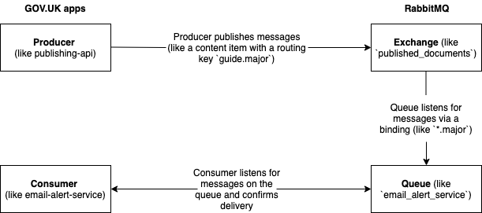

RabbitMQ is a message broker: it accepts and forwards messages. You can think about it
as a post office: when you put the mail that you want posting in a post box, you can be
sure that Mr. or Ms. Mailperson will eventually deliver the mail to your recipient. In this
analogy, RabbitMQ is a post box, a post office and a postman.

The major difference between RabbitMQ and the post office is that it doesn't deal with paper.
Instead it accepts, stores and forwards binary blobs of data ("messages").

[Learn more about RabbitMQ](https://www.rabbitmq.com/tutorials/tutorial-one-ruby.html).

## How we run RabbitMQ

### Overview



When a document is created or updated in a publishing application, it sends a message to
RabbitMQ exchanges. These exchanges route messages to the relevant queues that are bound
to them.

Applications that subscribe to these content update events, like publishing-api, consume
and process these messages from the queues they listen to.

In order to standardise how GOV.UK consumes messages from RabbitMQ, all consumer applications
use our [govuk_message_queue_consumer](https://github.com/alphagov/govuk_message_queue_consumer) gem.

While the migration of GOV.UK from Carrenza to AWS is ongoing, we run two RabbitMQ clusters,
one in each environment.

### Federation

The `published_documents` exchange is federated in both directions, i.e. the RabbitMQ cluster
from each provider connects as a client to the exchange in the other provider and forwards
messages to its own exchange.

There is no infinite loop because `max-hops` is set to `1`.

Each cluster has a list of private IP addresses of the other cluster's nodes. The connection
between Carrenza and AWS travels through the VPN.

Since the nodes in AWS use dynamic IP addresses, they are associated to network interfaces
with fixed IPs.

If a consumer tries to reach a queue from the other side of the VPN and the queue is empty,
check the federation is healthy.

## Checking the health of the federation

1. Via the jumpbox, SSH into one of the cluster's nodes:

```bash
$ rabbitmqctl eval 'rabbit_federation_status:status().'
```

On one of the nodes, you should get: `{status,running}`.

If not, something is wrong and the federation is broken.

2. Check the Kibana logs for the `rabbitmq` application.

3. Make sure the credentials and IP addresses for the federation are correct:

```bash
$ rabbitmqctl list_parameters
```

## Heartbeat messages

In order to keep consumers active and connections alive, heartbeat messages are published to
the exchanges every minute.

We currently publish heartbeat messages only to the `published_documents` exchange, with a
[rake task][heartbeat_rake_task] in `publishing-api`.


## RabbitMQ metrics

A [generic RabbitMQ dashboard][rabbitmq-dashboard] shows metrics for queues and exchanges.

## Connecting to the RabbitMQ web control panel

1. Create an SSH tunnel

Carrenza:

 ```bash
 $ ssh rabbitmq-1.backend.staging -L 15672:127.0.0.1:15672
 ```

 AWS:

 ```bash
 $ ssh $(ssh integration "govuk_node_list --single-node -c rabbitmq").integration -CNL 15672:127.0.0.1:15672
 ```

2. Log in to the web control panel

Point your browser at <http://127.0.0.1:15672>.

The username is `root`.

The password is in [govuk-secrets](https://github.com/alphagov/govuk-secrets).

Look for `govuk_rabbitmq::root_password` in the Puppet hieradata file for the relevant environment:

* [File for Carrenza](https://github.com/alphagov/govuk-secrets/tree/master/puppet/hieradata)
* [File for AWS](https://github.com/alphagov/govuk-secrets/tree/master/puppet_aws/hieradata)


## Inspecting/removing items from a queue

Because RabbitMQ processes messages in order of their reception, an unprocessed or unprocessable message
means no subsequent messages can be processed. The messages back up the queue.

In some cases, deleting the faulty message can be the right course of action.

1. Find the queue

In the "Queues" tab, click on the name of the queue.

2. Find messages

Click "Get messages" to fetch the specified number of messages.

> **Note**
>
> Fetching messages actually removes them from the queue. By leaving
> the "Requeue" option set to "Yes", they will be added back to queue.

3. Delete messages

> **Note**
>
> There is a risk that you might delete the wrong message(s). This
> is because the contents of the queue may have changed.

Repeat, but change the "Requeue" option to "No".

## Previewing a message for a document_type

For each new content update, Publishing API publishes a message to RabbitMQ. While messages
generated by different applications share a consistent format, message data varies across
publishing applications.

To generate an example message for a given document type, run this rake task in Publishing API:

```bash
$ bundle exec rake queue:preview_recent_message[<document_type>]
```

The example message is generated from the most recently published message according to `last public_updated_at`.

## Further reading

* [Read more about how we use RabbitMQ](/manual/rabbitmq.html)
* [RabbitMQ Tutorials](https://www.rabbitmq.com/getstarted.html)
* [Bunny](https://github.com/ruby-amqp/bunny) is the RabbitMQ client we use.
* [The Bunny Guides](http://rubybunny.info/articles/guides.html) explain all
  AMQP concepts really well.

[heartbeat_rake_task]: https://github.com/alphagov/publishing-api/blob/012cb3f1ceb3b18e7059a367cc4030aa0763afb4/lib/tasks/heartbeat_messages.rake
[rabbitmq-dashboard]: https://grafana.publishing.service.gov.uk/dashboard/file/rabbitmq.json
