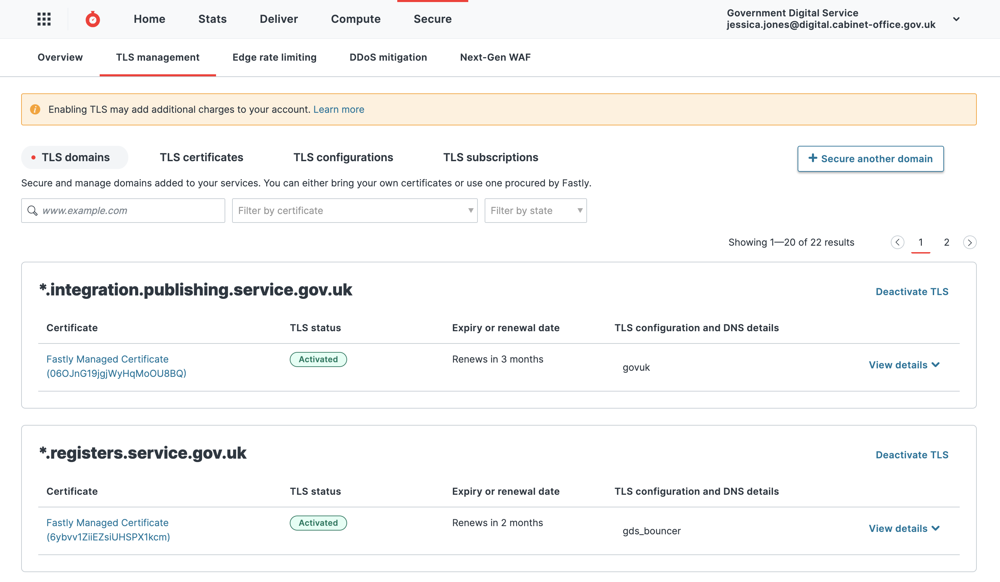

When transitioning HTTPS domains, these are the steps to request a TLS certificate from Fastly.

1. Login to Fastly - you will need "TLS management" permissions. A [member of the senior tech team](https://docs.publishing.service.gov.uk/manual/ask-for-help.html#contact-senior-tech) should be able to grant access through the Fastly UI (it can't be done through govuk-user-reviewer).

1. Select "Production Bouncer" from the list of services

    

1. Select “Production Bouncer”, and then click "Service configuration". Search for the domain.

    

1. Once you have completed the previous step to confirm that your domain is listed, click on "Security" in the left hand toolbar, select "TLS Management" and then click "Domains". 

    

1. Click the button **+ Secure another domain**, and select "Use certificates Fastly obtains for you".

    

1. Enter the domain name(s) that you want a TLS certificate to be created for. Select **Let's encrypt** as the certification authority. And select one of the following two TLS configurations. To decide, you need to know where your domain resolves to. A quick way to find out is:

    ```
    ping <your-domain-name>
    ```

    or

    ```
    dig <your-domain-name> +short
    ```

    **bouncer.gds.map.fastly.net** - for any domain name which resolves to:

    ```
    - bouncer-cdn.production.govuk.service.gov.uk
    - bouncer.gds.map.fastly.net
    - 151.101.2.30, 151.101.66.30, 151.101.130.30, 151.101.194.30
    ```

    **www-gov-uk.map.fastly.net** - for any domain name which resolves to:

    ```
    - backend.production.alphagov.co.uk
    - redirector-cdn.production.govuk.service.gov.uk
    - redirector-cdn-ssl-businesslink.production.govuk.service.gov.uk
    - redirector-cdn-ssl-directgov.production.govuk.service.gov.uk
    - redirector-cdn-ssl-events-businesslink.production.govuk.service.gov.uk
    - www-cdn.production.govuk.service.gov.uk
    - www-gov-uk.map.fastly.net
    - 151.101.0.144, 151.101.64.144, 151.101.128.144, 151.101.192.144
    ```

    

    Click **Submit**

1. At this point, a unique domain [ownership validation](https://docs.fastly.com/en/guides/serving-https-traffic-using-fastly-managed-certificates#verifying-domain-ownership) record (`_acme-challenge`) is generated by Fastly.

1. ACME DNS validation method (with “_acme-challenge” record) should be used for all HSTS protected domains (e.g. find-coronavirus-support.service.gov.uk, *.service.gov.uk) and domains currently available over the HTTPS. This is to allow GOV.UK team to test and prevent service going offline during the certificate creation process (as per a [warning](https://docs.fastly.com/en/guides/serving-https-traffic-using-fastly-managed-certificates#using-the-acme-http-challenge-to-verify-domain-ownership) in Fastly documentation).

    *Note: for domain names which already resolve to Fastly IPs/CNAME and do not have services available over the HTTPS  you can select “Alternative domain verification method”. This option automatically verifies domain ownership using ACME HTTP method.*

1. After domain ownership is confirmed the certificate should be enabled.

   
