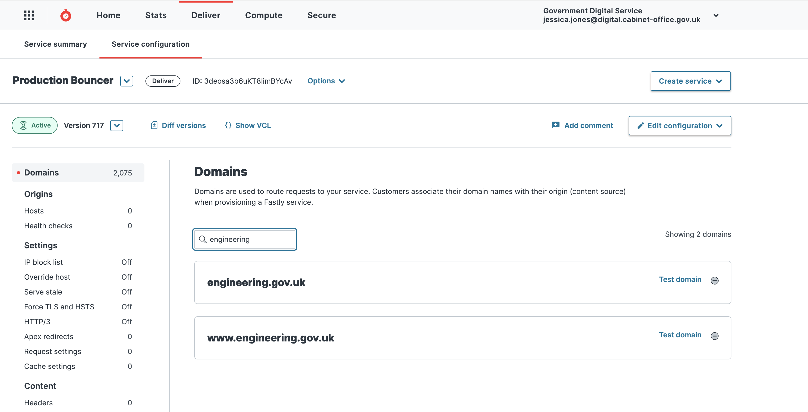
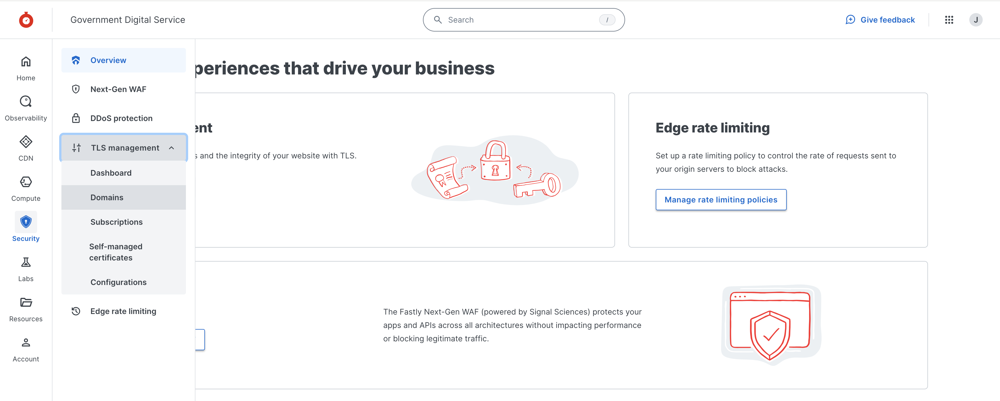

When transitioning HTTPS domains, these are the steps to request a TLS certificate from Fastly.

1. Login to Fastly. If you need access, speak to a member of the senior tech team. You will need "TLS management" permissions.

2. Search for "Production Bouncer"

   

3. Select “Production Bouncer”, and then click "Service configuration". Search for the domain.

   

*Note: If the domain is not listed, you may need to re-run [CDN: deploy Bouncer configs](https://deploy.blue.production.govuk.digital/job/Bouncer_CDN/) Jenkins job.*

4. Once you have completed the previous step to confirm that your domain is listed, click on "Secure" in the main header. Click the button **+ Secure another domain**, and select "Use certificates Fastly obtains for you".

   

5. Enter the domain name(s) that you want a TLS certificate to be created for. Select **Let's encrypt** as the certification authority. And select one of the following two TLS configurations. To decide, you need to know where your domain resolves to. A quick way to find out is:

   ```
   ping <your-domain-name>
   ```

   or

   ```
   dig <your-domain-name> +short
   ```

   **bouncer.gds.map.fastly.net** - for any domain name which resolves to:

   ```
   - bouncer-cdn.production.govuk.service.gov.uk
   - bouncer.gds.map.fastly.net
   - 151.101.2.30, 151.101.66.30, 151.101.130.30, 151.101.194.30
   ```

   **www-gov-uk.map.fastly.net** - for any domain name which resolves to:

   ```
   - backend.production.alphagov.co.uk
   - redirector-cdn.production.govuk.service.gov.uk
   - redirector-cdn-ssl-businesslink.production.govuk.service.gov.uk
   - redirector-cdn-ssl-directgov.production.govuk.service.gov.uk
   - redirector-cdn-ssl-events-businesslink.production.govuk.service.gov.uk
   - www-cdn.production.govuk.service.gov.uk
   - www-gov-uk.map.fastly.net
   - 151.101.0.144, 151.101.64.144, 151.101.128.144, 151.101.192.144
   ```

   

   Click **Submit**

6. At this point, a unique domain [ownership validation](https://docs.fastly.com/en/guides/serving-https-traffic-using-fastly-managed-certificates#verifying-domain-ownership) record (`_acme-challenge`) is generated by Fastly.

7. ACME DNS validation method (with “_acme-challenge” record) should be used for all HSTS protected domains (e.g. find-coronavirus-support.service.gov.uk, *.service.gov.uk) and domains currently available over the HTTPS. This is to allow GOV.UK team to test and prevent service going offline during the certificate creation process (as per a [warning](https://docs.fastly.com/en/guides/serving-https-traffic-using-fastly-managed-certificates#using-the-acme-http-challenge-to-verify-domain-ownership) in Fastly documentation).

   *Note: for domain names which already resolve to Fastly IPs/CNAME and do not have services available over the HTTPS  you can select “Alternative domain verification method”. This option automatically verifies domain ownership using ACME HTTP method.*

8. After domain ownership is confirmed the certificate should be enabled.


