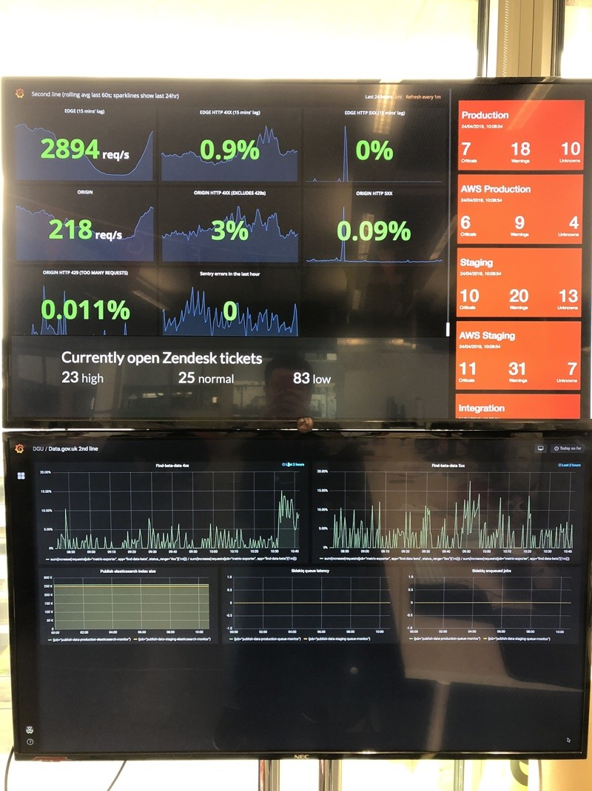

Most teams in GOV.UK have screens set up to show data about pull requests, released and/or current work.

Most often displayed are the [deploy lag radiator][deploy-lag], the [fourth wall][fourth-wall] and the team's
Trello board.

[deploy-lag]: https://github.com/dsingleton/deploy-lag-radiator
[fourth-wall]: https://github.com/alphagov/fourth-wall

## Search screen


The [search screen][search-screen] displays live data from GOV.UK. It includes the number of people on GOV.UK, latest
searches, trending and recent content. It's not publicly accessible because there's sometimes personal data in the
latest searches.

The username and password can be obtained by logging in to Heroku and viewing the app's environment variables.

[search-screen]: https://github.com/alphagov/govuk-display-screen

## 2nd line screens



There are two screens by the 2nd line desks.

The top screen is a webpage running [frame splits][frame-splits] with three splits: production health, open Zendesk
tickets and Icinga alert summary per environment.

The bottom screen is a PaaS-hosted Grafana dashboard showing statistics for data.gov.uk.

[frame-splits]: https://github.com/alphagov/frame-splits

### Production health

This dashboard contains graphs of edge and origin requests, edge and origin 4xx and 5xx errors, origin 429 (too many
requests) errors and Sentry errors. It's worth keeping an eye on this and looking for any anomalies, as this may
indicate issues on production. It's likely due to our caching behaviour that the top graph of origin errors will
indicate issues before they are visible in the second graph, and to end users.

[production-health]: https://grafana.production.govuk.digital/dashboard/file/2ndline_health.json

#### Troubleshooting

Sometimes the 'EDGE' graphs may disappear. These are obtained by the
[collectd-cdn plugin][collectd-cdn] on
`monitoring-1.management.production`. If the graphs disappear, they
should write errors to `/var/log/syslog`. They may look something like
this:

```sh
Nov 10 11:37:17 monitoring-1.management collectd[32764]: cdn_fastly plugin: Failed to query service: govuk

Nov 10 11:37:17 monitoring-1.management collectd[32764]: cdn_fastly plugin: Failed to query service: tldredirect

Nov 10 11:37:17 monitoring-1.management collectd[32764]: cdn_fastly plugin: Failed to query service: assets

Nov 10 11:37:17 monitoring-1.management collectd[32764]: cdn_fastly plugin: Failed to query service: redirector
```

If this happens, restarting `collectd` on the monitoring server may kick
things into life.

```
sudo service collectd restart
```

[collectd-cdn]: https://github.com/gds-operations/collectd-cdn

### Open Zendesk tickets

This screen shows a summary of currently open Zendesk tickets in the "2nd line - alerts and issues" queue. It
automatically refreshes once a minute.

This is powered by [govuk-zendesk-display-screen][] which is [deployed to Heroku][govuk-zendesk-display-screen-heroku].

The username and password can be obtained by logging in to Heroku and viewing the app's environment variables.

[govuk-zendesk-display-screen]: https://github.com/alphagov/govuk-zendesk-display-screen
[govuk-zendesk-display-screen-heroku]: https://govuk-zendesk-display-screen.herokuapp.com/

### Icinga alert summary per environment

This screen shows a summary of the critical and warning alerts for our environments (production, staging, integration, CI)
in both Carrenza and AWS environments in colour-coded boxes (red for critical errors, yellow for warnings, purple for
unknown errors and green for no issues). It automatically refreshes once a minute.

This is powered by [blinkenjs][] which is [deployed to Heroku][govuk-secondline-blinken-heroku]. You must be in the
office or on the VPN to access the Icinga instances it gets its data from.

[blinkenjs]: https://github.com/alphagov/blinkenjs
[govuk-secondline-blinken-heroku]: https://govuk-secondline-blinken.herokuapp.com/blinken.html
