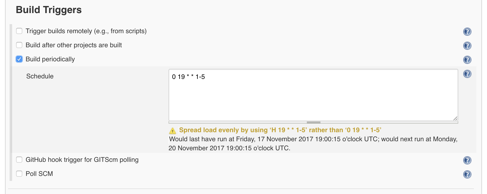
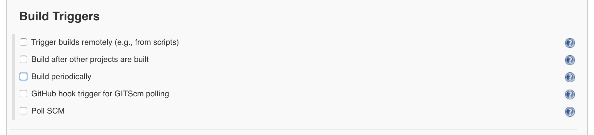
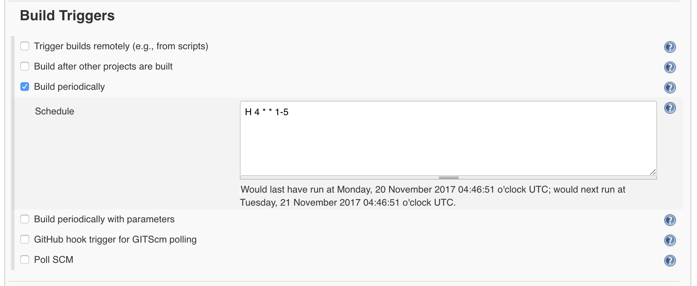

But default the integration environments is shutdown each night at 7pm to save money.

On occasion is it necessary to keep the integration environment online overnight (i.e. pre budget testing).
In this case it is necessary to disable the process which shuts down the environment.

To do this we need to disable the `Stop vApps` job in jenkins, in addition we need to disable puppet runs
on the [deploy.integration.publishing.service.gov.uk]() machine - as otherwise the job will be automatically
re-enabled the next time puppet runs.

> The puppet runs should be disabled before the job is.

In addition to disabling the integration reboot it is usually to stop the data sync to avoid data being
overwritten the following morning.

This is done by disabling the `Copy_Data_to_Integration` job in jenkins, as this runs on [deploy.publishing.service.gov.uk]() we
will also need to disable puppet run on that machine

## Disabling puppet for `deploy.integration`

This can be done using the [fabric scrips]():

```
fab integration -H jenkins-1.management puppet.disable:"<reason for disabling the job>"
```

## Disabling puppet for `deploy.production`

This can be done using the [fabric scrips]():

```
fab production -H jenkins-1.management puppet.disable:"<reason for disabling the job>"
```

## Disabling `Stop vApps` in jenkins (integration)

To do this logging into the jenkins server at [https://deploy.integration.publishing.service.gov.uk]() selecting the
[Stop vApps](https://deploy.integration.publishing.service.gov.uk/job/stop_vapps/) job and click on **configure**.

In the settings scroll down to the Build Triggers:



You need to disable the periodic build:



Remeber to **Save** the project

## Disabling `Copy_Data_to_Integration` in jenkins (production)

To do this logging into the jenkins server at [https://deploy.publishing.service.gov.uk]() selecting the
[Copy_Data_to_Integration](https://deploy.publishing.service.gov.uk/job/Copy_Data_to_Integration/) job and click on **configure**.

In the settings scroll down to the Build Triggers:



You need to disable the periodic build:


Remeber to **Save** the project

## Renabling everything

This can be done by just re-enabling the puppet job, as this will reset the flag on jenkins task. This can be
down by running the following [fabic script]:

```
fab integration -H jenkins-1.management puppet.enable
```

And if you have stop the data copy you should also run:

```
fab production -H jenkins-1.management puppet.enable
```

[fabric scrips]: /manual/tools.html#fabric-scripts
