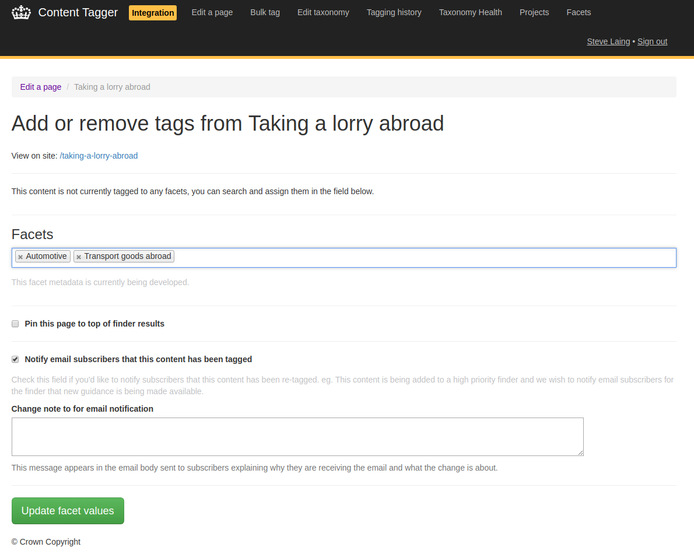

Content tagger is the central place for tagging content with facet values.

### How to edit facet values for a single page

**Note** This workflow would normally be performed by 2nd-line content
designers.

You'll need GDS Editor permissions for content tagger.

1. Visit the [facet groups admin page in content tagger][content-tagger].
1. Click on the facet group you'd like to use for tagging content.
1. Enter the page path you'd like to edit.
1. Type to search available facets in the "Facets" select field and assign the
   appropriate values.
1. (Optional) If you'd like to notify subscribers to the finder using this
   facet group than new content has been added to the search results check the
   appropriate box and fill the notification message. This message appears in
   the resulting email notification telling users what has changed and why.
1. Click "Update facet values". The changes will patch links in the Publishing
   API and take effect as soon as they reach the content-store.

