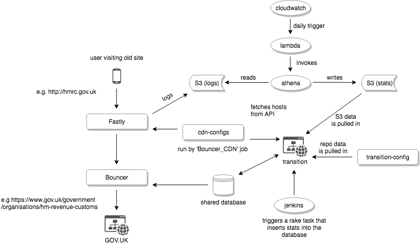

The Transition system is built to transition government websites to GOV.UK. The
main work around this [happened in 2014][blog], but we still take on websites.

All the repositories involved in transition have been [tagged with govuk-transition
on GitHub][repos].

[blog]: https://insidegovuk.blog.gov.uk/2014/12/19/300-websites-to-just-1-in-15-months
[repos]: https://github.com/search?q=topic%3Agovuk-transition+org%3Aalphagov

## High level overview

Source diagram in the [GOV.UK architecture folder][arch-folder].

[arch-folder]: https://drive.google.com/drive/folders/0B7zRJZy-BNyUS2lMMzJHLUpYM00

### Components

- [transition][] is the admin app that departments use to transition.
- [transition-config][] contains YAML files to configure transitioning
  websites. It's imported into the Transition database by the
  [Transition_load_site_config job][config-import].
- The [cloudwatch / athena / lambda][infra-fastly-logs] trio process the logs
  from Fastly to produce the statistics. Those are then loaded into Transition
  by the [Transition_load_all_data job][stats-import].
- [bouncer][] is the application that does the actual redirecting.
- [govuk-cdn-config][] contains the script that the [Bouncer_CDN job][] uses
  to send the [hosts from transition][] to Fastly.

## Transition data sources

Site configuration is automatically imported every hour via
[a Jenkins job][config-import] from [transition-config][].

Traffic data is automatically imported every day via [a Jenkins
job][stats-import].  This import puts a high load on the database. CDN logs
for the "Production Bouncer" Fastly service are sent (by Fastly) to the
`govuk-production-fastly-logs` S3 bucket and processed by a lambda function
defined in the [infra-fastly-logs][] Terraform project.

[transition]: /apps/transition.html
[config-import]: https://deploy.blue.production.govuk.digital/job/Transition_load_site_config
[transition-config]: https://github.com/alphagov/transition-config
[stats-import]: https://deploy.blue.production.govuk.digital/job/Transition_load_all_data/
[infra-fastly-logs]: https://github.com/alphagov/govuk-aws/tree/master/terraform/projects/infra-fastly-logs

## Bouncer

[Bouncer][] is a Ruby/Rack web app that receives requests for the URLs of government
sites that have either been transitioned to GOV.UK, archived or removed. It queries
the database it shares with Transition and replies with a redirect, an archive page
or a 404 page. It also handles `/robots.txt` and `/sitemap.xml` requests.

Transition is a Rails app that allows users in transitioning organisations and
at GDS to view, add and edit the mappings used by Bouncer. It also presents
traffic data sourced from CDN logs and logs provided by transitioning organisations
(though this latter activity has now ended).

### Bouncer's stack

#### DNS

When sites transition they are generally CNAMEd to a domain we control that
points to our CDN (an A record is used for root domains which can't be CNAMEd).

Some sites partially transition, which means that they redirect some paths to
their AKA domain, which is CNAMEd to us.

GDS doesn't control the DNS for most transitioned domains, except for some domains such as
`*.direct.gov.uk`, `*.businesslink.co.uk`, `*.alphagov.co.uk`. If the DNS
for a particular transitioned site isn't configured correctly we need to inform
the responsible department so they can fix it themselves.

#### CDN

Bouncer has a separate CDN service at Fastly ("Production Bouncer") from the
main GOV.UK one, and it's configured by a
[separate Jenkins job](/manual/cdn.html#bouncer39s-fastly-service)
which adds and removes domains to and from the service.
That job fetches the list of domains which should be configured at the CDN from
Transition's [hosts API](https://transition.publishing.service.gov.uk/hosts), so
will fail if that is unavailable.

[More information about Bouncer's Fastly service](/manual/cdn.html#bouncer39s-fastly-service)

#### Machines

Bouncer runs on 3 machines in the `redirector` vDC (`bouncer-[1-3].redirector`),
and they are load-balanced at the vShield Edge rather than by a separate machine.
Bouncer's traffic does not go through the `cache-*` nodes - the CDN proxies all
requests to `bouncer.publishing.service.gov.uk` which points to its vShield Edge.

It uses an Nginx default vhost so that requests for all domains are passed on to
the application; there's generally no Nginx configuration for individual
transitioned sites (but see [Special cases](#special-cases) below).

In the case of a data centre failure, within the disaster recovery (DR) vCloud organisation we have:

- Bouncer application servers which read from the DR database slave
- a second PostgreSQL slave for the Transition database

#### Application

Bouncer is a small application, and so long as its dependencies are present the
only thing to do if it's erroring is to restart it.

#### Database

Bouncer reads from the `transition_production` database by connecting to
`transition-postgresql-slave-1.backend`. It authenticates using its own
postgresql role which is granted `SELECT` permissions on all tables
[by Puppet](https://github.com/alphagov/govuk-puppet/blob/master/modules/govuk/manifests/apps/bouncer/postgresql_role.pp#L21-L33),
and that role is further restricted to connecting only to the slave because the
[pg_hba.conf rule](https://github.com/alphagov/govuk-puppet/blob/master/modules/govuk/manifests/node/s_transition_postgresql_slave.pp#L24-L30)
to allow it isn't present on the master.

#### Special cases

We serve some assets which were previously on directgov and businesslink
[via Nginx](https://github.com/alphagov/govuk-puppet/blob/master/modules/govuk/manifests/apps/bouncer.pp#L56-L146)
on the Bouncer machines. The assets live in [two](https://github.com/alphagov/assets-directgov)
[repos](https://github.com/alphagov/assets-businesslink) which are [fetched and
rsynced](https://github.com/alphagov/govuk-app-deployment/blob/master/bouncer/config/deploy.rb#L16-L41)
to the machines when Bouncer is deployed.

#### HTTPS support for transitioned sites

Bouncer does not support HTTPS for transitioned sites. This functionality is under
investigation as of December 2018. This limitation should be investigated as part
of any site transition, especially if the existing site uses HSTS to force secure
connections.

[Bouncer]: /apps/bouncer.html
[govuk-cdn-config]: https://github.com/alphagov/govuk-cdn-config
[Bouncer_CDN job]: https://deploy.blue.production.govuk.digital/job/Bouncer_CDN/
[hosts from transition]: https://transition.publishing.service.gov.uk/hosts.json
