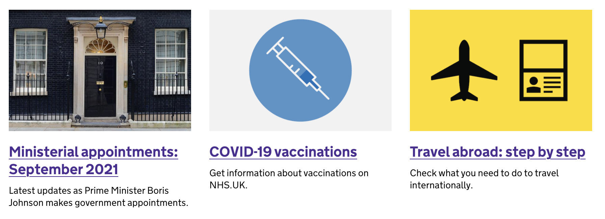

The three promo boxes on the homepage are used to highlight important information on GOV.UK.

2ndline can occasionally get requests to update which documents are featured. This will involve updating the promo slot image, link, title and description.

These are hardcoded within [Frontend](https://github.com/alphagov/frontend). To change them, you will need to raise a new PR in Frontend and deploy this to production.

This is an example PR: [Update homepage promo](https://github.com/alphagov/frontend/pull/1689/files)
