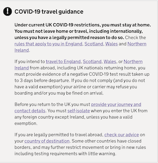

The travel advice callout box is used to highlight important information about travelling to or from the UK.

Travel advice callout boxes appear on two types of page. The [travel advice search page](https://www.gov.uk/foreign-travel-advice) and the [individual country pages](https://www.gov.uk/foreign-travel-advice/cuba).

These boxes are hardcoded within [frontend](https://github.com/alphagov/frontend/blob/master/app/views/travel_advice/index.html.erb#L28) and [government-frontend](https://github.com/alphagov/government-frontend/blob/main/app/views/content_items/travel_advice.html.erb#L27). To change them, you will need to raise a new PR in both frontend and government-frontend and deploy both of them to production.

These are some example PRs:

- [Update travel advice callout - frontend](https://github.com/alphagov/frontend/pull/2586)
- [Update travel advice callout - government-frontend](https://github.com/alphagov/government-frontend/pull/1978)
