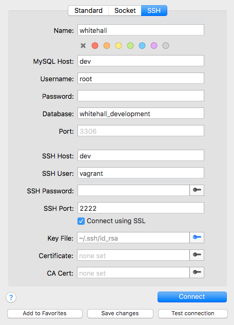
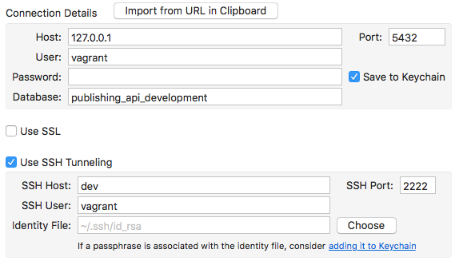

Database GUI tools can be useful when developing applications and to understand
the relationships between data. This document explains how to configure
[Sequel Pro](https://www.sequelpro.com/) for MySQL and [PSequel](http://www.psequel.com/)
for PostgreSQL inside the [development VM](https://github.com/alphagov/govuk-puppet/tree/master/development-vm).

## Prerequisites

You should have set up the development VM and have replicated data. You'll need
to generate a ssh config to be able to connect to the VM via the standard ssh
command rather than `vagrant ssh`:

```bash
$ cd ~/code/govuk-puppet/development-vm
$ vagrant ssh-config --host dev >> ~/.ssh/config
```

If you can connect to your VM with `ssh dev` this is working correctly.

## Sequel Pro (for MySQL)

Install Sequel Pro in the normal way. Add a new connection with the following
configuration:



There's no need to set a key file. Vagrant already set this in your
`~/.ssh/config`. Test the connection and if it is successful, add it to
favourites. It will now appear in the left-hand menu.

If you need to access other MySQL databases, you can duplicate the favourite,
change the database and choose a different name.

## PSequel (for Postgres)

Install PSequel in the normal way. Add a new connection with the following
configuration:



There's no need to set an identity file. Vagrant already set this in your
`~/.ssh/config`.
