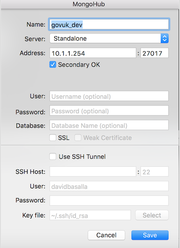

Database GUI tools can be useful when developing applications and to understand
the relationships between data. This document explains how to configure
[Sequel Pro](https://www.sequelpro.com/) for MySQL, [PSequel](http://www.psequel.com/)
for PostgreSQL and [MongoHub](https://github.com/jeromelebel/MongoHub-Mac) for MongoDB
inside the [development VM](https://github.com/alphagov/govuk-puppet/tree/master/development-vm).

## Prerequisites

You should have set up the development VM and have replicated data. You'll need
to generate a ssh config to be able to connect to the VM via the standard ssh
command rather than `vagrant ssh`:

```bash
cd ~/code/govuk-puppet/development-vm
vagrant ssh-config --host dev >> ~/.ssh/config
```

If you can connect to your VM with `ssh dev` this is working correctly.

## Sequel Pro (for MySQL)

Install Sequel Pro in the normal way. Add a new connection with the following
configuration:


There's no need to set a key file. Vagrant already set this in your
`~/.ssh/config`. Test the connection and if it is successful, add it to
favourites. It will now appear in the left-hand menu.

If you need to access other MySQL databases, you can duplicate the favourite,
change the database and choose a different name.

## PSequel (for Postgres)

Install PSequel in the normal way. Add a new connection with the following
configuration:


There's no need to set an identity file. Vagrant already set this in your
`~/.ssh/config`. You can try to connect but this **won't work yet**.

The problem is that Postgres is configured to only accept connections in this
way when a password is provided. Our Rails applications typically don't set one.

To fix this, run the following in the dev VM:

```bash
sudo sed -i.backup 's/md5/trust/' /etc/postgresql/9.3/main/pg_hba.conf
sudo service postgresql restart
```

You should now be able to connect to the database with PSequel. Unfortunately,
`govuk_puppet` will revert these changes the next time it runs so you'll need to
run these last two commands again if this happens.

You may wish to put these lines in a `/usr/local/bin/trust` script to make this
easier in the future.  You can make `trust` runnable with
`sudo chmod a+x /usr/local/bin/trust`.

If something goes wrong and Postgres fails to start, re-run `govuk_puppet` or
restore the `pg_hba.conf.backup` file created by `sed` then try restarting again.

## MongoHub (for MongoDB)

You only need to set the host address for the VM (10.1.1.254) and the default
port (27017) to connect to MongoDB on your dev machine. See below for sample
settings.


