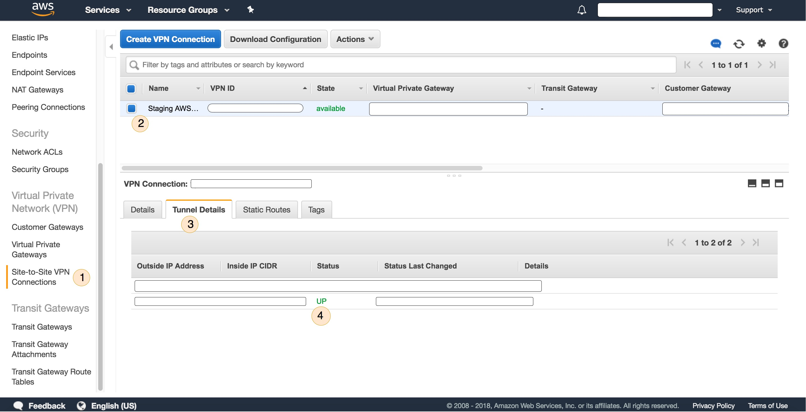
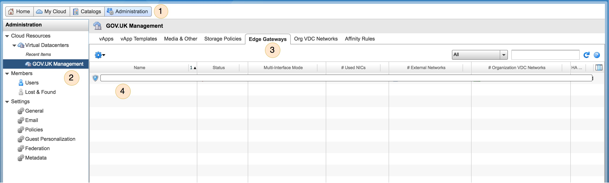
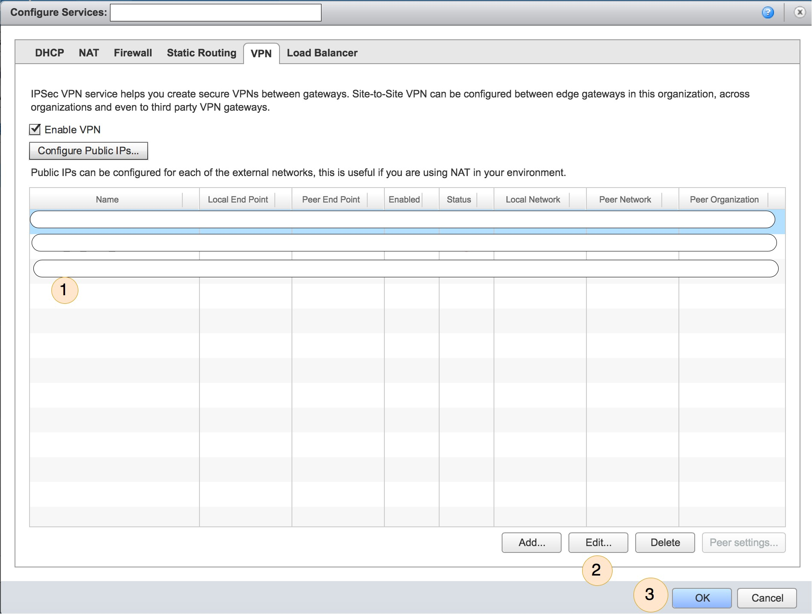

GOV.UK uses several VPNs to connect environments. This page explains what they
are and what happens if they stop working.

## VPN between live organisation and disaster recovery organisation

There's a VPN in each Carrenza environment (currently staging and production) which connects
the live organisation to the disaster recovery organisation. It's used for monitoring
the disaster recovery machines and for syncing data to them. The VPNs are managed by Carrenza.

If it goes down, these things will happen:

1. The machines on the disaster recovery side of the connection will appear as
   unreachable hosts in GOV.UK monitoring
2. Data replication will pause

## VPN between live organisation and Licensing

Licensing is hosted in Skyscape.
There's a VPN in each environment which connects it to the live (Carrenza) organisation. The VPN
is managed by Carrenza and Skyscape.

If it goes down, these things will happen:

1. The machines on the disaster recovery (Skyscape) side of the connection will appear as
   unreachable hosts in GOV.UK monitoring

Applying for a licence should remain available because
the connection between GOV.UK (the router and content store) and the Licensify organisation is made
over the internet rather than over the VPN.

[carrenza-secure]: connect-to-vcloud-director.html
[gds-vpn]: https://sites.google.com/a/digital.cabinet-office.gov.uk/gds/working-at-the-white-chapel-building/how-to/connect-to-the-aviation-house-vpn

## VPN between live organisation in Carrenza and AWS during AWS migration

During the staged migration of the GOV.UK from Carrenza to AWS, there is a VPN
tunnel to connect the 2 private clouds so that migrated and un-migrated services can still access each
other during the migration.

If the VPN goes down, these things will happen:

1. the ping probes between certain virtual machines in AWS and Carrenza will
   fail and these will appear in the Icinga dashboard of GOV.UK

2. services which makes use of the VPN will fail and the relevant
   alerts will appear in Icinga

### Troubleshooting Steps

1. Check that the VPN is `UP` in the AWS Console by:

    1. log in into the AWS console and assume your role for the given GOV.UK
       environment

    2. go to the `VPC` service dashboard, as pictured in Figure 1.0
       
       Figure 1.0: VPC dashboard in AWS showing the VPN site-to-site status.

    2. scroll on the left pane of the dashboard and click
       `Site-to-Site VPN Connections` as shown in step 1 in Figure 1.0

    3. select the `Staging AWS` VPN connection as shown in step 2 in Figure 1.0

    4. select the tab `Tunnel Details` as shown in step 3 in Figure 1.0

    5. check the status of the VPN tunnel, in the normal scenario, only **one**
       tunnel will be `UP` as shown in step 4 in Figure 1.0. The other tunnel is
       `DOWN` by default.

       If **all** tunnels are down this means there is a VPN issue and you may
       have to swap to the secondary VPN tunnel.

2. Switching to the secondary VPN tunnel:

   ```
    **WARNINGS:**
      1. The steps described below may render the VPN to be only _partly_
         functional because the Carrenza vCloud interface allows only
         a restrictive subnet to be selected but a `/16` subnet is needed
         for the VPN to be fully functional. You may have to contact Carrenza
         support so that they apply `/16` subnet on the VPN through their
         backend system.
   ```

   1. log in the Carrenza vCloud interface as described
      [here](connect-to-vcloud-director.html)

   2. click on the "Administration" button on the interface as shown in step 1
      in Figure 2.0
      
      Figure 2.0: Carrenza vCloud interface showing the vEdge gateways list

   3. select the `GOV.UK Management` virtual data centre and the data
      centre should appear as shown in step 2 in Figure 2.0

   4. select the `Edge Gateways` tab as shown in step 3 in Figure 2.0

   5. right-click the only edge gateway in the list as shown in step 4 in Figure
      2.0 and select `Edge Gateway Service...`. A new pop-up window will appear
      as shown in Figure 2.1.
      

   6. select the `enabled` (shown by a green tick in the enabled column) AWS VPN
      as shown in step 1 in Figure 2.1. Make a note of it so you remember which
      VPN you are going to disable.
      **Do not select the Skyscape VPN**

   7. click on the `edit` button as shown in step 2 in Figure 2.1. A new pop-up
      window will appear where you can `uncheck` the
      `Enable this VPN configuration` option so that this VPN is disabled. Finally
      select `ok` to return to the previous pop-up window.

   8. in the list of VPN connections, select the second AWS VPN tunnel and click
      `edit` as in step 2 in Figure 2.1 and enable the VPN configuration in the
      new pop-up window.

   9. finally click on `ok` as shown in step 3 in Figure 2.1.

   10. go to the AWS console and check if the other VPN tunnel is now `UP` and
       the previously active VPN tunnel is `DOWN`.

       In addition, check that the Icinga ping alerts across the Carrenza-AWS VPN
       has now been cleared.
