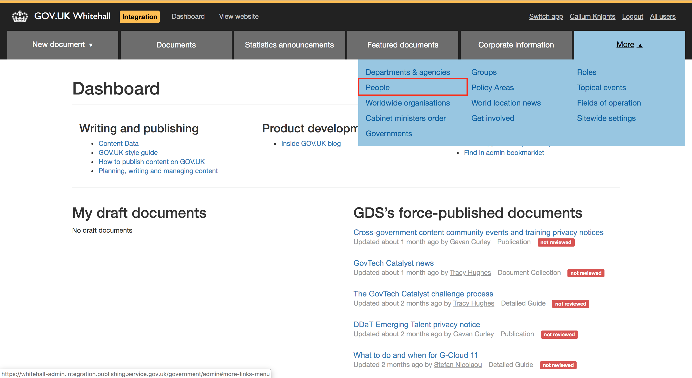
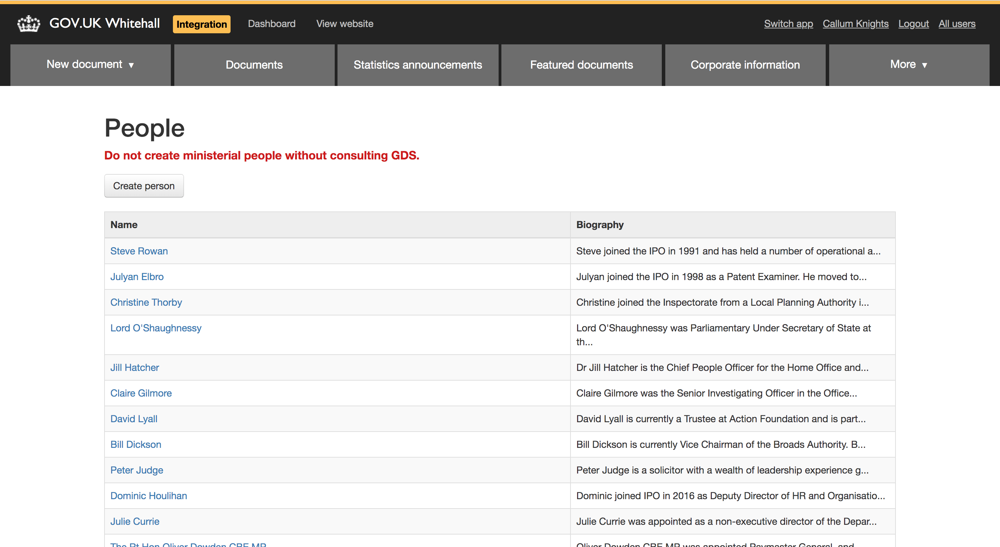
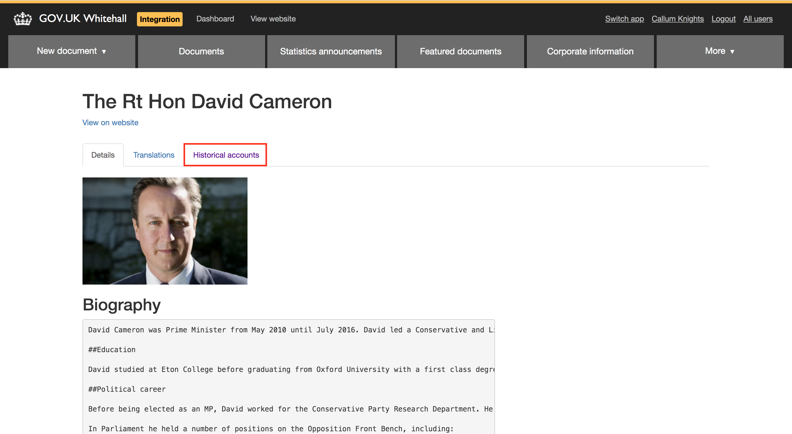
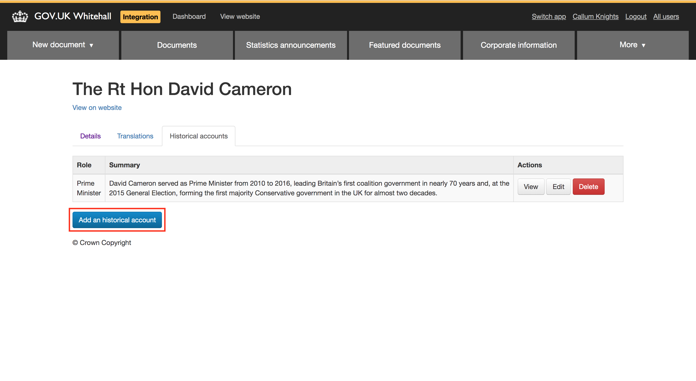
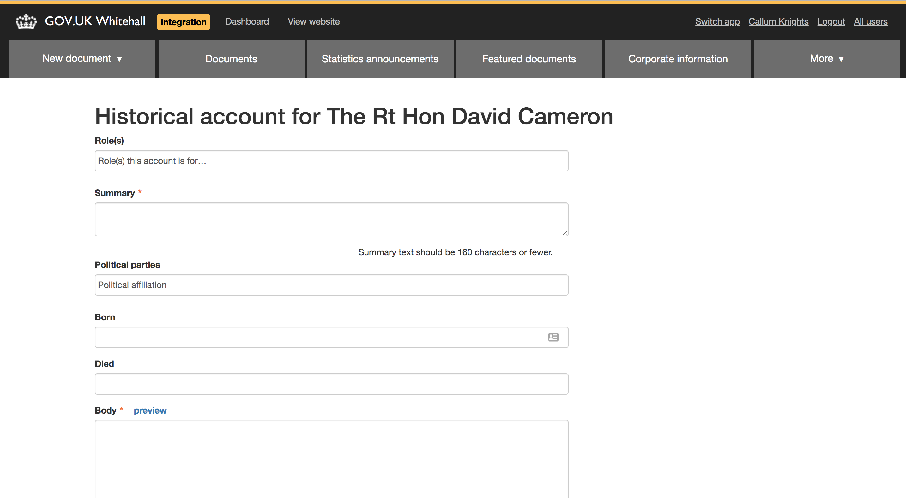

## Adding Historical Accounts to Whitehall

People in Whitehall can have a biography attached to each role they have held. These are called Historical Accounts. We primarily use Historical Accounts to add information to our History of Government's [Notable People](https://www.gov.uk/government/history#notable-people) section. For example, most [past prime ministers](https://www.gov.uk/government/history/past-prime-ministers) have one.

Historical accounts can be added though the [Whitehall Admin Interface](https://whitehall-admin.integration.publishing.service.gov.uk/government/admin).

Log in to Whitehall Admin and click the 'More' tab in the top right of the page, then select the 'People' option.

You should see this page.

Then `cmd + f` the name of the person you are looking for and click through to their main page. Click on the 'Historical Accounts' tab.

Press the 'Add an Historical Account' button.

You should then be presented with the form shown below.

Fill out the form with the biography you have been supplied with and press save.
